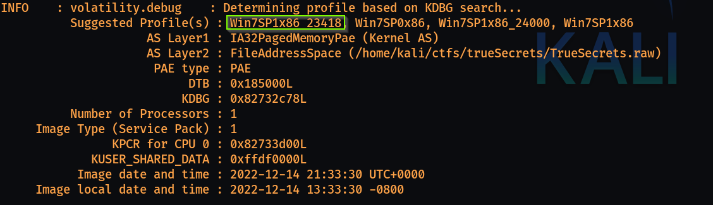
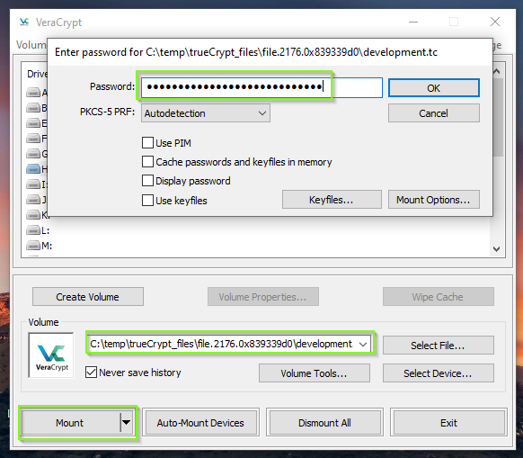

## TrueSecrets

This is a forensics challenge in which we are given one file which is the memory capture of the APT's group computer while it was still powered on.
Our task is to analyze this memory dump.

We are going to use volatility for analyzing this memory dump.
- Well fist start by checking the imageinfo for getting the profile for the OS used.\
` python2 vol.py -f TrueSecrets.raw imageinfo`

Now we know it's a Windows 7 image.

- Next we'll start checking the running process on the machine at the time when the dump was taken, this we'll do using the pslist command
```bash
python2 vol.py -f TrueSecrets.raw --profile Win7SP1x86_23418 pslist

Offset(V)  Name                    PID   PPID   Thds     Hnds   Sess  Wow64 Start                          Exit                          
---------- -------------------- ------ ------ ------ -------- ------ ------ ------------------------------ ------------------------------
0x8378ed28 System                    4      0     87      475 ------      0 2022-12-15 06:08:19 UTC+0000                                 
0x83e7e020 smss.exe                252      4      2       29 ------      0 2022-12-15 06:08:19 UTC+0000                                 
0x843cf980 csrss.exe               320    312      9      375      0      0 2022-12-15 06:08:19 UTC+0000                                 
0x837f6280 wininit.exe             356    312      3       79      0      0 2022-12-15 06:08:19 UTC+0000                                 
0x84402d28 csrss.exe               368    348      7      203      1      0 2022-12-15 06:08:19 UTC+0000                                 
0x84409030 winlogon.exe            396    348      3      110      1      0 2022-12-15 06:08:19 UTC+0000                                 
0x844577a0 services.exe            452    356      9      213      0      0 2022-12-15 06:08:19 UTC+0000                                 
0x8445e030 lsass.exe               468    356      7      591      0      0 2022-12-15 06:08:19 UTC+0000                                 
0x8445f030 lsm.exe                 476    356     10      142      0      0 2022-12-15 06:08:19 UTC+0000                                 
0x84488030 svchost.exe             584    452     10      347      0      0 2022-12-15 06:08:19 UTC+0000                                 
0x844a2030 VBoxService.ex          644    452     11      116      0      0 2022-12-15 06:08:19 UTC+0000                                 
0x844ab478 svchost.exe             696    452      7      243      0      0 2022-12-14 21:08:21 UTC+0000                                 
0x844c3030 svchost.exe             752    452     18      457      0      0 2022-12-14 21:08:21 UTC+0000                                 
0x845f5030 svchost.exe             864    452     16      399      0      0 2022-12-14 21:08:21 UTC+0000                                 
0x845fcd28 svchost.exe             904    452     15      311      0      0 2022-12-14 21:08:21 UTC+0000                                 
0x84484d28 svchost.exe             928    452     23      956      0      0 2022-12-14 21:08:21 UTC+0000                                 
0x8e013488 svchost.exe             992    452      5      114      0      0 2022-12-14 21:08:21 UTC+0000                                 
0x8e030a38 svchost.exe            1116    452     18      398      0      0 2022-12-14 21:08:21 UTC+0000                                 
0x8e0525b0 spoolsv.exe            1228    452     13      275      0      0 2022-12-14 21:08:21 UTC+0000                                 
0x84477d28 svchost.exe            1268    452     19      337      0      0 2022-12-14 21:08:21 UTC+0000                                 
0x8e0a2658 taskhost.exe           1352    452      9      223      1      0 2022-12-14 21:08:22 UTC+0000                                 
0x844d2d28 dwm.exe                1448    864      3       69      1      0 2022-12-14 21:08:22 UTC+0000                                 
0x8e0d3a40 explorer.exe           1464   1436     32     1069      1      0 2022-12-14 21:08:22 UTC+0000                                 
0x8e1023a0 svchost.exe            1636    452     10      183      0      0 2022-12-14 21:08:22 UTC+0000                                 
0x8e10d998 svchost.exe            1680    452     14      224      0      0 2022-12-14 21:08:22 UTC+0000                                 
0x8e07d900 wlms.exe               1776    452      4       45      0      0 2022-12-14 21:08:22 UTC+0000                                 
0x83825540 VBoxTray.exe           1832   1464     12      140      1      0 2022-12-14 21:08:22 UTC+0000                                 
0x8e1cd8d0 sppsvc.exe              352    452      4      144      0      0 2022-12-14 21:08:23 UTC+0000                                 
0x8e1f6a40 svchost.exe            1632    452      5       91      0      0 2022-12-14 21:08:23 UTC+0000                                 
0x8e06f2d0 SearchIndexer.          856    452     13      626      0      0 2022-12-14 21:08:28 UTC+0000                                 
0x91892030 TrueCrypt.exe          2128   1464      4      262      1      0 2022-12-14 21:08:31 UTC+0000                                 
0x91865790 svchost.exe            2760    452     13      362      0      0 2022-12-14 21:10:23 UTC+0000                                 
0x83911848 WmiPrvSE.exe           2332    584      5      112      0      0 2022-12-14 21:12:23 UTC+0000                                 
0x8e1ef208 taskhost.exe           2580    452      5       86      1      0 2022-12-14 21:13:01 UTC+0000                                 
0x8382f198 7zFM.exe               2176   1464      3      135      1      0 2022-12-14 21:22:44 UTC+0000                                 
0x83c1d030 DumpIt.exe             3212   1464      2       38      1      0 2022-12-14 21:33:28 UTC+0000                                 
0x83c0a030 conhost.exe             272    368      2       34      1      0 2022-12-14 21:33:28 UTC+0000
```
From the above response there are few processes which seems interesting and might be of use for us. These are `TrueCrypt.exe`, `7zFM.exe` and `DumpIt.exe`.

- We can see the process tree for a verbose reponse
```bash
python2 vol.py -f TrueSecrets.raw --profile Win7SP1x86_23418 pstree -v

. 0x8382f198:7zFM.exe                                2176   1464      3    135 2022-12-14 21:22:44 UTC+0000
     audit: \Device\HarddiskVolume1\Program Files\7-Zip\7zFM.exe
     cmd: "C:\Program Files\7-Zip\7zFM.exe" "C:\Users\IEUser\Documents\backup_development.zip"
     path: C:\Program Files\7-Zip\7zFM.exe
. 0x83c1d030:DumpIt.exe                              3212   1464      2     38 2022-12-14 21:33:28 UTC+0000
     audit: \Device\HarddiskVolume1\Users\IEUser\Downloads\DumpIt.exe
     cmd: "C:\Users\IEUser\Downloads\DumpIt.exe" 
     path: C:\Users\IEUser\Downloads\DumpIt.exe
. 0x91892030:TrueCrypt.exe                           2128   1464      4    262 2022-12-14 21:08:31 UTC+0000
     audit: \Device\HarddiskVolume1\Program Files\TrueCrypt\TrueCrypt.exe
     cmd: "C:\Program Files\TrueCrypt\TrueCrypt.exe" 
     path: C:\Program Files\TrueCrypt\TrueCrypt.exe
```

- What we can say till this point is that some sort of zipping mechanism is being used in the whole mechanism. We can see above that the 7zFM file is being passed an argument which is a backup folder. So now we have to dump files for further analysis.
```bash
python2 vol.py -f TrueSecrets.raw --profile Win7SP1x86_23418 --dump-dir=dump dumpfiles -r .zip$

DataSectionObject 0x843f6158   2176   \Device\HarddiskVolume1\Users\IEUser\Documents\backup_development.zip
SharedCacheMap 0x843f6158   2176   \Device\HarddiskVolume1\Users\IEUser\Documents\backup_development.zip
```
- Once we dump the files as zip and extract them we get two files, when we run `file` command on then we get that these are data files.\
As of this stage I'm not aware what can be done for openining these dumps. So now it's time to see if there is some information about TrueCrypt.

- From a general search we can see that it's an open source disk encryption system for windows. From a little more digging we get to few blogs explaining how truecrypt stores password. The password is being stored in the memory so is it possible to extract it.\
Volatiltiy has the support for extracting the same passphrase from the memory.
```bash
python2 vol.py -f TrueSecrets.raw --profile Win7SP1x86_23418 truecryptpassphrase
```
- This will give us the password for the truecrypt and which we can then use to mount the drive.


- Now this media contains a lot of encrypted folders and there was one code snippet which is of our interest, inside malware_agent there is one C# script named AgentServer. This file contains key and initialization vector hardcoded.

- We can use the same script and write a decryption logic for the same.
```python
import os
from Crypto.Cipher import DES
import base64
key = b"AKaPdSgV"
iv = b"QeThWmYq"

def decrypt_sessions(inp):
    def pad(text):
        n = len(text) % 8
        return text + (b' ' * n)
    
    data = pad(base64.base64decode(inp))
    des = DES.new(key, DES.MODE_CBC, iv)
    print(des.decrypt(data))

path = "malware_agent/sessions/"
for file in os.listdir(path):
    f = open(os.path.join(path, file), 'r')
    lines = f.readlines()
    f.close()
    for line in lines:
        decrypt_sessions(line)
```
- Now when we run this script then it will decrypt the sessions folder. As we are printing the result while decrypting we'll see that there is a file named `flag.txt` under `C:\Users\greg\documents`. When decrypted we'll see the flag.

### Completed
