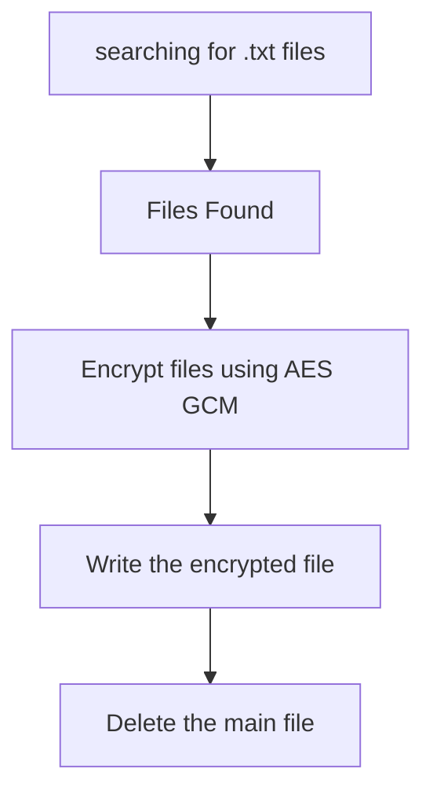

#  Malevolent ModMaker 

### Challenge Description
Bob, a senior software engineer at Acme Inc., was taking a break from correcting AI code to check in with his favorite gaming community. One of the newer members shared a new program that can make mods for a popular game. Eager to try new things, when he ran it as administrator (as instructed), all of his files were deleted and replaced! He immediately called the help desk, so they locked his machine and an incident response was called!

The challenge gives us the following files to work with
```bash
total 9125
drwxr-xr-x 1 shar 197121       0 Sep  1 22:47 .
drwxr-xr-x 1 shar 197121       0 Sep  1 22:47 ..
-rwxr-xr-x 1 shar 197121 2030080 Aug 12 06:59 bruh.exe
-rw-r--r-- 1 shar 197121     220 Aug 12 07:09 D.txt
-rwxr-xr-x 1 shar 197121 1751552 Jan 20  2025 goteem.exe
-rwxr-xr-x 1 shar 197121 5550080 Aug  6 02:25 MCModMaker-v.1.4.exe
-rw-r--r-- 1 shar 197121    3890 Aug  5 01:40 probably_important.txt.goteem
```

Content of the D.txt file.
```
HA! GOTEEM! To get your files back, gotta pay us 1 BTC to: d32a7dafsd432789df798

We'll give you the decryption key, then you run the following command from the folder with `bruh.exe`:
.\bruh.exe -key <DECRYPTION_KEY>
```
So we can see from above description that the decryption key is passed to bruh.exe.\
This malware is of type `ransomware`.\
We can also see another file which is of extension `GOTEEM` but we can see it's having two extensions `txt` and `goteem`.\
When opened in programs like HxD or notepad we can see that the content is encrypted in that file.

### Basic Static Analysis
So we are taking both the exe's that is `goteem.exe` and `MCModMaker-v.1.4.exe` for this analysis.

#### Generic information about the binaries


One information that we can get from this that `golang` was used for making these malwares. We can also see the `compiler version` as well as which operating system.

#### Checks done on Virustotal


When strings command was ran nothing that feasible as result came.

#### Response from PEStudio
- Goteem


- ModMaker


From these images we can see that there are many libraries which are being imported which are involved in some type of techniques like `Process Injection`, `Process Discovery`, `File and Directory Discovery` etc.\
From the indicators section we can also see that the chain of imports forms a very high level of indicator. Many of these API's are used for code and process injection.

| API    | Main Use | Malware Use |
| -------- | ------- | ------- |
| WriteFile  | Writes data to a file	    |  Can be used to drop payloads or ransom notes       |
| WerSetFlags | Windows Error Reporting manipulation	    |   Often abused to suppress crash reports or evade detection      |
| VirtualQuery / VirtualAlloc    | Memory inspection and allocation	    |    Used to find and allocate memory for injecting code     |
| SwitchToThread / SuspendThread	    | Thread control	    |   Used in process hollowing or thread hijacking      |

*Source GPT*


### Dynamic Analysis
When the goteem bianry executes it makes a D.txt in various folders wherever it traverses. The same file is provided to us in the source of the challenge.\
\
The above screenshot shows that goteem binary is traversing all the available locations and is encrytping the text files present and creating D.txt file as well.\


When we try running the modmaker binary at that time we can see that it gives some text on the command line. This part reveals many information about the malware, which includes
- the apiKey
- c2 server domain
- discord webhooks


We can see from the above image that the Modmaker actually works as a downloader malware, as this is the one which downloads the goteem.exe file and then executes it as well.\
It also fails when creating some files on the disk. This we can see in the following image.


### Advanced Static Analysis
We have used Ida Free version, we tried few other decompilers as well but IDA worked best in this case.\
**The ModMaker**
- In the main page we can see the primary function that is the sendToDiscord and runCommand functions. The bianry uses webhooks for communicating with the discord server.

- Second it connects to a domain with a specific apiKey and then downloads the goteem.exe.
- Third it executes the binary with elevated privilege.


**The Goteem**\
From the decompilation results we can see the *main*, *encryptFile*, *encryptTxtFiles* and *createDFile* functions.
- The malware scans for text files that are present in the machine. This we can confirm with the error when file is not found and message when a file is found.


- In case when the malware is unable to traverse the directory then it just skips that direcotry.


- In the encryptFile function we can see that AES is being used with Galois/Counter Mode (GCM) for encrypting the files on the system.


- In the main function we can see the address of crypto/aes key being loaded in rax register.


- Once the encryption is complete the data is written to a file and then the main is deleted from the system.

**High Level working**

### Restoring files
```
bruh.exe -key <key_value>
```


### Complete
