# CrashDump

### Sherlock Scenario
A suspicious executable was identified running on one of the compromised endpoints. Initial triage suggests that this process may have been leveraged by the threat actor to establish a foothold on the system. To support further malware analysis and behavioral reconstruction, a user‑mode process dump of the suspected executable has been provided.

For this challenge we are given two minimdumps of notepad and one more process.\
We are going to use WinDbg for this challenge.

### Analyzing dumps using WinDbg
- Before we start analyzing we need to know what sort of dump do we have that is either a user- or kernel-level dump. This we can know using two things:
    - when we load a dump in windbg if it's a user level dump we get the `0:000>` sort of prompt.
    - second way is using command `vertarget`.
      
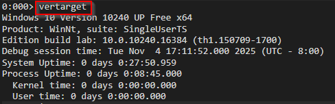

we can see that the kernel time is 0 in this case.

- We load the minidumps in WinDbg and then we use the command `!analyze -v`. This acts as an automated crash analyzer, it gives critical data about the machine and other information if there was a crash that happened.

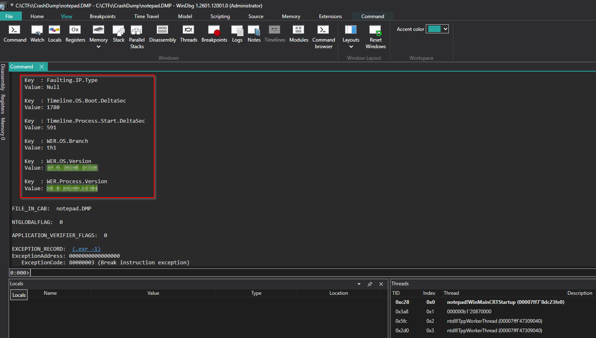\
This will give us the system information. This information we can from both the dumps.

- The next question asks us about the full path for the malicious process, for this we need to use the second dump that we have. We check the **Process Environment Block** for getting more insights about the process and we can also see the path from where this malicious file was loaded.

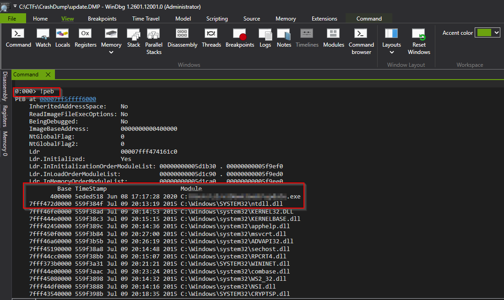

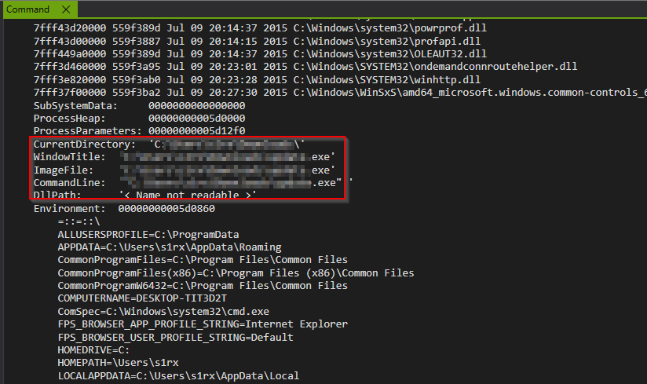

- For getting thread information we can use the `!thread` command with the second dump.
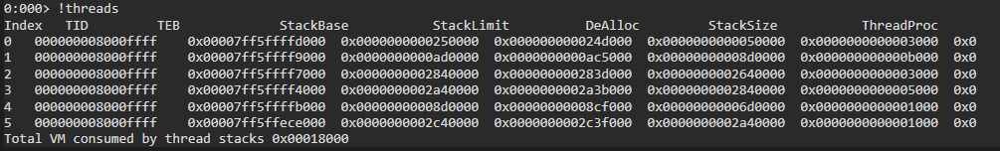

- Named Pipe (IPC channel): for this we are going to target the base process that is notepad dump file. For solving this we are going to use the search functionality in WinDbg.\
The general format in which named pipes are persent in the machine is //pipe/<pipe_name>. For this we use the following command `s -a 0 L?80000000 "\\\\.\\pipe\\"`.\
```
s = search
-a = ANSI text
0 L?80000000 = search whole user address space
"\\\\.\\pipe\\" = string literal (escaped for WinDbg)
```
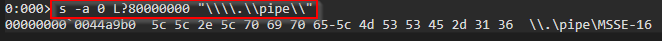\
Then from here we use the string that we got from above and then perform a search on the update dump file.\
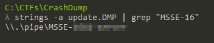

- PID for the injected process: when checking for the threads for this process we came across the following result.

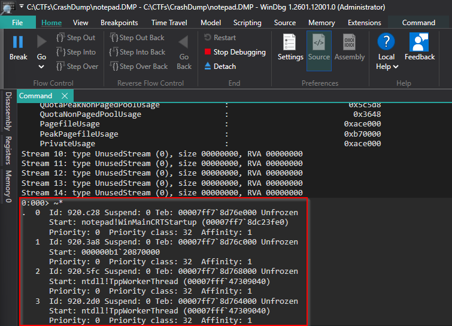\
The format that is represeneted here. `<ProcessID>.<ThreadID>`. From this we can get the process ID of the injected process that notepad.exe.\
One weird thing that we can note from the above image is that thread with ID: 920.3a8 is the only one wihtout a proper start that is the start address of other thread is pointing to internal/loaded library while for this thread that is not the case. So a little suspicious.

- Threat creation time for the injected process: n a user‑mode dump, the only reliable way to get the absolute creation time for each thread is if the dump contains the ThreadInfoList stream. That stream records per‑thread CreateTime as a FILETIME in UTC.\
With `.dumpdebug` we check if the stream exsits and then with `~*e .ttime` we list creation time of every thread.

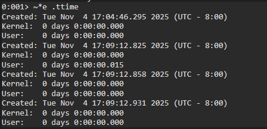\
Now we just have to convert time to UTC.

- Base address for the injected shellcode: We check more information about all the threads that are there. We analyze and check for some suspicious nature in these threads, once we have identified the same then we return base address of same. We already have the thread from the above list that we have suspicion on, we can check if that was ever executed or not using `!runaway` command.


- C2 server IP address: when we run strings command on the dump that we got from the above, we can get the address of the C2 server.

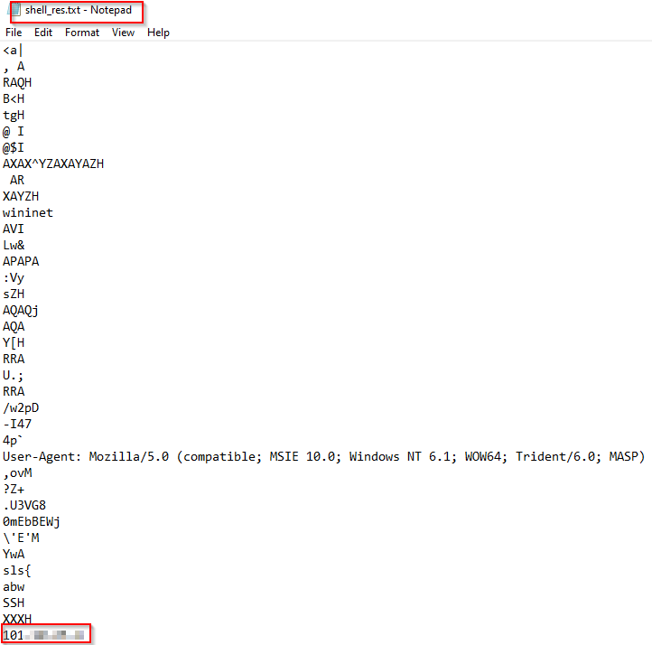

- C2 framwork used: once we have the dump extracted from the thread, we can take it's hash and then post it on Virustotal to check if it's some identified binary.

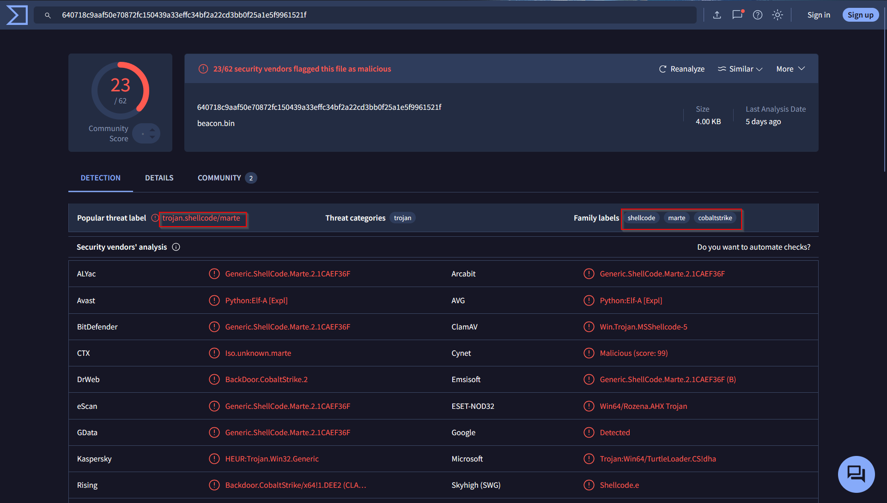

### Complete
