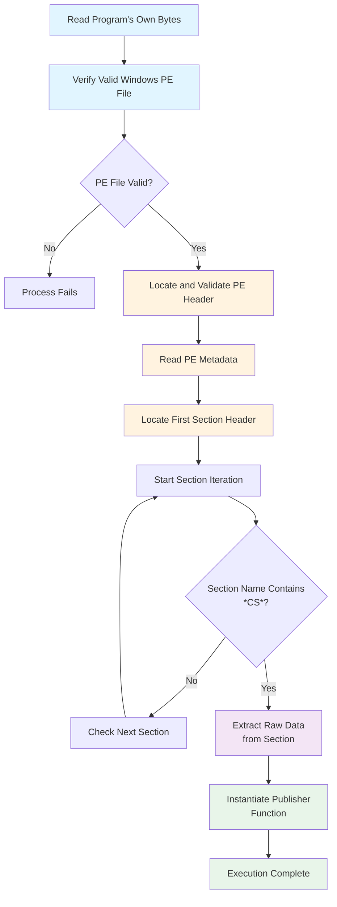

# Foreigner

### Sherlock Scenario
An organization has requested assistance after a user followed instructions from a website claiming their system required an urgent fix. The site prompted the user to manually execute several commands to resolve the issue. Shortly afterward, the workstation began exhibiting suspicious behavior, including the execution of unknown processes and unexpected outbound network communications. The organization requires your help to analyze the provided artifacts.

### Basic Static Analysis
For this challenge we are provided with a `PE`.

- DIE response


- Response from PE studio: general information and indicators.


- Running strings on the `exe` didn't reveal much information.
```
WrapNonExceptionThrows
Initial
Copyright 
  2025
$5c249bfa-2dd8-4f1a-9314-11e3fed61454
1.0.0.0
.NETFramework,Version=v4.7.2
FrameworkDisplayName
.NET Framework 4.7.2
RSDSQ
C:\Users\Admin\source\repos\Initial\Initial\obj\Release\Initial.pdb
_CorExeMain
mscoree.dll
```

### Basic Dynamic Analysis
We launch the application and check responses in Wireshark, Procmon, Process Hacker and Regshot.

- While analyzing the results from procmon we observed the following.
    - The process launches multiple subprocesses
    - Among these subprocess it launches `WerFault.exe` as well.
    - Among all these subprocesses one of the process keeps running, the main one exits once launching these sub-onse.
    - The one that runs later has a section with `RWX` permission which is suspicous.


- Regshot and Wireshark didn't reveal much information

### Advanced Static Analysis
As we know the binary is build using `.Net` so we can use `DNSPy` for getting the source code.\
When we load the binary file in DNSPy we see that the name show with binary is `Initial.exe`. By reading the questions we can say that there is phase2 related with this binary.

What we can observe in the main function:
- On line 5 we can see the program is reading it's own bytes, then verifies it's a valid windows PE file.
- Then it locates and validates PE header line 10-14
- After this PE metadata is read, locates first section header and iteration starts.
- After this program looks for a section whose name has `*CS*` in it.
- Once found then raw data is extracted from the section.
- At end we see `Publisher` function being instantiated.



Publisher function working:
- Decrypts data using `DeleteSentence`.
- Uses `VirtualProtect` to make memory as executable `64U = PAGE_EXECUTE_READWRITE`.
- Exectues raw shellcode via `CallWindowProcA`. 

`DeleteSentence` is heavily obfuscated function that is used for decryption purpose, the code sections which hints that this is an RC4 with Key Scheduling Algorithm (KSA) + Pseudo-Random Generation ALgorithm(PRGA) are:

```c#
// 256 byte state arrays
byte[] array = new byte[256];
byte[] array2 = new byte[256]


for (i = 0; i < 256; i++)
{
    try
    {
        array[i] = byte.Parse(i.ToString()); // initialization
        array2[i] = Sygcydy[i % iuogfht]; // key repition
    }
    catch (ArgumentNullException)
    {
    }
}

// Key Scheduling Algorithm
while (i < 256)
{
    num43 = (num43 + (int)array[i] + (int)array2[i]) % 256;
    byte b = array[num43];
    array[num43] = array[i];
    array[i] = b;
    i++;
}

// PRGA stream generation

i = (i + 1) % num44;
num43 = (num43 + array[i]) % num44;
...
int num137 = (int)(array[i] + array[num43]) % num44;
byte keystream = array[num137];
...
ioAdhugxya[k] ^= keystream;
```

*Note*: I used copilot for analysing the `DeleteSentence` function, wasn't able to understand the full logic how is it working.

Now we'll have to dump the content of the shellcode, for this as we already saw the `RWX` section in the Process Hacker with one of the subprocesses, we'll go there right click and save, this will be saved as `.bin` file.

## Phase 2 Analysis

### Basic Static Analysis
- DIE response


- PE studio indicators


- Following are the interesting strings that can be extracted from the second stage binary.

| String | String | String |
|--------|--------|--------|
| \t\t\t\t\t\t\t\t | 3333333333333333UUUUUUUUUUUUUUUU | {"id":1,"method":"Storage.getCookies"} |
| .tgz | Security | History |
| Work Dir: In memory | SOFTWARE\Microsoft\Cryptography | firefox |
| %08lX%04lX%lu | _key.txt | Soft\Steam\steam_tokens.txt |
| passwords.txt | information.txt | WebSocketClient |
| .keys | Azure\.aws | status |
| Wallets | GdipGetImageEncoders | https |
| Software\Martin Prikryl\WinSCP 2\Sessions | Plugins | /devtools |
| prefs.js | token | amcommunity.com |
| Telegram | Software\Valve\Steam | GdipSaveImageToStream |
| GdipLoadImageFromStream | \AppData\Roaming\FileZilla\recentservers.xml | formhistory.sqlite |
| cookies.sqlite | places.sqlite | Azure\.azure |
| _0.indexeddb.leveldb | _formhistory.db | _history.db |
| _cookies.db | _passwords.db | _webdata.db |
| _key4.db | \key4.db | \storage\default\ |
| \.aws\ | \Telegram Desktop\ | \Steam\ |
| \config\ | \.azure\ | Stable\ |
| \.IdentityService\ | \discord\ | C:\ProgramData\ |
| http://localhost: | "webSocketDebuggerUrl": | ^userContextId=4294967295 |
| 65 79 41 69 64 48 6C 77 49 6A 6F 67 49 6B 70 58 56 43 49 73 | ws://localhost:9223 | .metadata-v2 |
| https://t.me/l793oy | ir7am | Mozilla/5.0 (Macintosh; Intel Mac OS X 10_15_7) Chrome/131.0.0.0 Safari/537.36 OPR/116.0.0.0 |
| https://steamcommunity.com/profiles/76561199829660832 | and many more intereseting strings are there in the result | |

### Advanced Static Analysis
