# Foreigner

### Sherlock Scenario
An organization has requested assistance after a user followed instructions from a website claiming their system required an urgent fix. The site prompted the user to manually execute several commands to resolve the issue. Shortly afterward, the workstation began exhibiting suspicious behavior, including the execution of unknown processes and unexpected outbound network communications. The organization requires your help to analyze the provided artifacts.

### Basic Static Analysis
For this challenge we are provided with a `PE`.

- DIE response

<p align="center">
  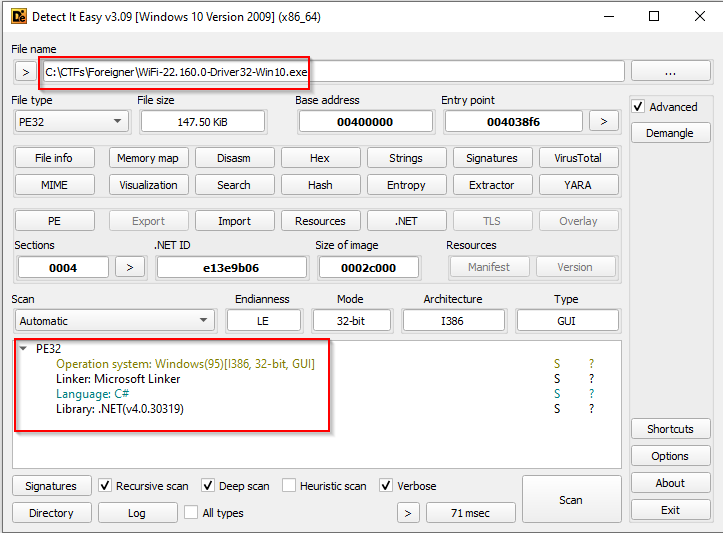
</p>

- Response from PE studio: general information and indicators.

<p align="center">
  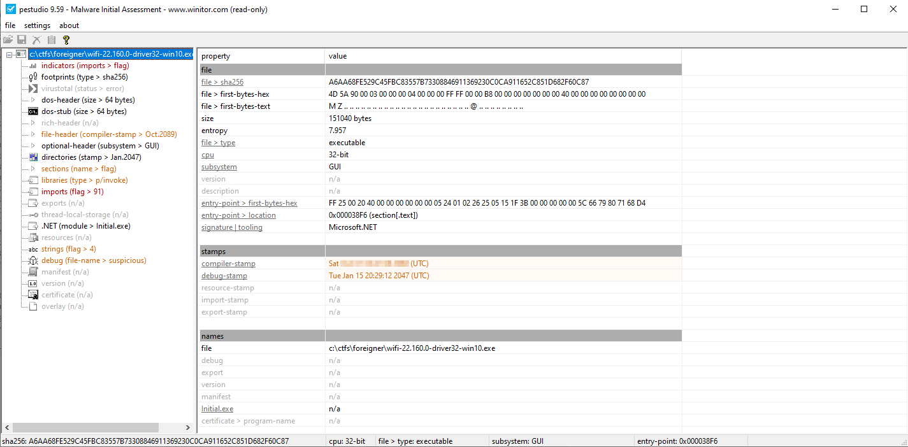
</p>
<p align="center">
  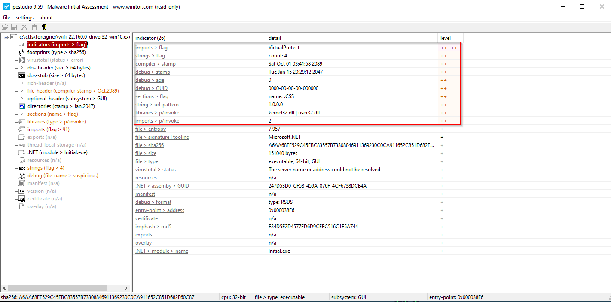
</p>

- Running strings on the `exe` didn't reveal much information.
```
WrapNonExceptionThrows
Initial
Copyright 
  2025
$5c249bfa-2dd8-4f1a-9314-11e3fed61454
1.0.0.0
.NETFramework,Version=v4.7.2
FrameworkDisplayName
.NET Framework 4.7.2
RSDSQ
C:\Users\Admin\source\repos\Initial\Initial\obj\Release\Initial.pdb
_CorExeMain
mscoree.dll
```

### Basic Dynamic Analysis
We launch the application and check responses in Wireshark, Procmon, Process Hacker and Regshot.

- While analyzing the results from procmon we observed the following.
    - The process launches multiple subprocesses
    - Among these subprocess it launches `WerFault.exe` as well.
    - Among all these subprocesses one of the process keeps running, the main one exits once launching these sub-onse.
    - The one that runs later has a section with `RWX` permission which is suspicous.

<p align="center">
  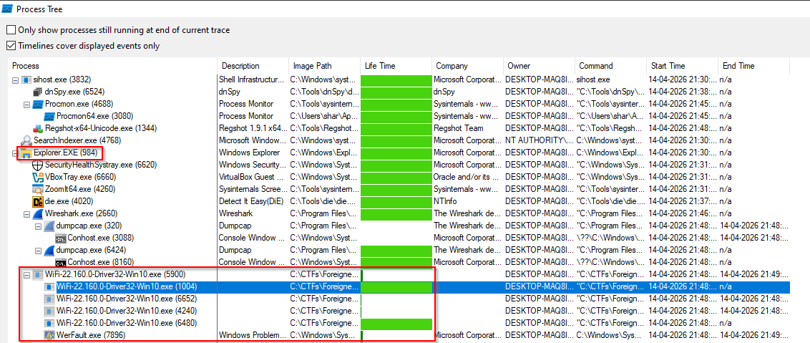
</p>

<p align="center">
  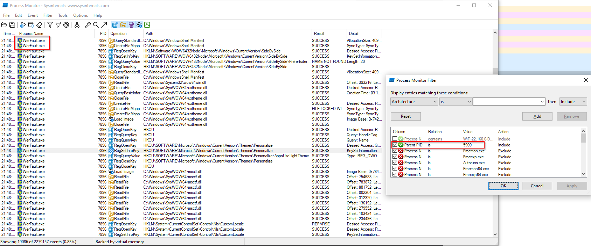
</p>

<p align="center">
  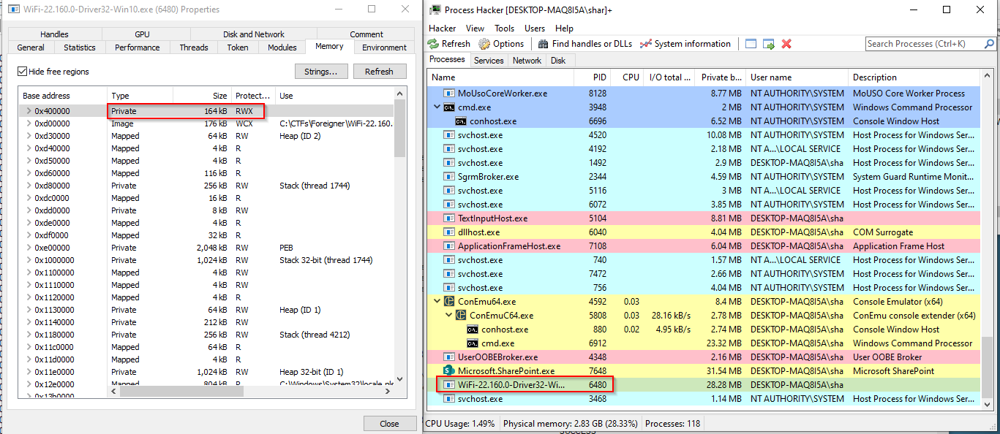
</p>

- Regshot and Wireshark didn't reveal much information

### Advanced Static Analysis
As we know the binary is build using `.Net` so we can use `DNSPy` for getting the source code.\
When we load the binary file in DNSPy we see that the name show with binary is `Initial.exe`. By reading the questions we can say that there is phase2 related with this binary.

What we can observe in the main function:
- On line 5 we can see the program is reading it's own bytes, then verifies it's a valid windows PE file.
- Then it locates and validates PE header line 10-14
- After this PE metadata is read, locates first section header and iteration starts.
- After this program looks for a section whose name has `*CS*` in it.
- Once found then raw data is extracted from the section.
- At end we see `Publisher` function being instantiated.

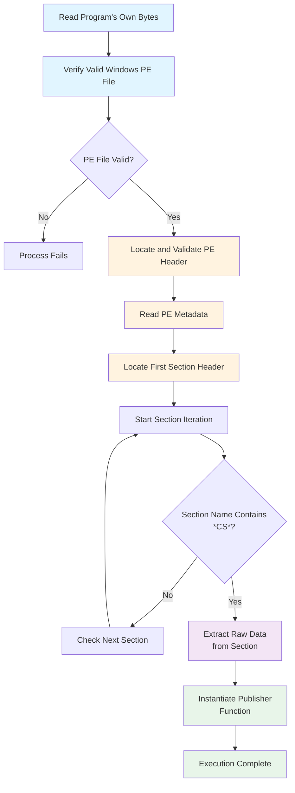
```mermaid
flowchart TD
    A["Read Program's Own Bytes"] --> B["Verify Valid Windows PE File"]
    B --> C{PE File Valid?}
    C -->|No| D["Process Fails"]
    C -->|Yes| E["Locate and Validate PE Header"]
    E --> F["Read PE Metadata"]
    F --> G["Locate First Section Header"]
    G --> H["Start Section Iteration"]
    H --> I{Section Name Contains<br/>*CS*?}
    I -->|No| J["Check Next Section"]
    J --> H
    I -->|Yes| K["Extract Raw Data<br/>from Section"]
    K --> L["Instantiate Publisher<br/>Function"]
    L --> M["Execution Complete"]
    
    style A fill:#e1f5ff
    style B fill:#e1f5ff
    style E fill:#fff3e0
    style F fill:#fff3e0
    style G fill:#fff3e0
    style K fill:#f3e5f5
    style L fill:#e8f5e9
    style M fill:#e8f5e9
```
<p align="center">
  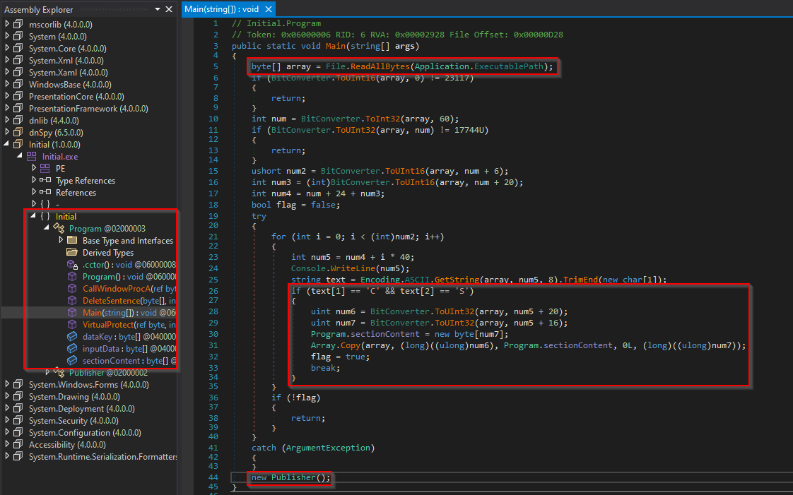
</p>

Confirming the section which has `CS` in it.

<p align="center">
  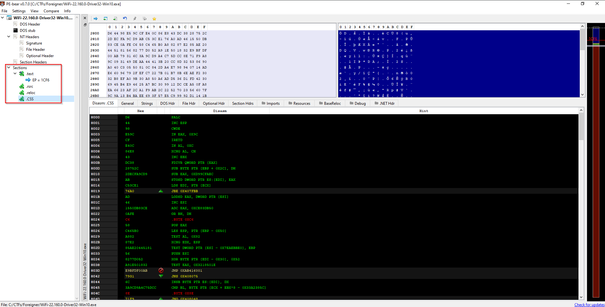
</p>

Publisher function working:
- Decrypts data using `DeleteSentence`.
- Uses `VirtualProtect` to make memory as executable `64U = PAGE_EXECUTE_READWRITE`.
- Exectues raw shellcode via `CallWindowProcA`. 

`DeleteSentence` is heavily obfuscated function that is used for decryption purpose, the code sections which hints that this is an RC4 with Key Scheduling Algorithm (KSA) + Pseudo-Random Generation ALgorithm(PRGA) are:

```c#
// 256 byte state arrays
byte[] array = new byte[256];
byte[] array2 = new byte[256]


for (i = 0; i < 256; i++)
{
    try
    {
        array[i] = byte.Parse(i.ToString()); // initialization
        array2[i] = Sygcydy[i % iuogfht]; // key repition
    }
    catch (ArgumentNullException)
    {
    }
}

// Key Scheduling Algorithm
while (i < 256)
{
    num43 = (num43 + (int)array[i] + (int)array2[i]) % 256;
    byte b = array[num43];
    array[num43] = array[i];
    array[i] = b;
    i++;
}

// PRGA stream generation

i = (i + 1) % num44;
num43 = (num43 + array[i]) % num44;
...
int num137 = (int)(array[i] + array[num43]) % num44;
byte keystream = array[num137];
...
ioAdhugxya[k] ^= keystream;
```

*Note*: I used copilot for analysing the `DeleteSentence` function, wasn't able to understand the full logic how is it working.

- We have two sections which calls DeleteSentence function, first is the primary shellcode and second is the encrypted second stage

```

Program.DeleteSentence(Program.inputData, Program.inputData.Length,
                       Program.dataKey, Program.dataKey.Length);

Program.DeleteSentence(Program.sectionContent, Program.sectionContent.Length,
                       Publisher._key, Publisher._key.Length);

```

The shellcode starts executing at offset 392 inside inputData, test sectionContent is input data to the shellcode

**Process to Dump the second stage and shellcode:**
There are two ways we can get this dump, first one gives binary which is more easy to analyze.
- We'll debug the binary that is given to us, one thing to note here is that binary has some sort of check which doesn't allow it to run when we make some changes in the source code, compile and save.
- Put a breakpoint in the `Publisher` class at the place where `VIrtualProtect` is to be exectured. We know that the content of the second phase binary resides in `Program.sectionContent`.
- We want to look the value of this byte array and save it. For doing so we need to Watch it's content. Debug -> Window -> Watch.
- This will open a panel at the bottom, with this add `Initial.Program.sectionContent`. This will allow us to see the byte array, right click on it and save.
- This save the `.bin` file.

Second way is using Process hacker. We run the main program, as we know this creates a subprocess with same content and with RWX memory region.\
Right click on this RWX region and click on save.

<p align="center">
  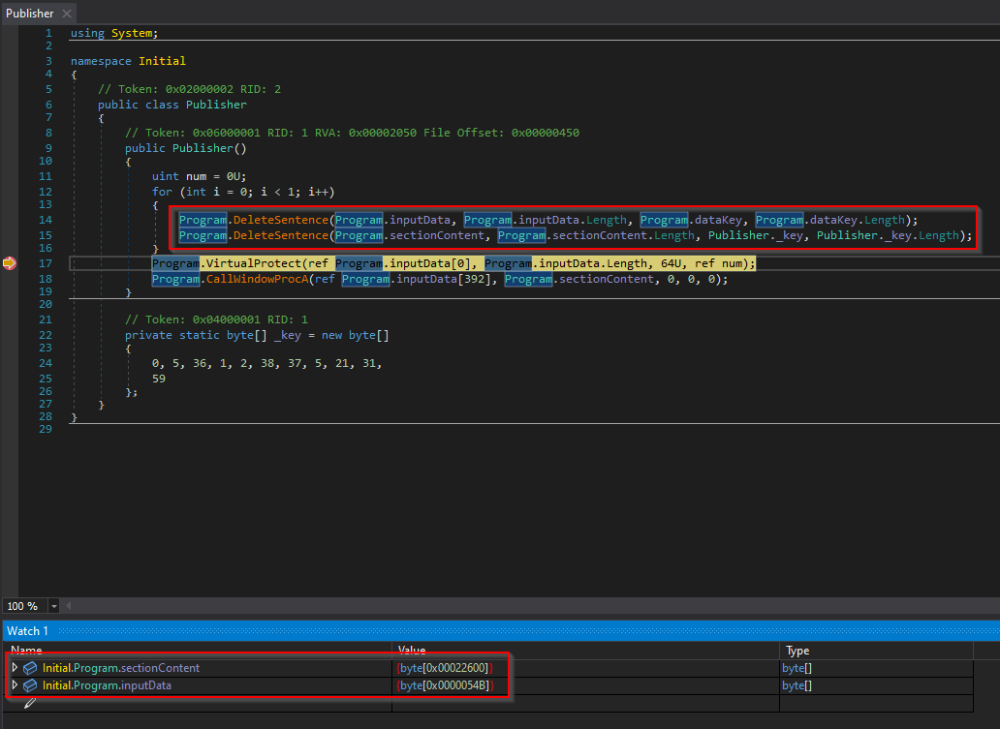
</p>

- Once we have dumped both we can run strings on the shellcode, we can see following API's being used, this clearly indicates that process hollowing. The target binary name is also present with the strings result
```
user32.dll
CreateProcessW
VirtualAlloc
GetThreadContext
ReadProcessMemory
VirtualAllocEx
WriteProcessMemory
SetThreadContext
ResumeThread
TerminateProcess
```

## Phase 2 Analysis

### Basic Static Analysis
- Second binary general info

<p align="center">
  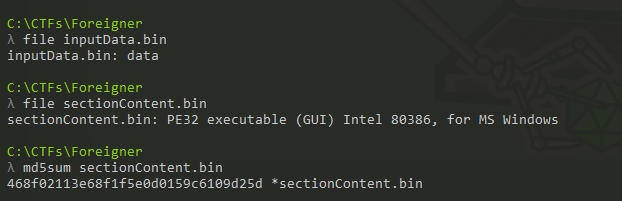
</p>

- DIE response

<p align="center">
  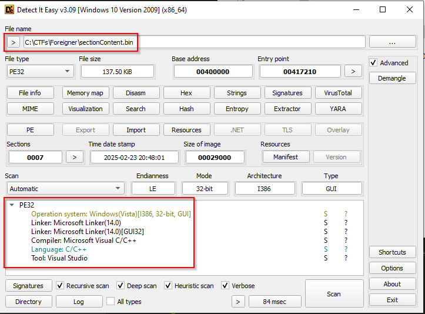
</p>

- PE studio indicators

<p align="center">
  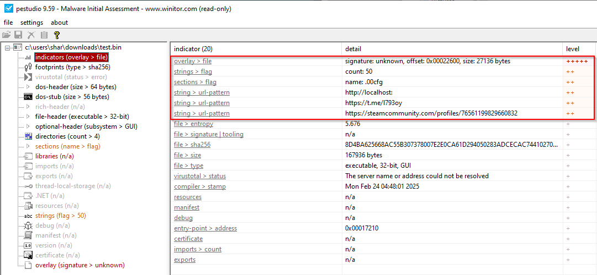
</p>

- Following are the interesting strings that can be extracted from the second stage binary.

| String | String | String |
|--------|--------|--------|
| ee4724586a69cda3db87344f07509f40 | \\Monero\\wallet0123456789 | ChromeBuildTools |
| DPAPI0123456789ABCDEF | \\BraveWallet\\P | \\Discord\\token |
|  & del / | /c timeout /t 11\Program | " & rd /s /q "C: & rd /s /q "C:\ProgramD |
| " & exit | _key.txt | Soft\Steam\steam_tokens.txt |
| passwords.txt | information.txt | WebSocketClient |
| .keys | Azure\.aws | status |
| Wallets | GdipGetImageEncoders | https |
| Software\Martin Prikryl\WinSCP 2\Sessions | Plugins | /devtools |
| prefs.js | token | amcommunity.com |
| Telegram | Software\Valve\Steam | GdipSaveImageToStream |
| GdipLoadImageFromStream | \AppData\Roaming\FileZilla\recentservers.xml | formhistory.sqlite |
| cookies.sqlite | places.sqlite | Azure\.azure |
| _0.indexeddb.leveldb | _formhistory.db | _history.db |
| _cookies.db | _passwords.db | _webdata.db |
| _key4.db | \key4.db | \storage\default\ |
| \.aws\ | \Telegram Desktop\ | \Steam\ |
| \config\ | \.azure\ | Stable\ |
| \.IdentityService\ | \discord\ | C:\ProgramData\ |
| http://localhost: | "webSocketDebuggerUrl": | ^userContextId=4294967295 |
| 65 79 41 69 64 48 6C 77 49 6A 6F 67 49 6B 70 58 56 43 49 73 | ws://localhost:9223 | .metadata-v2 |
| https://t.me/l793oy | ir7am | Mozilla/5.0 (Macintosh; Intel Mac OS X 10_15_7) Chrome/131.0.0.0 Safari/537.36 OPR/116.0.0.0 |
| https://steamcommunity.com/profiles/76561199829660832 | and many more intereseting strings are there in the result | |

```
https://t.me/l793oy
ir7am
Mozilla/5.0 (Macintosh; Intel Mac OS X 10_15_7) Chrome/131.0.0.0 Safari/537.36 OPR/116.0.0.0
https://steamcommunity.com/profiles/76561199829660832
ir7am
Mozilla/5.0 (Macintosh; Intel Mac OS X 10_15_7) Chrome/131.0.0.0 Safari/537.36 OPR/116.0.0.0
```

### Advanced Static Analysis
#### MISC information gathered about the malware

- From Virustotal we saw that this is a `vidar` so I tried looking for more infomration about this malware comparisons to it with other malwares in market and came across these blogs.
[vidar-mars](https://medium.com/@bendavidbenyamin/arkei-variants-from-vidar-to-mars-stealer-3e8c2a24ca24) and [stealc](https://blog.sekoia.io/stealc-a-copycat-of-vidar-and-raccoon-infostealers-gaining-in-popularity-part-2/#h-context) these blogs provides us with details what sort of username is checked before starting enumeration.

- This part is for how we can arrive at "authentication artifcat that the second stage looks for".\
While analyzing we can see that the malware is looking for `.vdf` files.\
`Valve Data Format (.vdf)`: Often seen in Steam folders, these are human-readable text files storing key-value pairs. They manage game resources and user settings.\
Steam uses these files for storing login/session metadata, client state, web authentication context. So we can assume that the malware is after authenication artifacts not passwords.\
But the `.vdf` files are stored in disk not in memory so why the malware is looking in Steam's process memory, the reason is active authntication artifacts live only in memory such as `Web Session Tokens, OAuth` etc.\
So a runtime authentication token. Steam uses:
    - Web APIs
    - Session-based authntication
    - Bearer-style tokens for authenticated web calls\
Modern Steam web auth uses tokens that are portable, replayable, parsed client-side. This matches how JSON Web Tokens work.

<p align="center">
  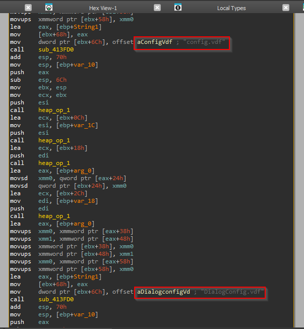
</p>

We can also see that the tokens are being stored by the malware later in a file named `steam_token.txt`

<p align="center">
  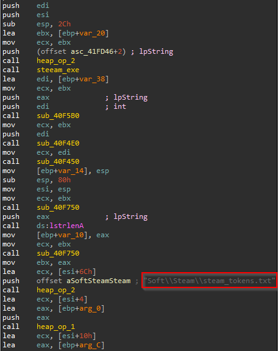
</p>

- From the strings we saw that there is a reference for a `password.txt` file. When we search for this string in the disassembled code, we can see that this string is referenced in two functions.
```
.rdata:0041EFC2 ; const CHAR aPasswordsTxt[]
.rdata:0041EFC2 aPasswordsTxt   db 'passwords.txt',0    ; DATA XREF: sub_40C8C0+455↑o
.rdata:0041EFC2                                         ; sub_40CD90+12C↑o
```
When we visit these function we can see that these are two functions from where exfiltration is happening, the malware uses two file transfer clients one being `FileZilla`.\
We can observe the hostname, port, username, password being provided and then the `passwords.txt` file exfiltrated.
passoword file in same function from where we got the answer winscp

<p align="center">
  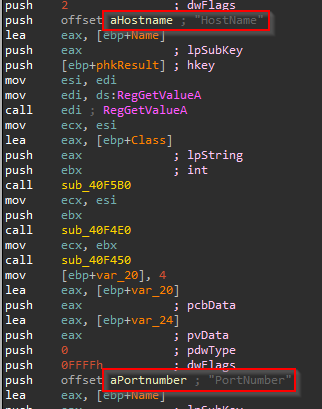
</p>

- Another way we can search for the another file transfer client is using search in strings.

<p align="center">
  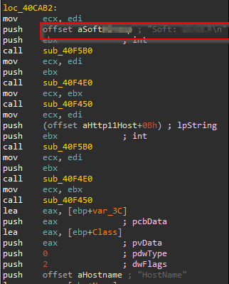
</p>

- Apart from steam we can see that the malware also targets components related to Discord, when checking its

- From strings we can see one messaging platform name as well. In that there is one function which is taking an encrypted key and trying to decrypt it and send it to a `_key.txt` file. Later that we can see one string is being pushed to stack and then a call is made to `StrStrA`.\
This API call is used to `find the first occurrence of a substring within a string`. So the malware looks for this string, this is the special marker string used in Discord crawling process.

<p align="center">
  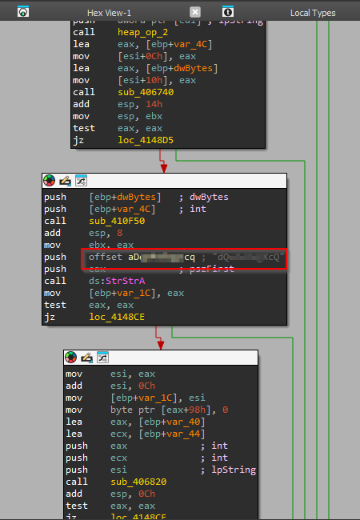
</p>

- There is one instruction that shows the malware launches a Chromium-based browser with remote debugging enabled, allowing it to programmatically control the browser and steal authenticated session data such as cookies, tokens, and wallet information.\
Enables Chrome DevTools remote debugging, Opens a debugging server on TCP port 9223. Allows full control of the browser via the DevTools protocol

<p align="center">
  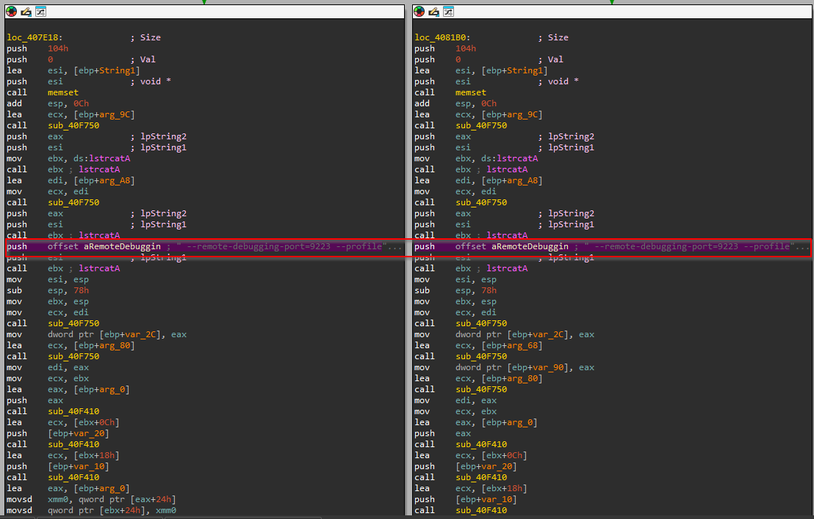
</p>

- This malware also has self deletion capabilities, whenever files are added in `C:\\ProgramData\\` folder the malware self cleans, the malware downloads multiple DLLs from the c2 and then these are stored under the `ProgramData` section, once the execution is complete the malware deletes these files as well.

- While analyzing the function which seems resposible for communicating with the c2 server for exfil we came across one small function inside it which was being called multiple times.\
This function is using `movaps` which is an assembly instruction used to `move 128 bits` (4 single-precision floats) of data `between XMM registers` or `between an XMM register and memory`.

<p align="center">
  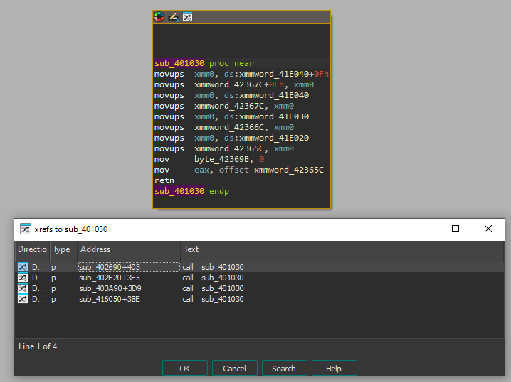
</p>

- When the `.rdata` region which contained this value was checked we came across a unique string which was used during the c2 communication.\
Currently it is being stored in little endian, so before we take the char representation we need to decode it accordingly.

<p align="center">
  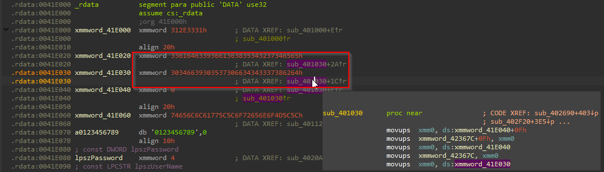
</p>

- Malware has capability to take screenshots as well, which are later deleted as self cleaning activity.

<p align="center">
  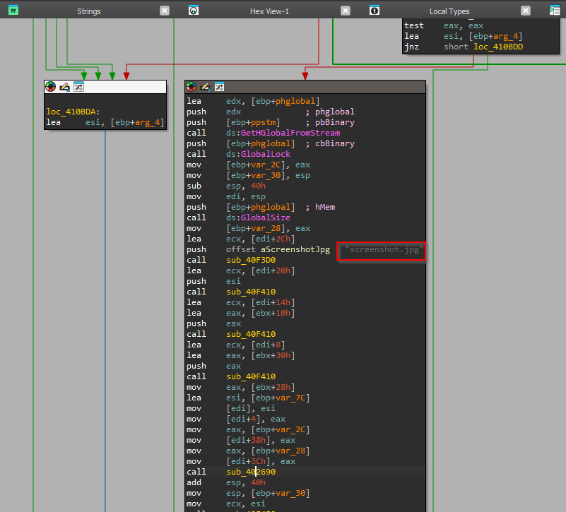
</p>
<p align="center">
  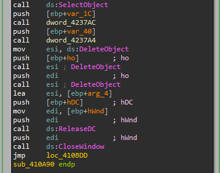
</p>

- Searching for crypto wallets like monero in users machine.
<p align="center">
  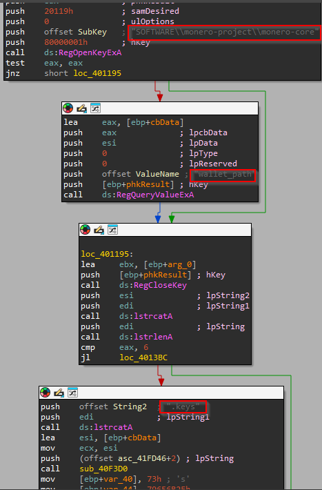
</p>

**Steam Process crawling**
1. Process Discovery: The function sub_00411250 (at address 0x00411250) is responsible for finding the process ID of a specific target. It uses the Windows Toolhelp32 API:
    * It calls CreateToolhelp32Snapshot (imported at 0x0041d052) with TH32CS_SNAPPROCESS (0x2) to get a list of all running processes.
    * It iterates through the processes using Process32First and Process32Next.
    * For each process, it compares the executable name against a target string (which, when called from 0x0040f170, is steam.exe).
    * If a match is found, it returns the Process ID (PID) of the Steam process.

2. Handle Acquisition: The PID returned by 0x00411250 is then passed to function 0x0040ee70 (via 0x0040f170). Inside 0x0040ee70:
    * The malware calls OpenProcess (at address 0x0040eeae, imported at 0x0042031c) with access rights 0x1ffff     (PROCESS_ALL_ACCESS) to acquire a full-access handle to the Steam process.

3. Crawling Logic: Once the handle is acquired, the malware "crawls" the Steam process's memory using ReadProcessMemory (inside 0x0040ee70) to search for specific patterns (e.g., 65 79 41 69 64 48 6C 77 49 6A 6F 67 49 6B 70 58 56 43 49 73) and extract sensitive information like steam tokens (often searching for the string N0ZWFt which is "Steam" in Base64-like encoding).

<p align="center">
  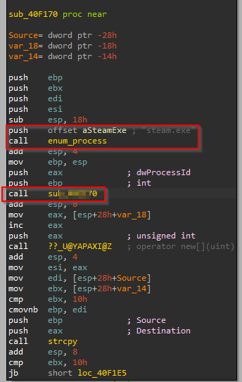
</p>

<p align="center">
  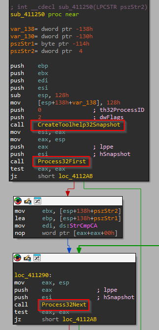
</p>

**Internal Strings to zero**
- The function sub_***3b0 is a __fastcall function that takes a pointer to the structure in the ECX register and performs the following operations:
   - Sets the dword at [ECX] to 0 (typically the data pointer).
   - Sets the dword at [ECX + 0x4] to 0 (possibly capacity or an
     internal flag).
   - Sets the dword at [ECX + 0x8] to 0 (typically the string
     length).
This function is used extensively in the binary.

<p align="center">
  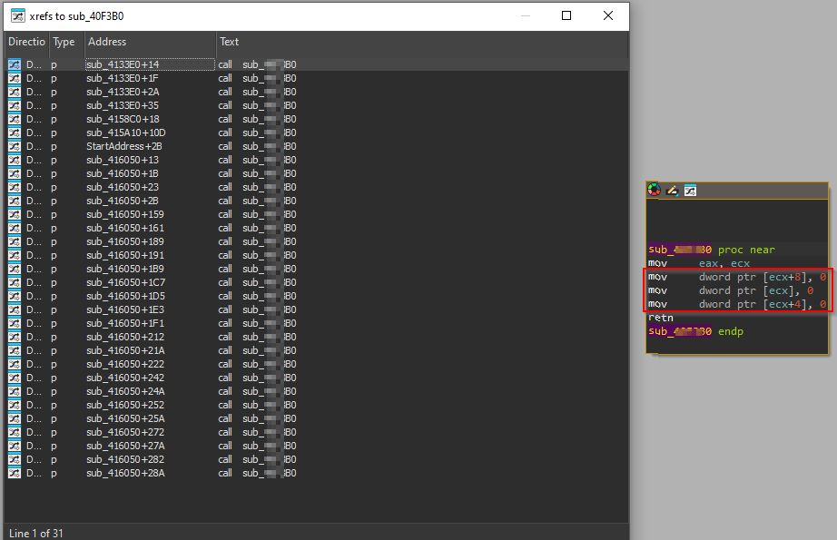
</p>


**Prevent multiple executions**
- During our analysis we came across a `CreateEventA` api call, this creates or opens an event object. 
    - If lpEventAttributes == NULL: The handle is not inheritable
    - If lpName is non‑NULL: The event becomes a named kernel object. If an event with that name already exists → the call opens it instead of creating a new one.
Named events are used as `global mutex` to `ensure only once instance of the program runs`.
<p align="center">
  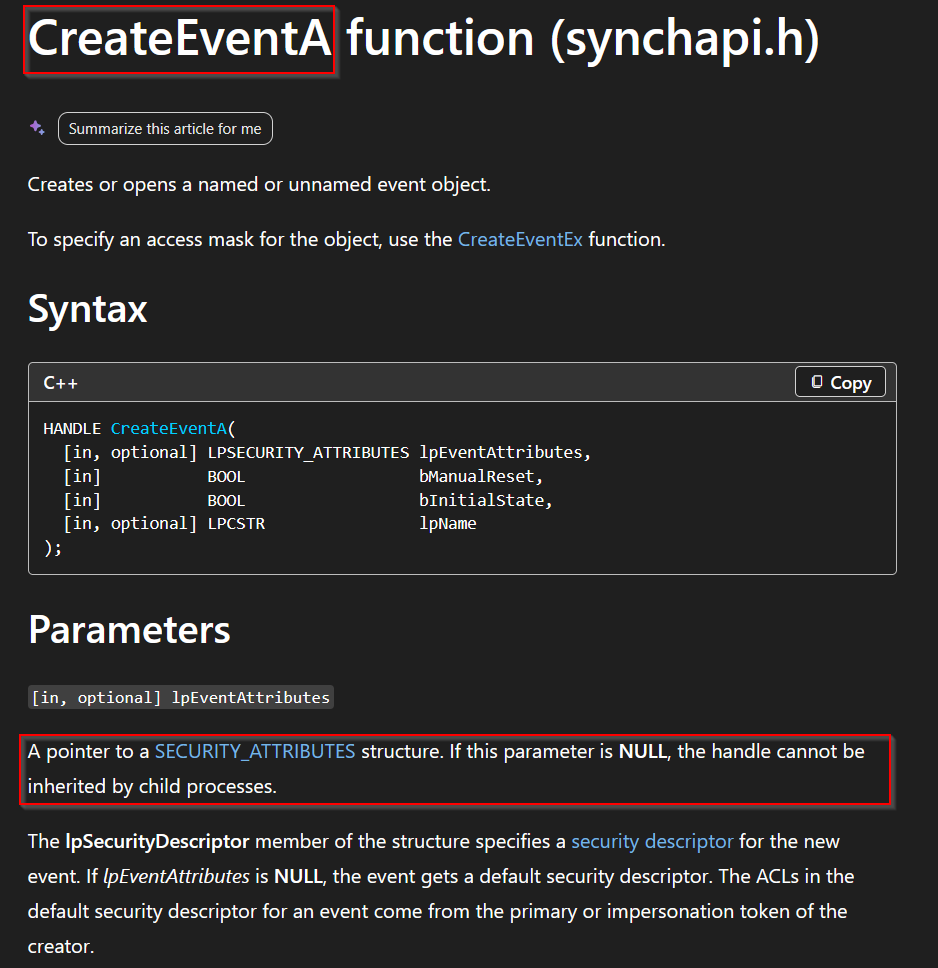
</p>

- When we started debugging we can see the named event object that is being used to ensure only single execution of the program.
<p align="center">
  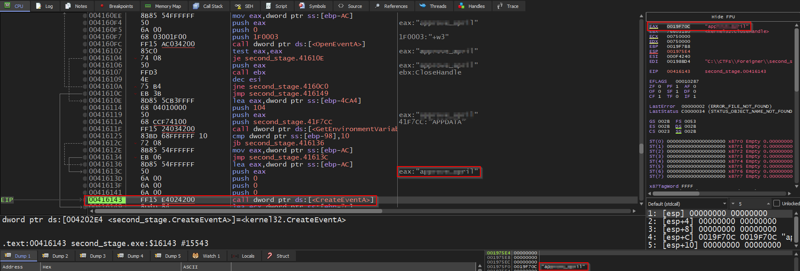
</p>

### Summary for the second stage
1. Core Functionality
  The malware is designed to harvest a wide range of sensitive information from an infected system, including:
   * Browser Data: Steals passwords, cookies, autofill data, and credit card information from popular browsers (Chrome, Firefox, Opera,
     etc.). It specifically looks for key4.db (Firefox) and Local State (Chrome) files and uses CryptUnprotectData to decrypt master
     keys.
   * Gaming Accounts: Targets Steam specifically, searching for login tokens in Soft\Steam\steam_tokens.txt.
   * Social Media: Harvests Discord tokens from local storage (\\Discord\\token).
   * FTP Credentials: Extracts saved server information from FileZilla (recentservers.xml).
   * Crypto Wallets: Targets the Opera Crypto wallet and likely other browser-based extensions.
   * System Information: Collects the computer name, username, hardware profile, local time, and list of running processes.

2. Stealth and Evasion
   * Obfuscation: The entry point is obfuscated with "junk code" (dead-code insertion) such as redundant loops and no-op instructions
     to hinder static analysis.
   * Dynamic Loading: It dynamically loads critical libraries like CRYPT32.dll and gdi32.dll at runtime to hide its true intentions
     from simple import table scanners.
   * Self-Deletion: It contains commands to delete its staging directories (e.g., rd /s /q "C:\ProgramData...) after execution to leave
     minimal trace.

3. Command & Control (C2) Mechanism
  The malware uses "Dead-Drop Resolvers" to find its actual command-and-control server:
   * Steam Profile: It references https[:]//steamcommunity[.]com/profiles/76561199829660832. Malware authors often hide C2 IP addresses or
     configuration strings in the profile summary.
   * Telegram: It uses https[:]//t[.]me/l793oy, which likely serves as either a data exfiltration channel or a backup C2 resolver.
   * Network Protocol: It uses WININET.dll for standard HTTP/HTTPS communication, imitating legitimate browser traffic.

4. Execution Workflow
   * Environment Check: Gathers system metadata and checks for the presence of targeted applications (Steam, Discord).
   * Data Harvesting: Scans specified directories for credential databases and session tokens.
   * Screen Capture: Uses GDI functions (BitBlt, CreateCompatibleBitmap) to take a screenshot of the user's desktop.
   * Staging: Copies stolen data to a temporary directory in C:\ProgramData\.
   * Exfiltration: Sends the collected data (often as a ZIP or encrypted blob) to the C2 server resolved via Steam or Telegram.
   * Cleanup: Executes a shell command to delete the temporary files and itself.

### Complete
