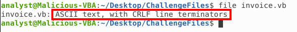
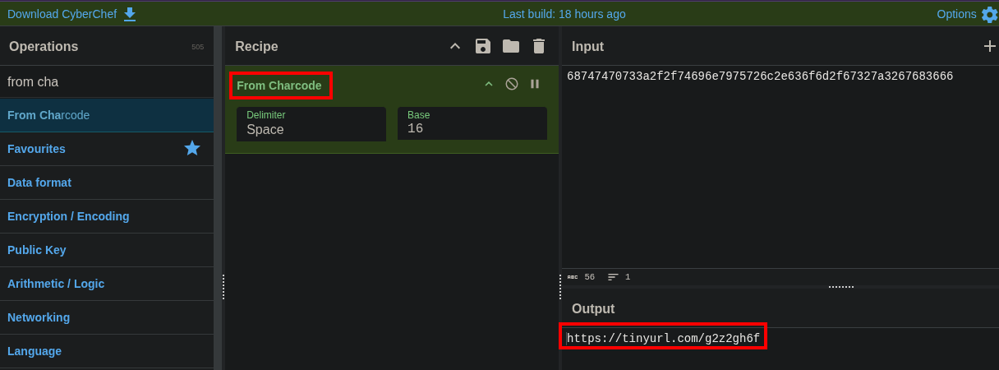
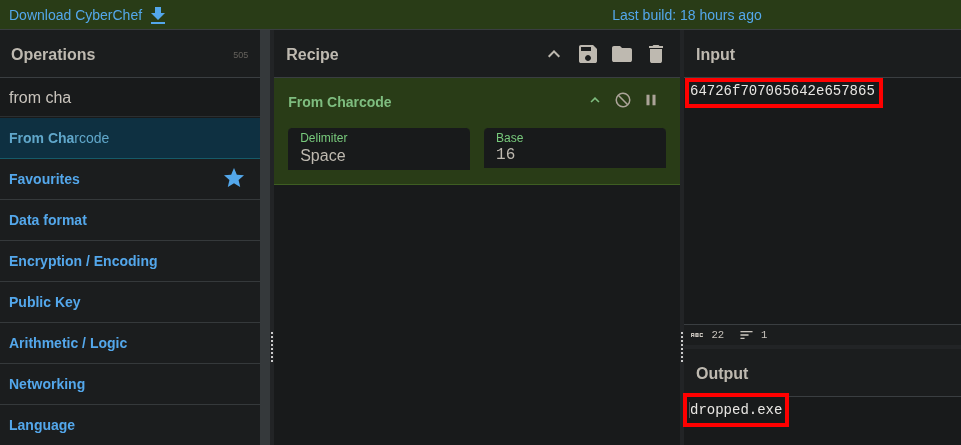
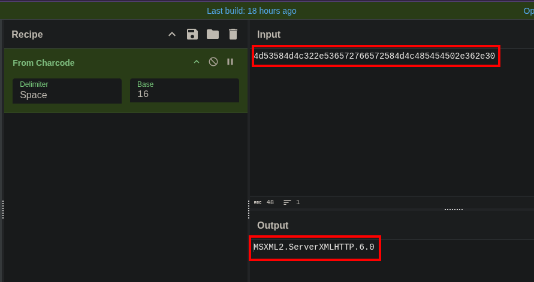
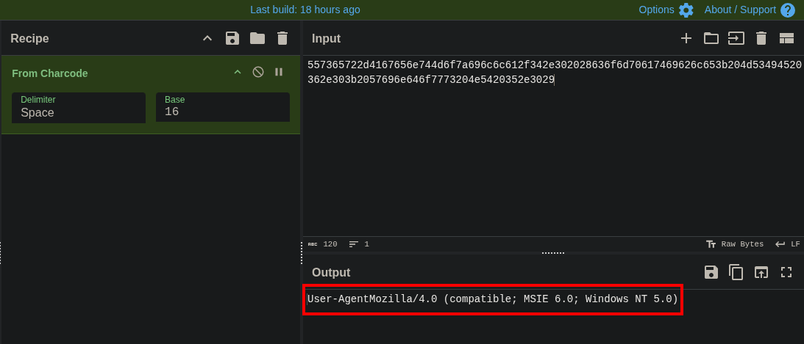
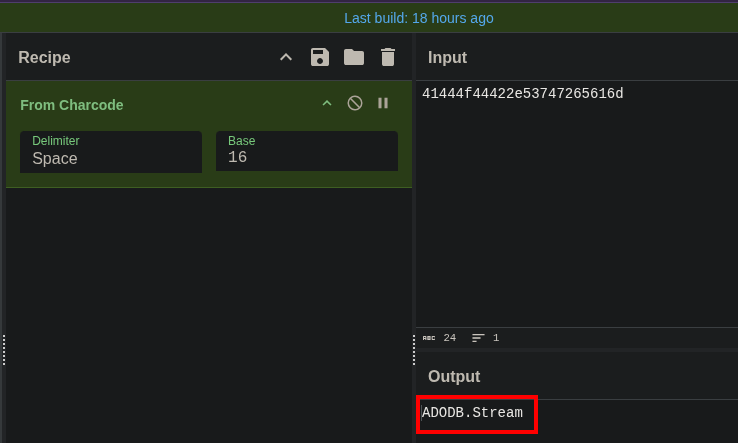
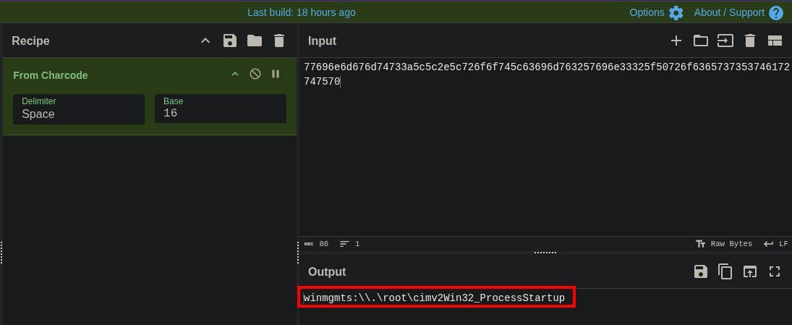
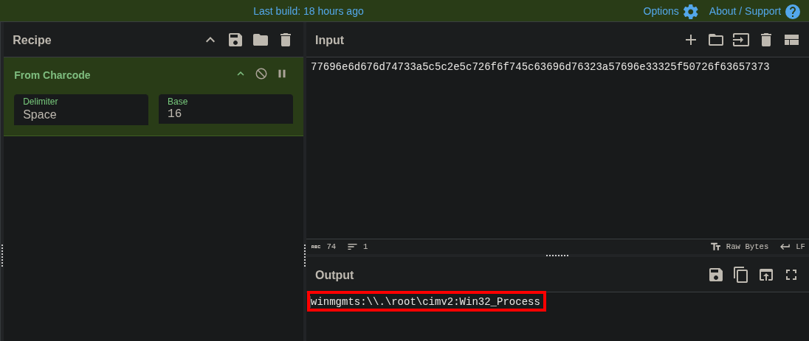

# Malicious VBA

### Sherlock Scenario
One of the employees has received a suspicious document attached in the invoice email. They sent you the file to investigate. You managed to extract some strings from the VBA Macro document. Can you refer to CyberChef and decode the suspicious strings?

### Static Analysis
We have an obfuscated VBA script, here our strategy is simplpe we have to analyze the strings that are present as part of function argument.

  

We can see that there is a function `hgmneqolwgxg` which is used multiple times in our code, this function takes in arguments.\
These arguments we can decode using `CharCode` or `From Hex` recipe at CyberChef for decoding purpose.

**Findings**
- Initial Access & Staging: The dropper reaches out to `https[:]//tinyurl[.]com/g2z2gh6f` to retrieve its payload.

  

- Payload: The downloaded malicious executable is named `dropped.exe`.

  

- Network Infrastructure: Connections to the malicious server are established using the `MSXML2.ServerXMLHTTP` object.

  

- Evasion (Network): The attacker spoofs the User-Agent `Mozilla/4.0 (compatible; MSIE 6.0; Windows NT 5.0)` to blend in with legacy web traffic.

  

- File Operations: The script uses the `ADODB.Stream` object to handle reading and writing the binary data to disk.

  

- Execution (Host): The payload is executed via Windows Management Instrumentation (WMI) using the `winmgmts:\\.\root\cimv2:Win32_Process` path, likely to hide the suspicious process execution from basic monitoring.

  

  

### Incident Analysis
The provided invoice.vb file functions as a classic, heavily obfuscated dropper script designed to silently compromise a host. By masking its true intent with character-encoded strings, the script attempts to bypass static security controls. Once running, it utilizes native Windows COM objects to establish an HTTP connection, spoof a legacy web browser, and download a secondary executable (dropped.exe). It then writes this binary to the file system and leverages WMI to execute the payload covertly in the background, completing the infection chain while actively evading basic host detection mechanisms.
