# Novitas

### Challenge Description
Recently, Binz received a request via email to create a 3D model for a client's family. Upon downloading and opening the provided files, he observed unusual system behavior that raised suspicion. Acting on instinct, he promptly deleted the files; however, he remained concerned that the system might still be compromised. In response, we acquired a full memory dump from the affected machine for in-depth malware analysis. The objective of this investigation is to identify indicators of compromise (IOCs) that can be integrated into our Endpoint Detection and Response (EDR) systems, as we suspect the use of a novel and sophisticated infection vector.

For this challenge we are provided with a memory dump. We'll be using `Volatility`.

### Using Volatility
- First we are going to get the general information about the image using `windows.info`.
```sh
vol3 -f memory.raw windows.info  
Volatility 3 Framework 2.24.0
Progress:  100.00		PDB scanning finished                                                                                              
Variable	Value

Kernel Base	0xf80437a00000
DTB	0x1ad000
Symbols	file:///home/kali/tools/volatility3/volatility3/symbols/windows/ntkrnlmp.pdb/CA8E2F01B822EDE6357898BFBF862997-1.json.xz
Is64Bit	True
IsPAE	False
layer_name	0 WindowsIntel32e
memory_layer	1 FileLayer
KdVersionBlock	0xf8043860f368
Major/Minor	15.19041
MachineType	34404
KeNumberProcessors	4
SystemTime	2024-09-05 16:01:34+00:00
NtSystemRoot	C:\Windows
NtProductType	NtProductWinNt
NtMajorVersion	10
NtMinorVersion	0
PE MajorOperatingSystemVersion	10
PE MinorOperatingSystemVersion	0
PE Machine	34404
PE TimeDateStamp	Wed Jan  4 04:27:11 1995
```

- Checking the processes that are running on the machine and analyzing if there is some suspicious one.\
Initally I thought that processes like `HxTsr.exe`, `HxAccounts.exe` are some vulnerable ones but reading about them made it clear that these are binaries that are associated with Microsoft Outlook and Microsoft email service.\
Some common system process which were observed are `System, smss.exe, csrss.exe, wininit.exe, services.exe, lsass.exe, explorer.exe, SearchIndexer.exe, RuntimeBroker.exe, and dllhost.exe`.\
The ones which are not normal or are user launched are `3DViewer.exe, View3D.Resource, FIRSTRUN.EXE, EXCEL.exe and DumpIt.exe`.
- It's already mentioned that dump was taken by the user so it makes sense that DumpIt.exe is running on the machine. Still unable to determine which process is the vulnerable one. Maybe the process is hidden.\
Let's run a psScan or psXView for this we might get something.
```sh
0xa7850b4c0080	autochk.exe	380	False	True	False	False	2024-09-05 14:50:20+00:00
0xa7850e1023cd	dexer	125689842201708	False	True	False	False	
0xa7850cf682c0	WmiPrvSE.exe	2984	True	True	True	True
```
- We can see that there is a process with a very big process-id and when we check it information using psscan we see the following information. Another suspicious part to note is that the lauch time is in 2000. This may be the case that it's being masked by the malware.
```sh
125689842201708	124014127218692	dexer	0xa7850e1023cd	3	-	-	True	2000-08-31 04:05:52.000000 UTC	-	Disabled
```
- But when trying to get more information on the following process we are not getting any specific item. One thing we should note that the user deleted the files which they downloaded. So we'll need some way we can get the content which was wiped. For doing so we have some options that we can try.
- First is performing a psScan.
- Second is checking the Master File Table(MFT).\
The Master File Table (MFT) is a crucial system file within the NTFS (New Technology File System) that acts as a directory for all other files and directories on an NTFS volume. It stores metadata about every file and folder, including its location on the disk, size, timestamps, permissions, file creation, modification and deletion as well.\
When we parse the Master File table using the `windows.mftscan.MFTScan`. We get the result which has a column named **Link Count** which refers to the *number of directory entries that point to a specific file or directory record*. So when this value is 0 then we can say that file no reference or deleted
- Third is checking the Amcache File.\
Amcache was introduced in the Windows OS to improve program compatibility by maintaining a cache of information about installed applications. It stores applications’ metadata to ensure their compatibility with the Windows environment. Using this artifact, forensic investigators can extract the file metadata, including the file hash, execution time, and other details.

- Process scan gave the following results, though one thing suspicious here is mmc being used.\
Microsoft Management Console (MMC), a core Windows framework for creating and running administrative tools (snap-ins like Device Manager, Event Viewer, Services) to manage system hardware, software, and network components through a unified interface, often by opening .msc files. MMC is a lolbin which is used by attackers to load snap-ins.
```
<REDACTED>
1632    5284    msedge.exe      0xa7850f18f0c0  14      -       1       False   2024-09-05 15:56:55.000000 UTC  N/A    Disabled
8076    824     3DViewer.exe    0xa7850e2da080  19      -       1       False   2024-09-05 15:57:41.000000 UTC  N/A    Disabled
4364    824     RuntimeBroker.  0xa7850f481340  6       -       1       False   2024-09-05 15:57:42.000000 UTC  N/A    Disabled
7704    1972    audiodg.exe     0xa785110230c0  6       -       0       False   2024-09-05 15:57:44.000000 UTC  N/A    Disabled
7676    4364    View3D.Resourc  0xa785113990c0  8       -       1       True    2024-09-05 15:57:45.000000 UTC  N/A    Disabled
3120    3144    mmc.exe 0xa78511394080  14      -       1       False    UTC  N/A     Disabled
7736    3120    dllhost.exe     0xa785113c9080  6       -       1       False   2024-09-05 15:58:17.000000 UTC  N/A    Disabled
7508    116     FIRSTRUN.EXE    0xa7850fed1340  18      -       1       False   2024-09-05 15:59:46.000000 UTC  N/A    Disabled
960     824     SppExtComObj.E  0xa7850ff7d0c0  7       -       0       False   2024-09-05 15:59:46.000000 UTC  N/A    Disabled
4488    680     svchost.exe     0xa78511ff0080  9       -       1       False   2024-09-05 16:01:06.000000 UTC  N/A    Disabled
4732    780     taskhostw.exe   0xa7851125f080  8       -       1       False   2024-09-05 16:01:08.000000 UTC  N/A    Disabled
8608    824     RuntimeBroker.  0xa78511fe9340  8       -       1       False   2024-09-05 16:01:11.000000 UTC  N/A    Disabled
8664    824     RuntimeBroker.  0xa78511c7e080  4       -       1       False   2024-09-05 16:01:12.000000 UTC  N/A    Disabled
<REDACTED>
```
- But from this we cannot conclude anything major, so we ran the `cmdline` for extracting the command line history. Here we can see that mmc is being used to execute an `msc` file from the Edge Downloads.\
This confirms our suspicion that mmc was used to load a .msc file. From here embedded scripts\COM objects can be executed.

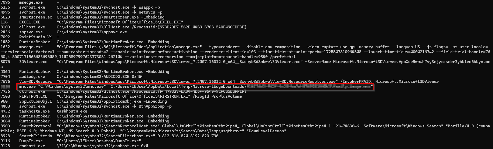

- Checking the pstree for the parent process of mmc. We can see that this parent process is explorer, which confirms that launch by user interaction.

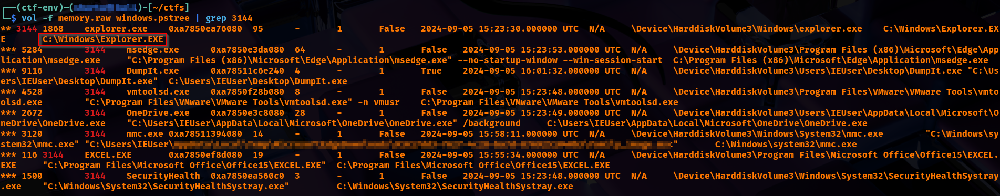

- From the question description we know that the user deleted the file from the machine, we know from the above analysis that the ms-edge is involved, so we'll check if there is way we can get the history of browsing. After some search got to know about a History file located under `\Users\<user>\AppData\Local\Microsoft\Edge\User Data\Default\`.\
This file is an SQLite database file which contains the entire browsing history. So now the target is to perform a filescan and get this hiostory file and dump it.
```bash
vol -f memory.raw windows.filescan | grep History            
0xa7850c78bb80.0\Windows\System32\CallHistoryClient.dll
0xa7850f524970	\Users\IEUser\AppData\Local\Microsoft\Edge\User Data\Default\History-journal
0xa7850f527080	\Users\IEUser\AppData\Local\Microsoft\Edge\User Data\Default\History
0xa7850f8665d0	\Users\IEUser\AppData\Local\Microsoft\Edge\User Data\Default\History-journal
0xa7850fa8e2d0	\Windows\System32\winevt\Logs\Microsoft-Windows-FileHistory-Core%4WHC.evtx


vol -f memory.raw windows.dumpfiles --virtaddr 0xa7850f527080
Volatility 3 Framework 2.26.2
Progress:  100.00		PDB scanning finished                        
Cache	FileObject	FileName	Result

DataSectionObject	0xa7850f527080	History	file.0xa7850f527080.0xa7850ecd0db0.DataSectionObject.History.dat
SharedCacheMap	0xa7850f527080	History	file.0xa7850f527080.0xa7850f1798a0.SharedCacheMap.History.vacb
```
- Once we dump these files, we can open them using sqlite browser. Under the downlaods table we'll see the downloaded items, from there we can get the size of the archive file containing the malware.
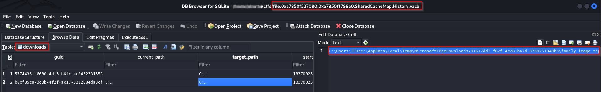

Now we need some way we can either extract this zip file or a way we can mount the raw file in our machine so as to use it as a Virtual File system.\
We can use `MemProcFS` for the same. MemProcFS is an easy and convenient way of viewing physical memory as files in a virtual file system.
```
memprocfs.exe -device memory.raw -forensic 1
```
Before running the above command we need to install DOKANY file system library, this we can get from this [url](https://github.com/dokan-dev/dokany/releases/tag/v2.3.1.1000).

- Now that we have the raw bytes mounted we can go to the target Process ID under under the pid folder. Here we can see multiple folders like modules, minidump, files, handles etc.\
For getting the number native modules being used we are are going to navigate to the modules directory and then check the modules.txt file, it contains 104 lines, removing first two, we have a total of 102 modules.
```
find /c /v "" "modules.txt"
```
The question is asking us to provide the native(NAT) modules, our list includes both the native modules and native images. For our response we just have to subtract the number of native images from the total.\
".ni." stands for Native Image. These are generated by the Native Image Generator (Ngen.exe) tool, which compiles .NET assemblies (DLLs/EXEs) into machine-specific code, rather than Intermediate Language (IL).

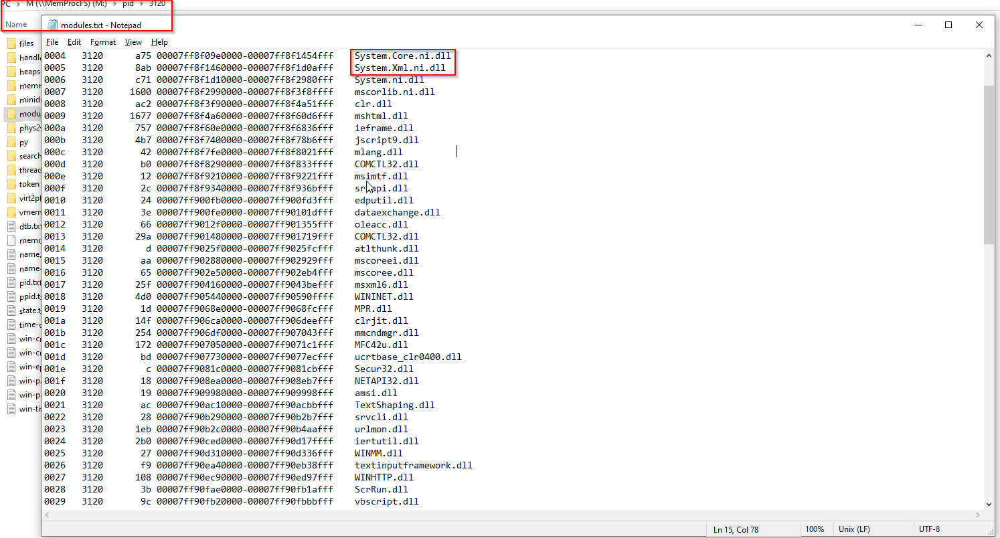

Now we'll need to interact with the minidump file, for this we'll use windbg. This minidump is a serialized snapshot of a process created in the MiniDump format. It typically contains:

- Threads & CPU registers (for each thread)
- Call stacks / stack memory
- Loaded modules (DLLs, their base addresses, version info)
- Limited memory segments (selected regions; not the entire address space)

Once we have loaded the minidump in windbg we use the following commands
```
.loadby sos clr
!DumpDomain
```
The first command loads the sos.dll(debugging extension) from the same directory as clr so as to avoid version mismatch. This loads the .NET debugging engine (SOS) that WinDbg is needed to inspect .NET code, .NET memory, .NET objects, and .NET threads.\
Windbg alone cannot understand .NET, it only understand native memory. Son Of Strike provides it this capability.\
Second command ists every .NET AppDomain, every assembly, and every module loaded in the process.

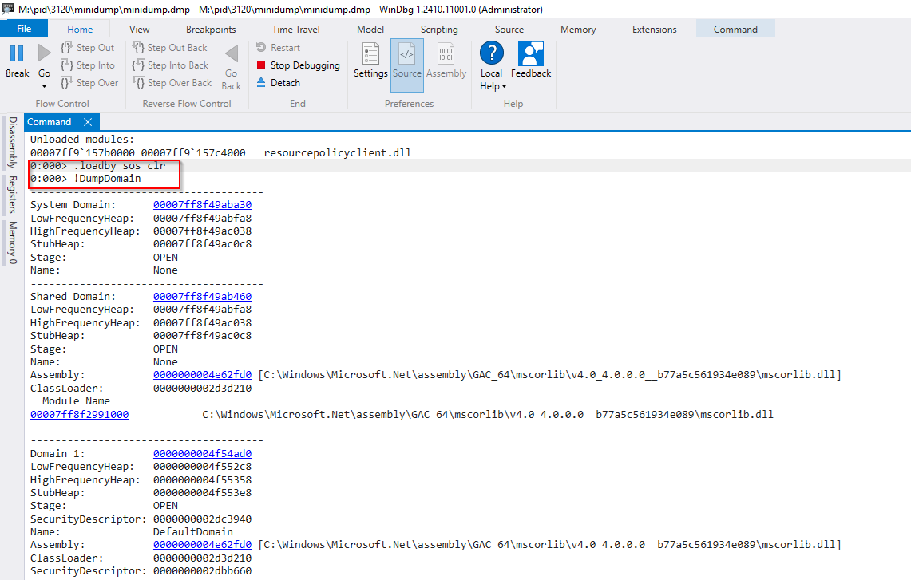

From the response of the above image we can get the name of the malicious module as well. The indicators being a random hex for a name, no file path associated.\
For saving this module we use the address that we extracted from the dumpdomain command, first confirm the address that we are passing, then we save it.
```
!dumpmodule 00007ff894956b70
!savemodule 00007ff894956b70 C:\CTFs\Novitas\Ad00bce9305554c87927205710b17699f.dll
```
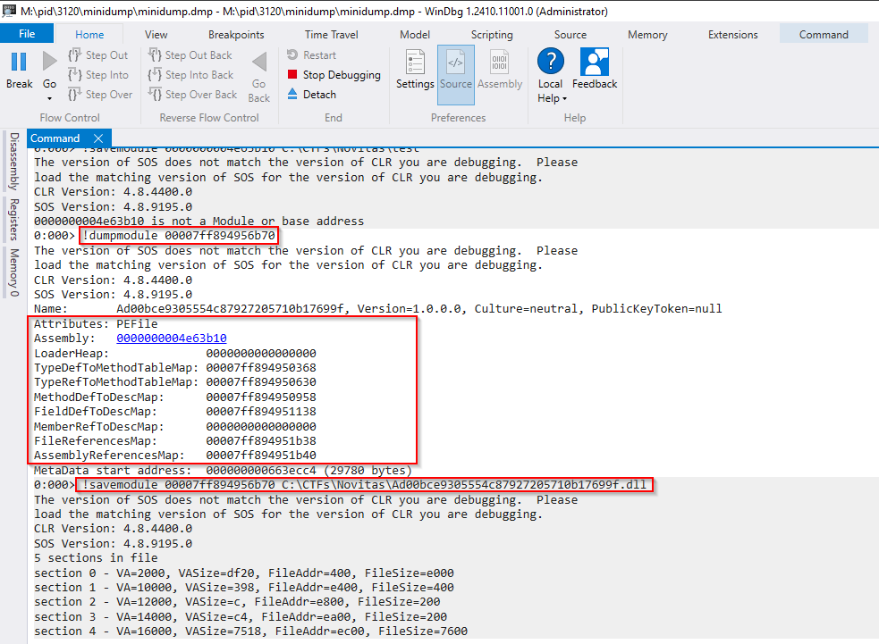

### Analyzing the DLL
Feeding the extracted dumped entity to Detect it Easy, we can see that it
s a .NET based DLL.
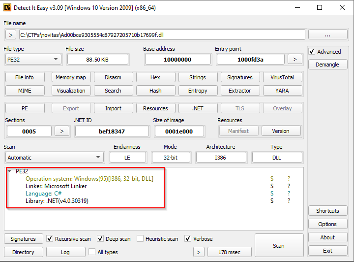

Virustotal result
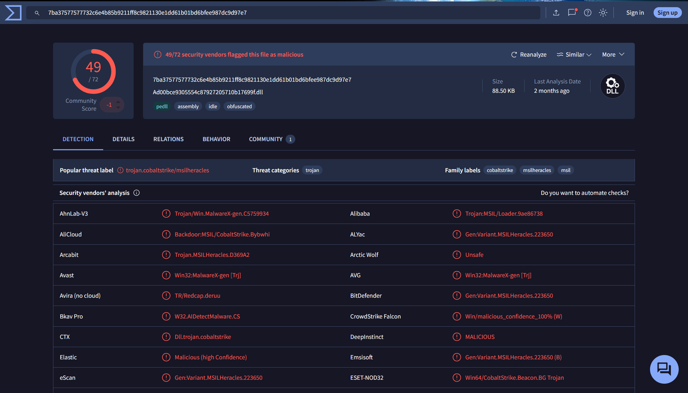
We can see that the dll is a trojen which belongs to cobaltstrike family (a famous c2), obfuscated file.

Cobalt strike being very popular tool for c2, tried checking if there are some tools that can help us in decrypting cobalt strike traffic, while searching for the same came across this [repo](https://github.com/DidierStevens/DidierStevensSuite/tree/master) and [video](https://www.youtube.com/watch?v=rpsnPwdxTnA).\
Using the `1768.py` file we can decrypt cobalt strike traffic from memory dump that we have.

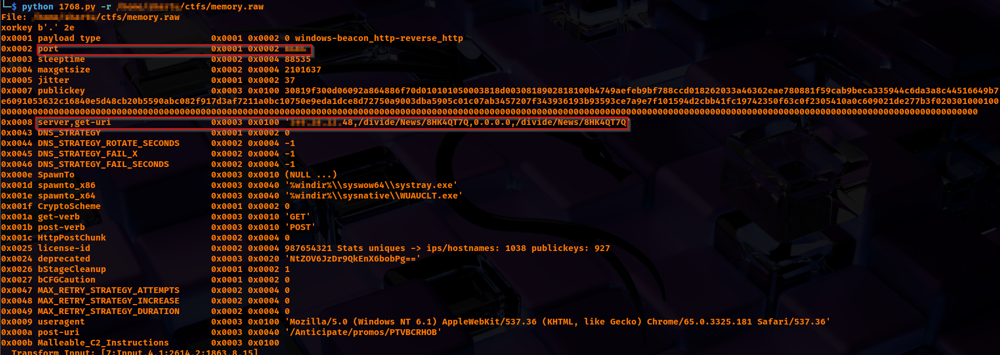


While checking the peb we can see a bunch of environment variables that are set for the current process.

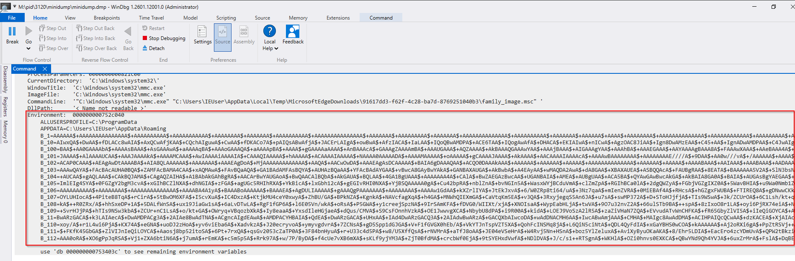

For extracting the same we can use volatility plugin windows.envars.Envars and obtain all environment variables.

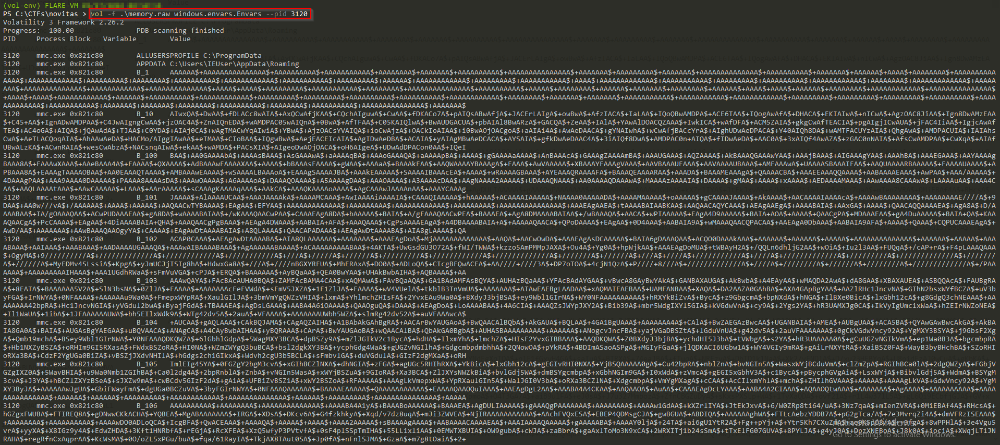
One thing to note over here is that there are a bunch of entries with the name `B_<some_number>`. Currently we are not aware what is the use of these variables.

When we check the pe-studio for this dll we can see that pe-studio highlights some strings.

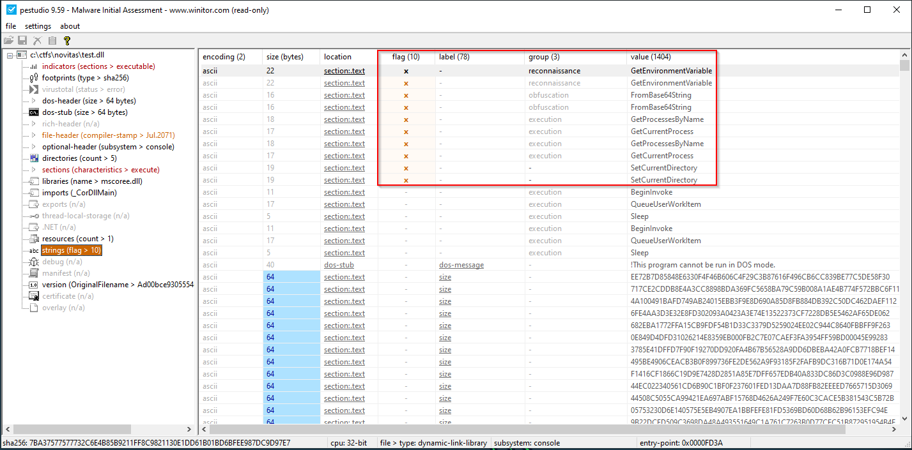

#### Advanced Static Analysis
We will load the DLL in DnsPy. The code is obfuscated which makes it difficult for us to analyze the code.

While going through the code we saw one code block which indicates towards something similar that we saw while we were checking the environment variables.\
From this code portion we can see that environement variables are being fetched in a specific format of a specified process and then being appended in text2.\
This also confirms the result that we saw from pe_studio
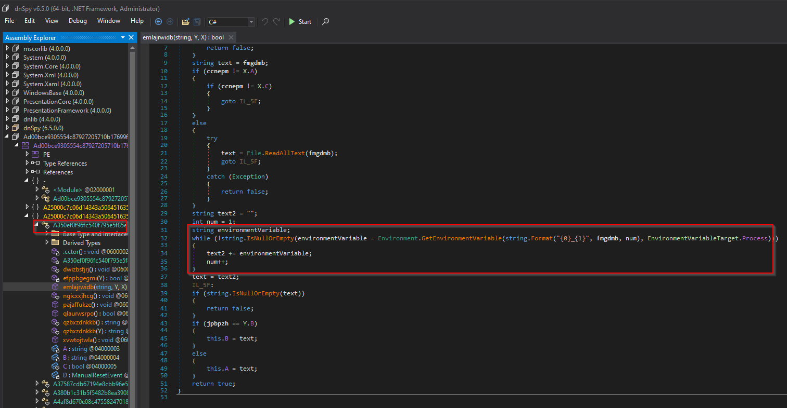

While navigating the dll we came across a function which seemed like it was processing the incoming string and then returning a byte array. The processing consisted of:
- First replacing "A$+" with nothing.
- then reversing the array
- at the end applying FromBase64String.

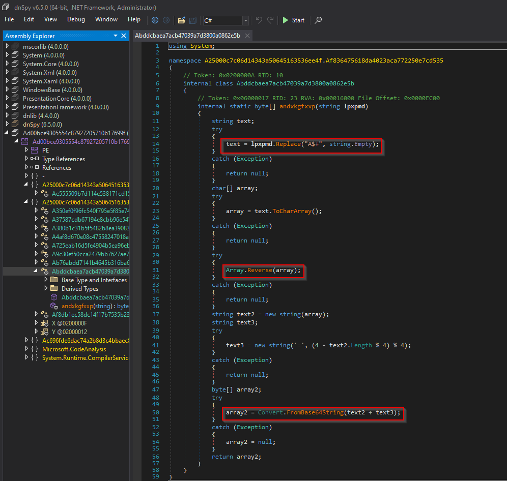

Processing the data extracted from environment variables with. We just need the data, we have to remove all the extra things like, mmc.exe, address, B_number. And have to order the variables numerically that is data from B_1, B_2, B_3 etc. Once this is done only then we can move to processing the data based on the logic that was extracted from the dll.

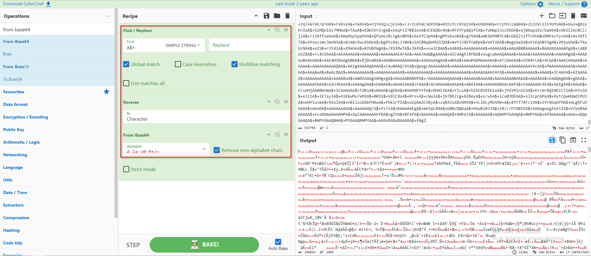

**Note:** This is not an extensive walkthorugh, just the way I approached the challenge. When stuck I've reffered this [blog](https://hackmd.io/KWAUAJIQSUi2HaJGpMMgTQ?view).

#### Complete
