# PhantomRing

### Sherlock Scenario
Your organization's SOC team intercepted a suspicious binary during a routine threat hunting operation on a Linux server. The file was found in /var/tmp with an unusual name and was attempting to establish outbound connections. Initial analysis suggests this could be a post-exploitation agent. Your task is to perform static analysis on the binary to identify its capabilities, extract indicators of compromise, and understand the threat actor's infrastructure.

### Basic Static Analysis
- Running DIE

  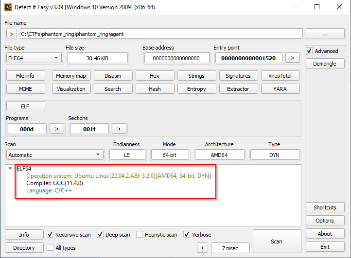

- Checksum

  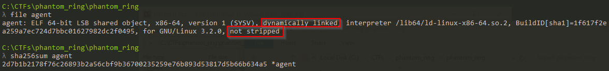

- Virustotal response

  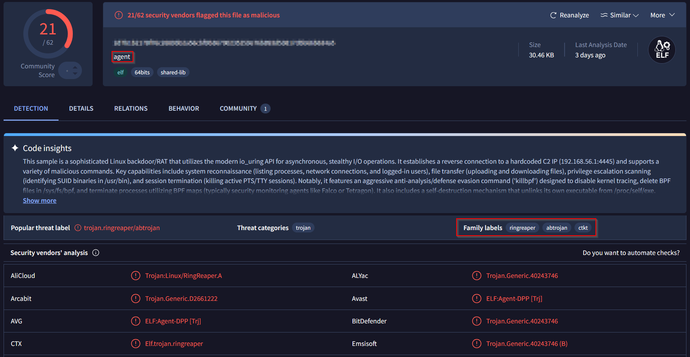

The binary that we have is an ELF which is dynamically linked and is not stripped, due to the fact its not stripped we won't lose the function and variable names and it'll be easy for us to reverse the binary.

### Advandced Static Analysis
Following diagram shows the call structure in the program.

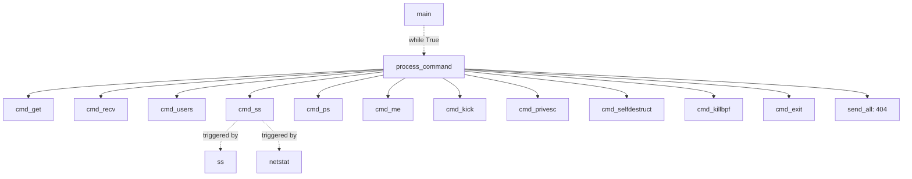
- In the main function we have the details for connection establishment, information like the IP and port for the outbound connection. Then we have a loop which calls the `process_command` function.

  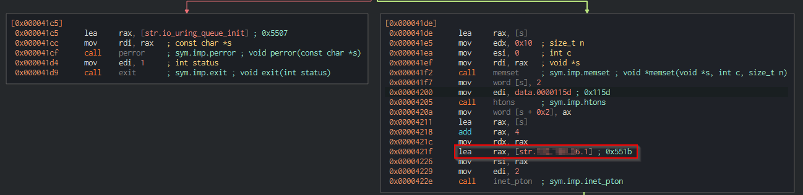

- In the main function we can see the reconnect request after a certain amount of time.

  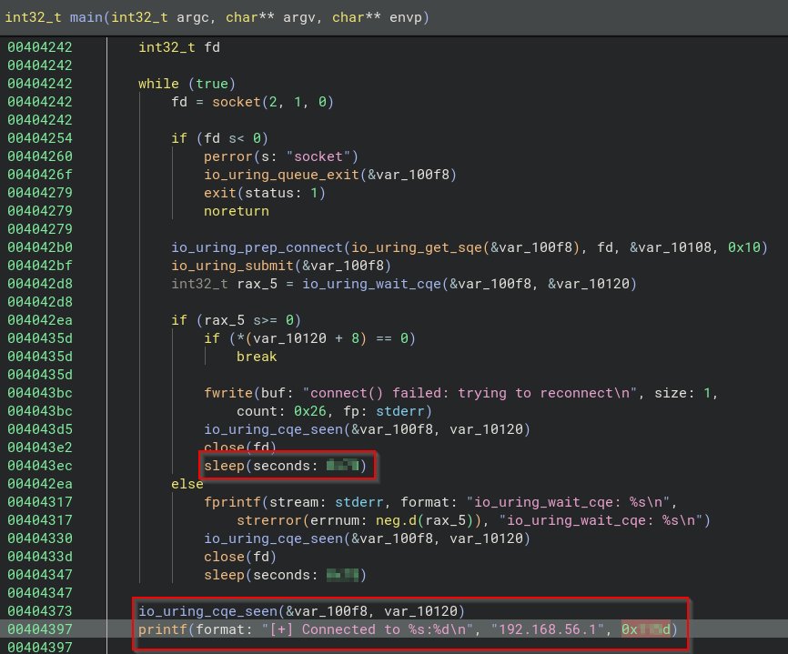

- Process command function has multiple functions which gets called based on the input that comes from the user.

  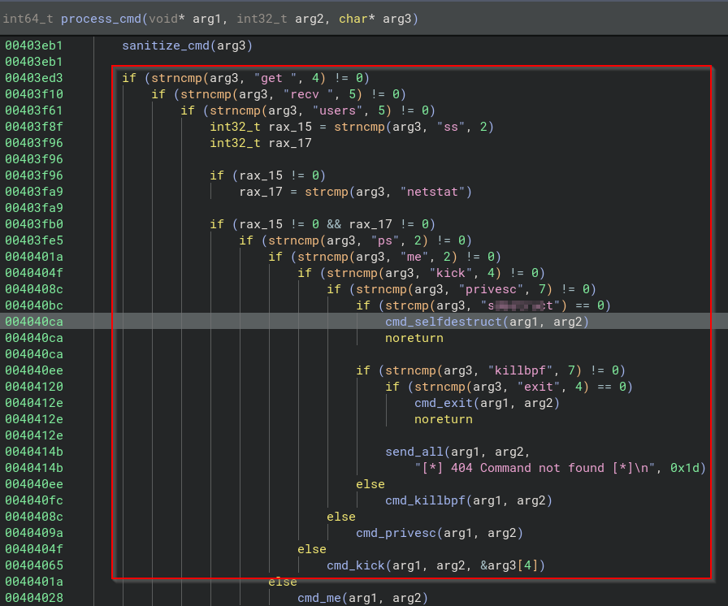

- The program traversed a dynamic file which tracks information about which users are currently active. The binary is present under `/var/run/` location.

  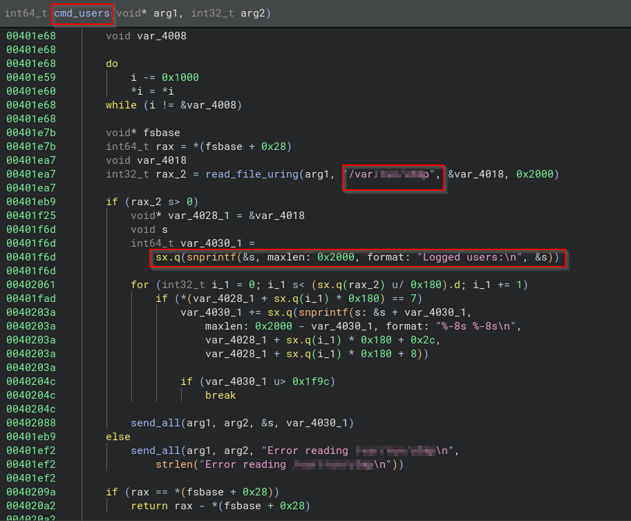

- While checking the `cmd_killbpf` function we can see that there are three files which are being targeted, these files are located at `/sys/kernel/debug/tracing/`. This directory contains Linux kernel's built-in trace infrastructure. EBPF uses kernel tracing, the tracing would be disabled primarily to evade detection, blind system administrators, and protect malicious processes from being monitored by in-kernel security tools

  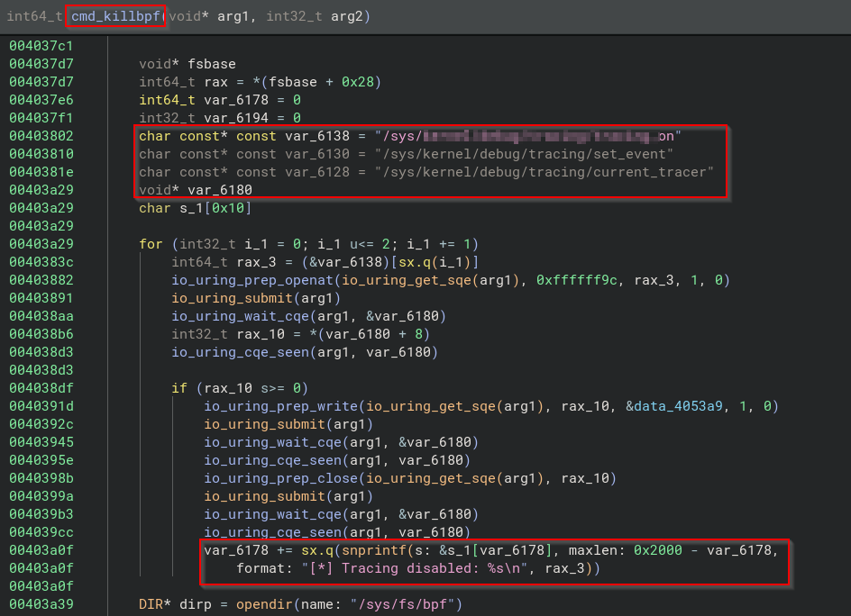

- In the same function we can see a specific memory region that is being searched by the program, this memory region belongs to `eBPF` and is located under `/proc/[pid]/maps`.\
Later an attempt to kill this process is done. Common reasons an attacker would kill process with bpf-map:
  - Disable eBPF-based security products.
  - Disable kernel monitoring agents.
  - Remove runtime detection tools.
  - Kill observability/telemetry components that use eBPF.

  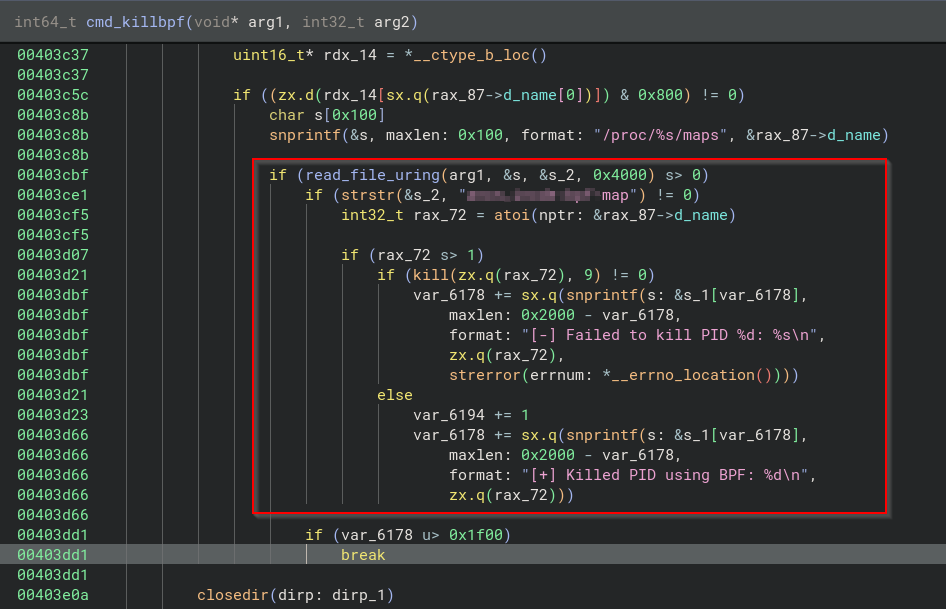

- Modern linux systems have a faster replacement for netstat command which is `ss (Socket Statistics)`. This is a CLI utility, the malware has feature to do the same.

  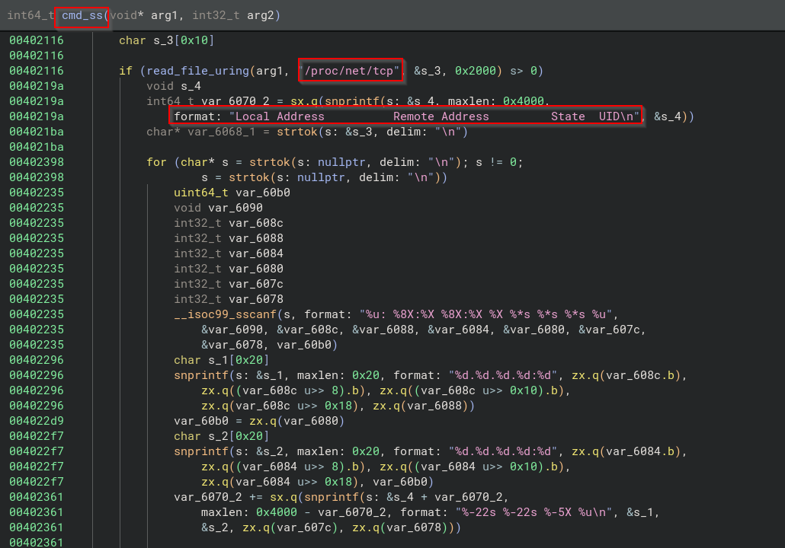

- The program has the feature to perform privelege escalation by searching for SUID binaries.

  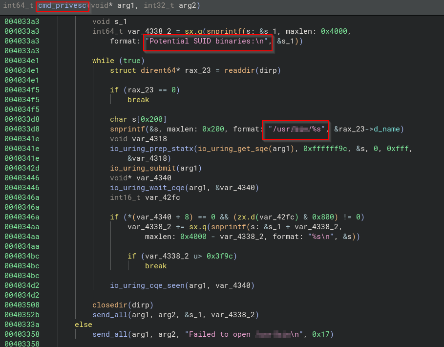

- Malware can also delete itself when it recieves a specific command from the user, following images shows the functionality and calling of the function. It tries to read the link of the file and then unlink that file.

  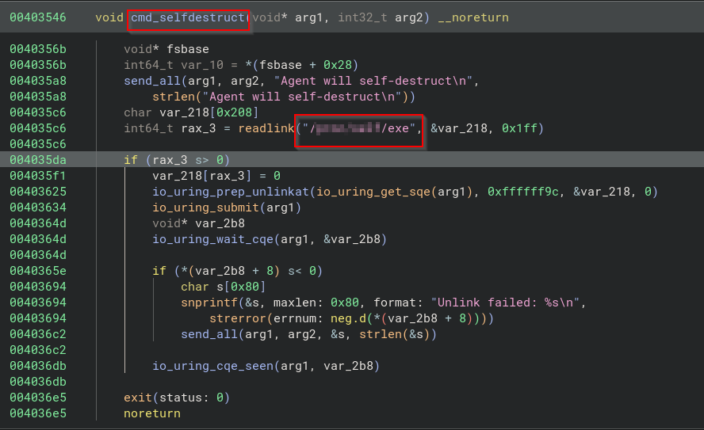

  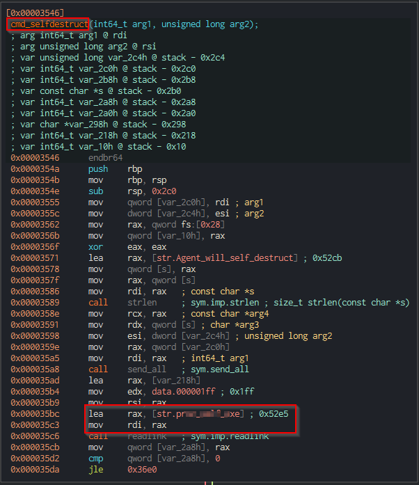

  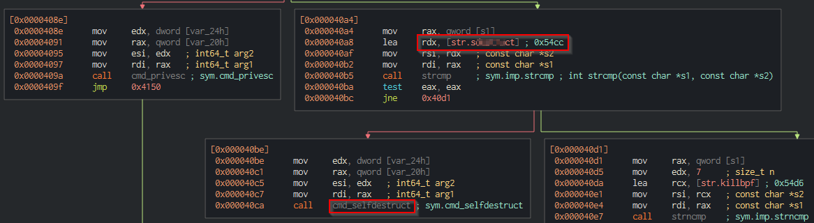

- Apart from the functions that are being called by the `process_command` we can see multiple functons with [io_ring](https://man7.org/linux/man-pages/man7/io_uring.7.html).\
`io_uring` is a Linux-specific API for asynchronous I/O.  It allows the user to submit one or more I/O requests, which are processed asynchronously without blocking the calling process.\

Most Linux EDRs monitor activity by:
    - Hooking syscalls
    - Using eBPF syscall probes
    - Tracing read, write, openat, connect, send, recv, etc.

With `io_uring`, operations are submitted to shared ring buffers and executed asynchronously by the kernel. Instead of generating a normal syscall event for every file or network operation, the process queues requests through the `io_uring` interface, creating a visibility gap for products that rely primarily on syscall telemetry.

#### Complete
