# ShadowMonarch

### Sherlock Scenario
A major telecommunications provider in Southeast Asia discovered suspicious network activity originating from one of their core infrastructure servers. Despite running enterprise-grade EDR solutions, no alerts were generated. The SOC team noticed unusual outbound connections that seemed to originate from legitimate system processes.

During incident response, the team recovered a suspicious binary from /dev/shm and captured network traffic containing what appears to be the activation sequence. Your mission is to fully reverse engineer this sophisticated backdoor, understand its BPF-based evasion mechanism, reconstruct the activation protocol, and extract all indicators of compromise.

## Static Analysis
- Detect it Easy

<p align="center">
  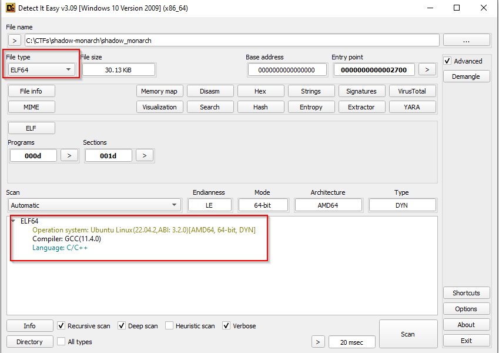
</p>

- Virus Total check

<p align="center">
  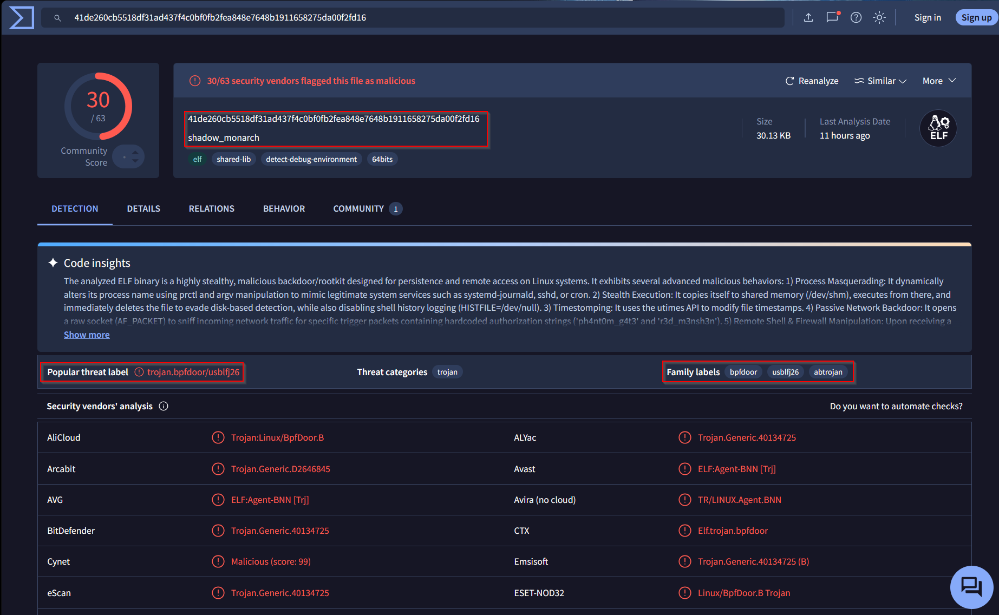
</p>

As the sherlock scenario asks us to reverse engineer this backdoor and get all indicators of compromise we'll jump to the Advanced Static analysis section.

## Advanced Static Analysis

### Main function
At the starting of main function we can see mutliple references to system binaries.

<p align="center">
  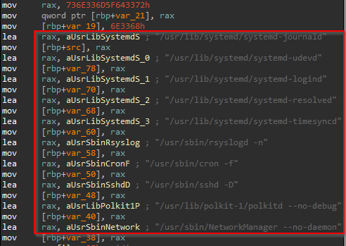
</p>

Following is the base information for these binaries:

- **systemd-journald** is the centralized logging service for the systemd ecosystem. It automatically collects, indexes, and stores structured logging data—including kernel messages, standard service outputs, and syslog entries.

- **systemd-udevd** is the Linux kernel's device manager daemon. Running in the background, it listens for kernel uevents (like plugging in a USB or a network card) and dynamically creates or removes device files in the /dev directory.

- **systemd-logind** is a crucial background service that manages user logins, active sessions, and hardware power states in Linux systems.

- **systemd-resolved** is a system service in Linux that provides network name resolution to local applications. It acts as a local stub resolver, handling DNS caching, DNSSEC validation, and routing queries to upstream DNS servers, Multicast DNS (mDNS), and LLMNR.

- The **polkitd** executable is located at */usr/lib/polkit-1/polkitd*. It runs in the background to handle system-wide privilege authorizations, such as authenticating when you use sudo or modify system settings in a GUI.

- The *systemd-user-runtime-dir* service (or systemd-runtime) manages the creation and cleanup of /run/user/$UID, the secure, RAM-based XDG runtime directory where users store temporary files, IPC sockets, and D-bus sessions. It provisions this at login and removes it upon final logout.

### Lock Files
Transient lock files to prevent multiple instances of an application from running simultaneously.

After these files we can see a location */var/run*, the */var/run* directory in Linux stores volatile runtime data describing system processes since the last boot, such as Process ID (PID) files and temporary communication sockets. Its contents are automatically cleared or reset upon every system reboot to prevent stale or conflicting process identifiers.\
Lock files are stored in the same directory

<p align="center">
  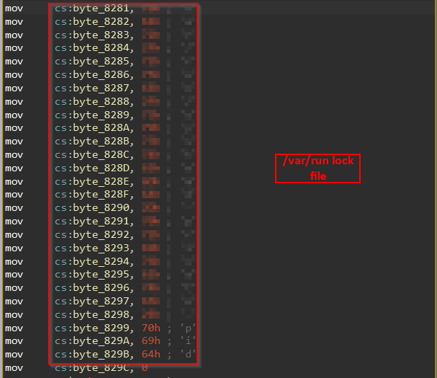
</p>

We can see that the lock file access is being checked and then later guid function is used to get running user details.

### Copy and Init function
Analyzing main function a little more we can see that a function is being called with a string argument of `systemd-***`, when we go into this function we can see the following commands being executed.
```sh
/bin/rm -f /dev/shm/.systemd-***;
/bin/cp <self> /dev/shm/.systemd-*** &&
/bin/chmod 755 /dev/shm/.systemd-*** &&
/dev/shm/.systemd-*** --init &&
/bin/rm -f /dev/shm/.systemd-***
```

Behavior:
1. Copies itself to **`/dev/shm/.systemd-***`**.
2. `chmod 755`, then re-executes the copy with the `--init` flag.
3. With `--init` (`argc == 2`) the code skips install and drops into the daemon path
   (disguise → `fork`/`setsid` → BPF listener).
4. Immediately **`rm -f`** the `/dev/shm` copy — the process keeps running from a now-unlinked, memory-resident file (**fileless**), leaving no binary on disk.

The init happens when the binary is launched **with no arguments** (`argc == 1`) as root.

<p align="center">
  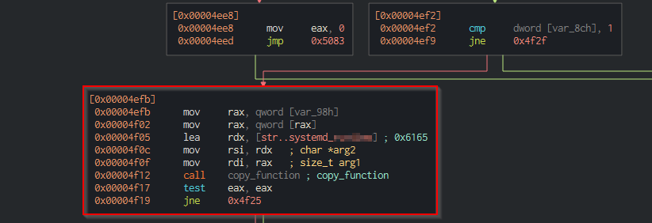
</p>

<p align="center">
  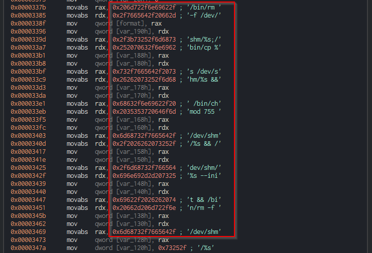
</p>

### Random name selection
We can see that there is a call to random function modulo with 10 and then that content is copied to a sepcific location, then this is passed to a function. At the start we saw multiple binary names being added, these are the binary which the malware can masquerade.

<p align="center">
  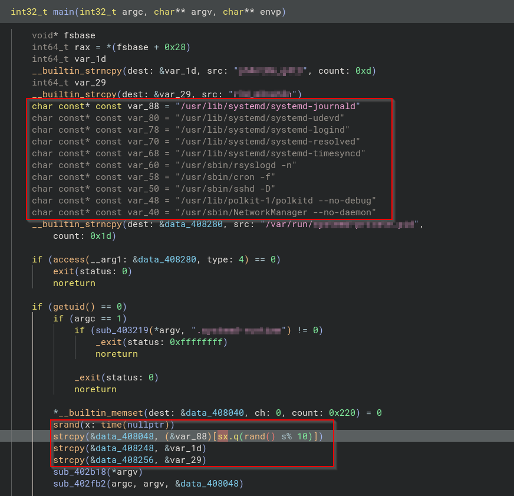
</p>

After this initally I wasn't sure how to move so I went to answering the questions related to iptables and environment variables.

### Iptables
For checking the command that is being used by the malware we searched the strings section and from there we got the address of the function where `iptables` command is being used.\
These are actually **four separate format strings** stored
```sh
# add + delete REDIRECT (***ROUTING)
/sbin/iptables -t nat -A ***ROUTING -p tcp -s %s --dport %d -j REDIRECT --to-ports %d
/sbin/iptables -t nat -D ***ROUTING -p tcp -s %s --dport %d -j REDIRECT --to-ports %d
# add + delete ACCEPT (INPUT)
/sbin/iptables -I INPUT -p tcp -s %s -j ACCEPT
/sbin/iptables -D INPUT -p tcp -s %s -j ACCEPT
```

### Environment variable /dev/null
For checking which environment variabled is set to */dev/null* to prevent bash history logging we can search for `dev/null` in the strings section. This gives us the function where it is being used. In Linux there is a main file which is targetted for this sort of thing.

<p align="center">
  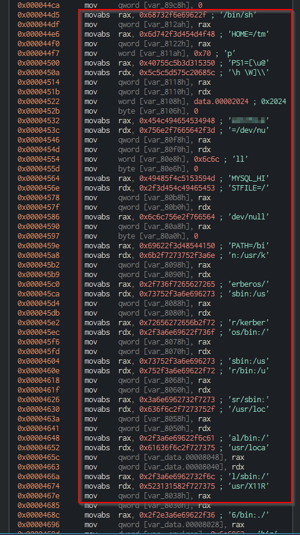
</p>

Following are some commands that are executed:
```sh
// FUN_00104433 — envp entries
"****FILE=/dev/null"
"MYSQL_****FILE=/dev/null"
"PATH=/bin:/usr/kerberos/bin:..."
"HOME=/tmp"
"TERM=vt100"
```

### Timestamp
We have a question on the date timestamp represents. There is utimes function present in the binary we checked that.\
**utimes()** is a POSIX system call used to change the access and modification times of a file or directory with microsecond precision.\
Here we came across a static value that is set, now the question was to convert this hex value to a date. We can do the following for this

```py
import datetime
datetime.datetime.utcfromtimestamp(<hex value>)
```
<p align="center">
  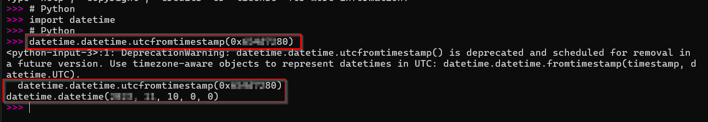
</p>

### BPF evasion filter

The scenario keeps pointing to a "BPF-based evasion mechanism", so we followed the last function that `main` calls before it goes quiet. Inside it we can see a socket being created, but not the usual kind. Here the socket is created with special parameters:

```c
socket(0x11, 3, htons(0x800));   // socket(AF_PACKET, SOCK_RAW, htons(ETH_P_IP))
```

To make sense of these numbers we just map them back to their header constants (the compiler replaces the macro names with plain numbers, so we do the reverse lookup):
- domain `0x11` = `17` = **AF_PACKET**
- type `3` = **SOCK_RAW**
- protocol `htons(0x800)` = **ETH_P_IP**

An `AF_PACKET` + `SOCK_RAW` socket is not a normal client/server socket at all — it is a **raw packet sniffer**, the same primitive `tcpdump`/Wireshark use to read frames straight off the wire. So the very first thing we conclude is that this function is quietly **listening to all incoming traffic** instead of opening a port.

Right after the socket we can see another important call:

```c
setsockopt(fd, 1, 0x1a, &filter, 0x10);   // SOL_SOCKET, SO_ATTACH_FILTER
```

The option `0x1a` = `26` = **SO_ATTACH_FILTER**, which is the classic way to attach a **BPF program** to a socket. The big block of `MOV` stores just above this call (30 of them) is that BPF program being built on the stack. In other words, the malware hands a tiny packet-matching program to the **kernel**, and the kernel decides which packets are even worth waking the process for.

<p align="center">
  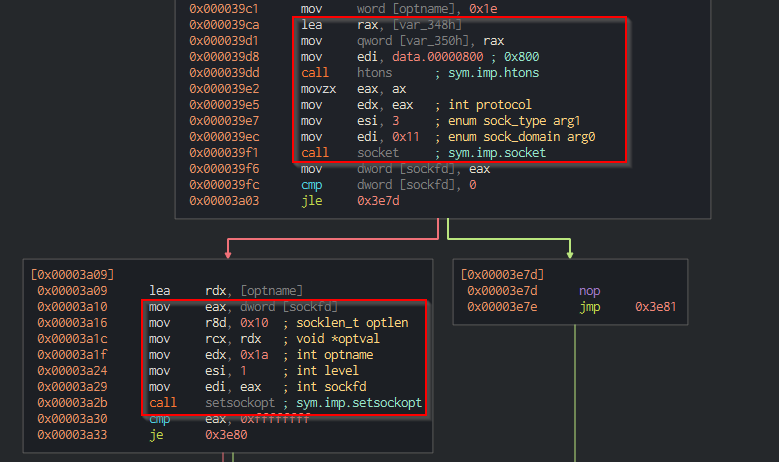
</p>

One thing that confused us at first: the hardcoded values in this function never seem to be *compared* anywhere in the program's own code. That is expected — those values are **data** for the BPF program, not instructions the binary runs. The only place the binary "uses" them is the `setsockopt` call that uploads the filter; the actual comparisons happen inside the kernel's BPF engine on every packet.

But still we weren't able to decide on the magic bytes that are there for TCP and UDP so for this identification we used `Ghidra MCP` + `Copilot`. That's when we got to know the following

The 30 filter entries (each is `{code, jt, jf, k}`, with the offsets counted from the start of the ethernet frame), the program accepts a packet if any of these are true and drops everything else:
- a **UDP** packet sent to a specific hardcoded port (`0x8***`), or
- an **ICMP** echo-request whose id/seq field equals that same value, or
- a **TCP** packet whose payload begins with a small magic marker (`0x4***` = `"**"`).

The decision is made by one byte in the IP header: the protocol field, which the BPF loads with `ldb [23]`.
```
ldb  [23]          ; IP protocol byte
jeq  #0x11  ...     ; == 17 ? -> UDP  branch  (then check dport == magic)
jeq  #0x06  ...     ; == 6  ? -> TCP  branch  (then check payload starts "AA")
jeq  #0x01  ...     ; == 1  ? -> ICMP branch
```
These instructions are present in the inital block that builds the BPF filter array.

### Encryption

While analysing the shell functions we came across a couple of small helper routines that were being used around the socket communication. One of them stood out — it fills a 256 byte array with sequential values and then keeps permuting and swapping those bytes using a key. This layout is the well known signature of the **RC4** cipher, so we could identify the encryption just from recognising this routine.

The key that is used for RC4 is simply the **password we sent inside the packet**, and the setup is done twice because the malware keeps two separate states — one for the data it sends and one for the data it receives.

<p align="center">
  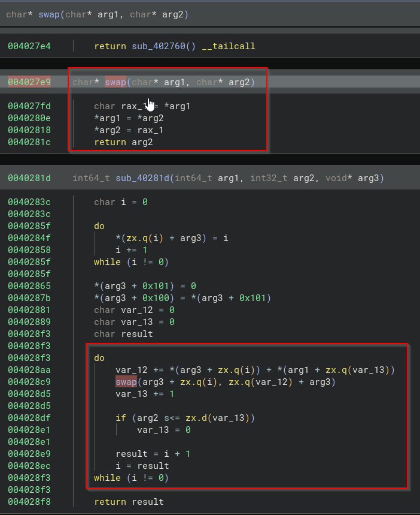
</p>

### Shell Type decision
While navigating the function which was called at last from main we came across a function which return either of the values 0, 1 or 2. Based on the password we provide its decided which type of shell will be used.\
We can see an address being loaded which has the data then a string comparison is run. The string values were stored in specific area in the main function starting.

<p align="center">
  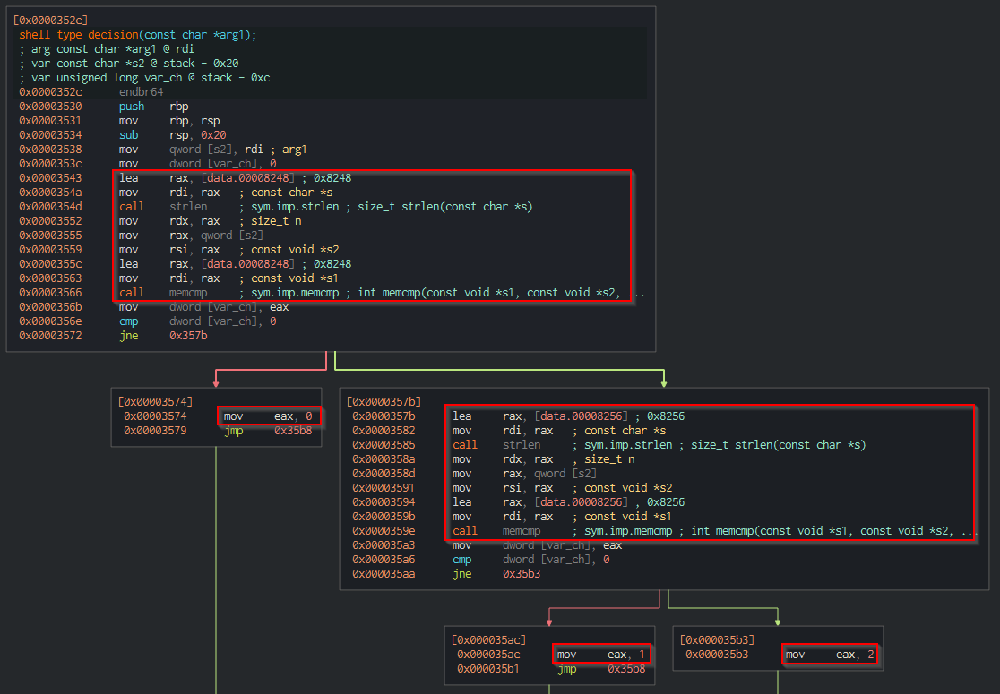
</p>

Based on the result that we get from the above function we invoke few other functions which defines the type of shell that we will interact with.

<p align="center">
  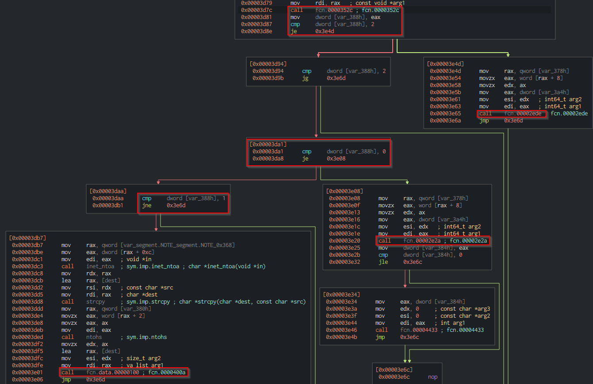
</p>

In the function ending with `400a` we can see the following methods being called:
socket -> bind -> listen -> accept, this is a bind shell.

In the function ending with `2e2a` we can see the following methods:
socket -> conenct, this is a reverse shell. The victim is told to connect at specific address.

Setting up a server on Linux requires a standard sequence of system calls:
- socket(): Creates an endpoint for communication.
- bind(): Assigns a specific IP and port to the created socket.
- listen(): Marks the socket as passive to queue client connections.
- accept(): Extracts the next connection request from the queue

Then in both the function we can see that they call function ending with `4433`.

### The Bind shell ports
The bind shell has a function after completing the ip-tables command have a function which defines this port range.

<p align="center">
  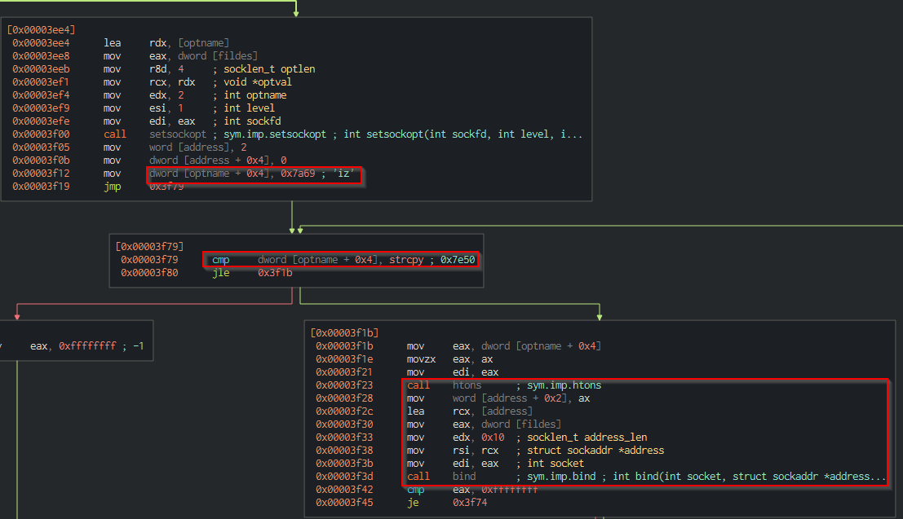
</p>

### The inital handshake packet and pty shell
In the function `4433` both the bind and reverse shell converges it has the operation which sets the environment variable to /dev/null and other things as well.\
Once the initalization is complete then we can see a write operation, the output of this is passed to the upcoming functions. This is that 4-character string that is send as a handshake.

<p align="center">
  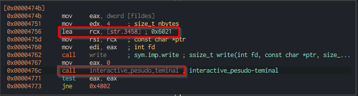
</p>

After this we can see a **pseudoterminal master multiplexor** is being referred. This is located at `/dev/ptmx`.\
Opening this special device yields a file descriptor for a PTM, which concurrently generates a corresponding *pseudoterminal slave* (PTS) in the `/dev/pts` directory.

**How it works**:
- When a process opens the master multiplexor, the kernel automatically provisions an unused slave device (e.g., /dev/pts/1).
- Data written to the slave acts as input for the master, and vice-versa, allowing an application to interact with a process just as if it were a physical hardware terminal

<p align="center">
  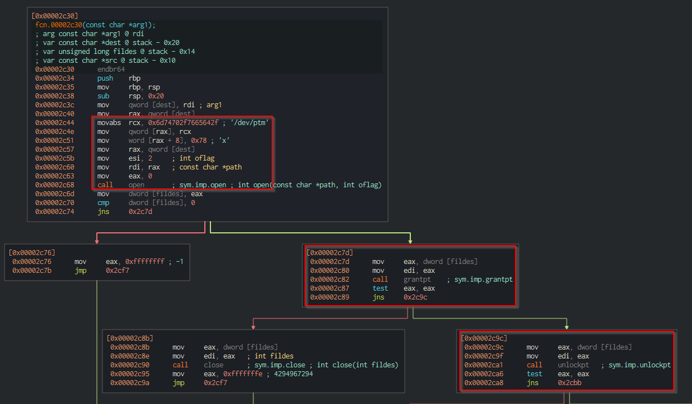
</p>

### Call graph

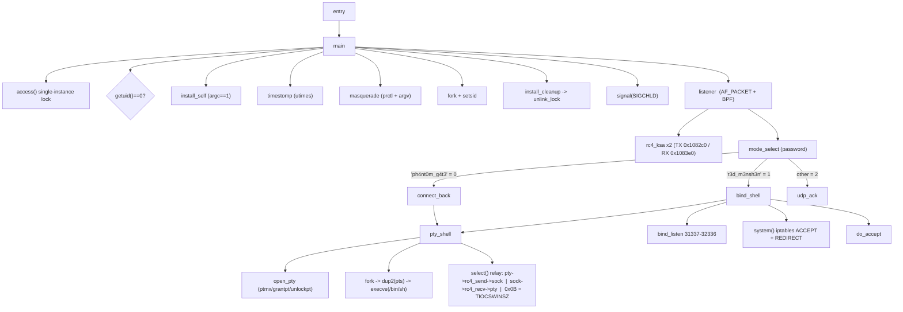
For generating the last portions of this call graph LLMs were used.

### Complete
