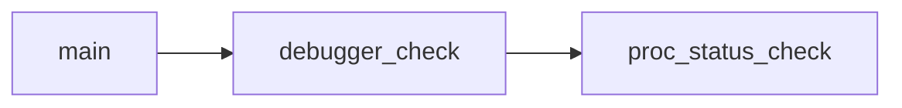

# Safecracker
### Challenge Description
We recently hired some contractors to continue the development of our Backup services hosted on a Windows server. We have provided the contractors with accounts for our domain. When our system administrator recently logged on, we found some pretty critical files encrypted and a note left by the attackers. We suspect we have been ransomwared. We want to understand how this attack happened via a full in-depth analysis of any malicious files out of our standard triage. A word of warning, our tooling didn't pick up any of the actions carried out - this could be advanced. Warning This is a warning that this Sherlock includes software that is going to interact with your computer and files. This software has been intentionally included for educational purposes and is NOT intended to be executed or used otherwise. Always handle such files in isolated, controlled, and secure environments. One the Sherlock zip has been unzipped, you will find a DANGER.txt file. Please read this to proceed.

### Process for solving the challenge
This challenge gives us the KAPE dump for analysis. This includes the encrypted file system, a raw file and with it other things that was present in the machine at the time of attack.\
So either we can use volatility for analyzing the raw data. Other than that we can use Autopsy for disk forensic.\
Following is the process we need to follow so as to analyze the logical disk.
- Lauch the Autopsy, Create a new case and fill other things like name of the person who's performing the analysis.
- Now load the files for analysis, since we have set of uploads files, we'll select the logical section and then upload our `ntfs` and 'auto` folder.

- Once this is done just click on next for continuing for default selected items, then we can wait for the analysis to happen. Once it's complete then we can analyze the content.

We can answer following question just using the response from Autopsy
- Which user account was utilised for initial access to our company server?\
Ans: This information can be obtained from the OS Accounts section. We can see that there is one account whose doamin is different and login name also states *contractor*.\

- Which command did the TA utilise to escalate to SYSTEM after the initial compromise?\
Ans: For the commands executed this information we can get from the history of the commands executed, this document we can find in the document section. Name for the same is `Console_history.txt` Once opened the command can be seen in the tab at bottom.\

- Out of this list, what extension is not targeted by the malware? .pptx,.pdf,.tar.gz,.tar,.zip,.exe,.mp4,.mp3\
Ans: When checking in the File view we can see the document present based on their type, under executable we can see that we have entries for `.exe`, `.bat` and `.cmd`. Then we can just tally from the question provide response.\

- What compiler was used to create the malware?\
Ans: When we click on the exe part we can see one exe is present `MsMpEng.exe`.
MsMpEng.exe, also known as the `Antimalware Service Executable`, is a **core process of Windows Defender** . It's responsible for real-time scanning of your computer for malware, viruses, spyware, and other potentially harmful software. Essentially, it's the engine that powers Windows' built-in antivirus protection.\
The default location of this binary is `C:\Program Files\Windows Defender`. But over here we see that this exe is present under Administrator's Download folder. And when executed from there it would get all the required permission. So this is our target malware. When we click on this exe at bottom we can see it's metadata, in it we can see multiple mentions of GLIBC, from here we can guess that it will be `gcc`.\ We can detect the same by opening the exe with DIE.


- What file extension does the ransomware rename files to?\
Ans: When checking files under the Administrator folder we can weird file extensions with huge size of file as well. These seems to be the encrypted files. This we can also confirm by examining the note file in which cyber gang has mentioned their name and encrypted files based on their signature.\

- What is the bitcoin address in the ransomware note?\
Ans: We can check the other file `salse-pitch.mp4.note` while examinig it we can see that the hacker gang goes by the name of `Cybergang31337` and they have demanded payment in BTC of $200,000.\


### Parsing the $MFT
For us to answer how many files have been encrypted by the ransomware we will need to parse the $MFT (Master File Table). This acts as a directory or index for all files and direcotries storing metadata. MFT grows when files are added or modified.\
The MFT entry contains information such as the file name, timestamps, permissions, and a pointer to the file's data. An MFT record has the follwoing general structure:
- File Record Header:This section contains information about the record itself.
- File Attribute List: This section contains a list of attributes that describe the file or directory, including its name, timestamps, size, and data.
- Data Runs: This section describes the location of the file or directory's data on the disk.\
(*Source: Geeks for Geeks*)

For parsing this table first we'll open this in HxD and try looking for the encrypted extension. When checked we have 35 hits, but this is not the correct response, that means some filename is appearing multiple times.


So now we have to parse the MFT, we already know the extension we are searching for, the file data we can load and the encoding we need to use. Following code helps in doing the same.
```py
import re

MFT_PATH = "C:/CTFs/safecracker/WinServer-Collection/uploads/ntfs/%5C%5C.%5CC%3A/$MFT"

with open(MFT_PATH, 'rb') as f:
    mft_data = f.read()

ransom_ext = '.31337'.encode('utf-16-le')
all_enc_files = []

# we know the encrypted extension so we are going to search on that basis
for item in re.finditer(ransom_ext, mft_data):
    #print(match)
    filename_end = item.end()
    # when we view the structure of the item we have a span but we cannot definitely say that it starts from the given location
    filename_start = mft_data[:filename_end].rfind(b'\x00\x00')
    #print(filename_start)

    all_enc_files.append(mft_data[filename_start+0x4:filename_end].decode('utf-16-le'))
    
all_enc_files = set(all_enc_files)

for file in all_enc_files:
    print(file)
print(len(all_enc_files))
```
The item structure looks like the following.


Once this was complete initally the file was taken from filename_start till filename_end, but that was resulting with some weird data with the filename.

After this first 4 bytes needs to be skipped first 2 are `\x00\x00`. After this was done we got the following.


## Reversing the MsMpEng binary
### Main Function
- It has two malloc methods which are used for memory allocation of a sprcific amount of data which is `0x18fb40`.
- then we have a call to a function which takes that allocated memory, the first function takes two more elements, first is a reference to a location and third another data value, when checked the first seems like encrypted data, and the last might be some keys.\
The packed data starts from `0x2893a0` in the virtual memory this is because whatever address we in decompilers all are virtual addresses. I tried IDA free for checking the same and we can get the physical offset from there.


- Once the func_2 is done we can see a call to `memfd_create()`, this creates an anonymous file that resides in RAM, and returns a file descriptor referring to it.\
The memfd takes in a file name and flag which is for control behavior. After this it's checked whether the call was successfull or not.

- After this we write the data in buffer to the file descriptor.
- At the end we can see that the a symlink is being created to the file descriptor. The `/proc/self/` directory is a link to the **currently running process**. This allows a process to look at itself without having to know its process ID.
- Once this symlink is created it's executed using `exec1`. So the main malware get's executed in the context of the current process that is MsMpeng. This gets executed with the name of `PROGRAM`.

### The uncompress function
- `Func_3` takes the response from func_2 and puts specific string after checking the input value the elements mentioned refer to specific memory segment or buffers used.
    - ZDATA: zero initialized data, part of .bss segment
    - ZBUF: zero buffer, used for temporary storage
    - ZMEM: zeroed memory region, used for memory allocation
- But these definition suffices when we consider firmwares but here as we have already identified that we have a packed data, so this can also be related with compression techniques.
    

While searching for ZDATA compression we came across an [article](https://www.nv5geospatialsoftware.com/docs/ZLIB_COMPRESS.html) which mentions about the `ZLIB_COMPRESS` method which can be decompressed using `ZLIB_UNCOMPRESS`. So we can say that the current func_2 is actually the uncompress function.


### The Decryption function
- This function takes in two hex encoded string of length `64(0x41)` and `32(0x21)`.
, when decoded these will be 32 and 16 bytes long. These parameters seems a good match for an AES-256 encryption algorithm. But we cannot be sure of what mode we have.\
What we can do is we can do a brute force on the mode selection as when we select the wrong mode then the zlib gives an error while parsing. From this we can come to the our conclusion of the mode used in AES-256.\
We can confirm AES being used while browsing the code, we can see there is call happening to `aes.c` file.\
We can do this trial and error thing for checking the modes as there are not many to consider.

Following code helps us in extracting the exncrypted and compressed data.
```py
from Crypto.Cipher import AES
from binascii import unhexlify
import zlib

key = unhexlify('a5f41376d435dc6c61ef9ddf2c4a9543c7d68ec746e690fe391bf1604362742f')
iv = unhexlify('95e61ead02c32dab646478048203fd0b')

data_offset = 0x2893a0
data_size = 0x18fb40

cipher = AES.new(key, AES.MODE_CBC, iv)

with open('C:\\CTFs\\safecracker\\WinServer-Collection\\uploads\\auto\\C%3A\\Users\\Administrator\\Downloads\\MsMpEng.exe', 'rb') as file:
    encrypted_packer_data = file.read()[data_offset:data_offset+data_size]

packer_data = cipher.decrypt(encrypted_packer_data)
data = zlib.decompress(packer_data)

with open('C:\\CTFs\\safecracker\\main_mal_data', 'wb') as file:
    file.write(data)
```
- Checking the data extracted from the above script. We are dealing with another elf.
```powershell
file .\main_mal_data
.\main_mal_data: ELF 64-bit LSB shared object, x86-64, version 1 (SYSV), dynamically linked, interpreter /lib64/ld-linux-x86-64.so.2, BuildID[sha1]=02dbb3e4159827041282eeb0b88b6cfe5e2821a5, for GNU/Linux 3.2.0, stripped
```

## Analyzing the other binary
- Calculating the checksum and then checking on Virustotal
```powershell
Get-FileHash -Path ".\main_mal_data" -Algorithm MD5

Algorithm       Hash                                                                   Path
---------       ----                                                                   ----
MD5             57C4A3C06A461F96F1ED3A986F4E6016                                       C:\CTFs\safecracker\main_mal
```

- We can see there is a match on Virustotal.\

- From the behavior tab we can collect some information about the malware, following information we can collect:
    - it uses encryption schemes like RC4, blowfish and AES for encrypting the data
    - it has the anti-behavioral analysis capability
    - it has anti-static analysis capability as well
    - data manipulation using XOR

### Reversing the ELF file
The weird part is I was expecting parts of the malware to be obfuscated using XOR as we saw in the behavior tab in virsutotal but that is not the case here.
- At the begining we can see a character constant, same constant is used once in another function and it's being used for xoring. So this can be the XOR string.


- In the **main** function we can see that at the beginning there is a call to one function, when navigating to it we can see at the start of that the result of that function is stored in a variable. When we go to this function we can observe the following
    - at the start `/proc/self/status` file will is opened, this file keeps the the status of the process itself
    - then in that file `TracerPid` string is searched, which will be present in case the program is being debugged.
    - nptr is calculated using strtok_r method which is a [reentrant](https://www.geeksforgeeks.org/cpp/reentrant-function/) function of strtok method.\
    The strtok() method splits str[] according to given delimiters and returns the next token.
    - if this is not equal to 0 then we return the int value of nptr.

- Then once the above value is returned there we check if that is equal to 0 or not if it is then the execution goes on otherwise the program prints "Debugged". So all this was done so that debugger can be detected.




- Once this part is done then in mainfunction we have a function which looks for a specific directory which is `/mnt/c/Users`, once found it starts encrypting, deleting and adding files to the host. In this we can see that program uses `readdir` function for reading files present in the directory.\
For getting which actual syscall was utilized for this either we can take the `libc.so.6` library and then decompile it and get the name of the method or search about it. Doing same we can get that syscall in libc.so.6 for readdir is `0x0d9` / `getdents64`.

**The Encrypt file function**

In this function following operations happen
- First we open the file in read mode and take it's content and move the contents to the encrypted file type.
- we also add a note file.
- once this is done we try to delete the file using remove command
- if that didn't work then an error is raised\


For getting information regarding which syscall was used with the remove function then we can either decompiled the `libc.so.6` file or search. While searching for same we encountered this [blog post](https://medium.com/@joshuaudayagiri/linux-system-call-unlink-79dddc577caa).\
The unlink system call in Linux is used to delete (remove) a file from the file system. Once a file is unlinked, it is removed from the directory structure, and its data blocks are marked as available for reuse.

Some side information we can get while navigating the rdata section.


We can load this malware sample in a debugger and see it give error live.


*Note: This is not a walkthough, just me writing the steps I took for notekeeping.*

Note: A great [writeup](https://adeadfed.com/posts/htb-sherlock-safecracker-writeup/) by @adeadfed.

### Complete
