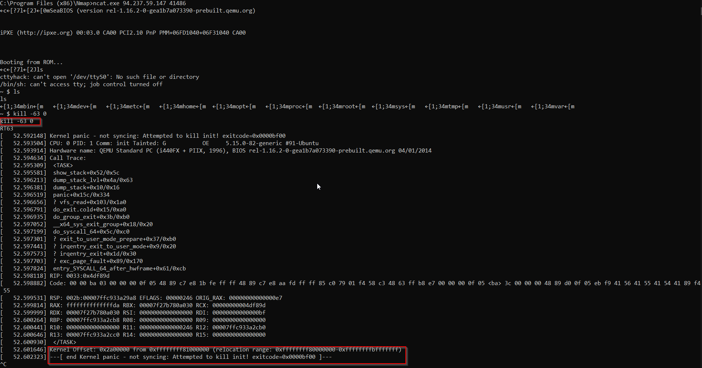
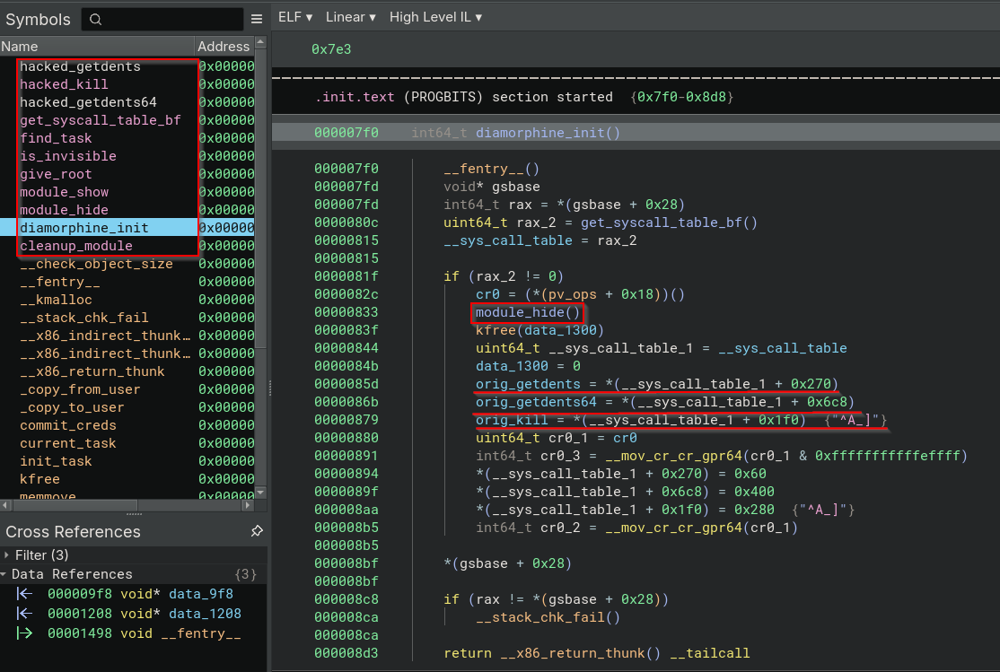
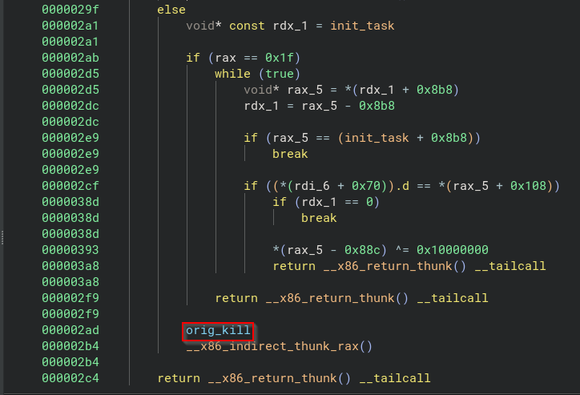
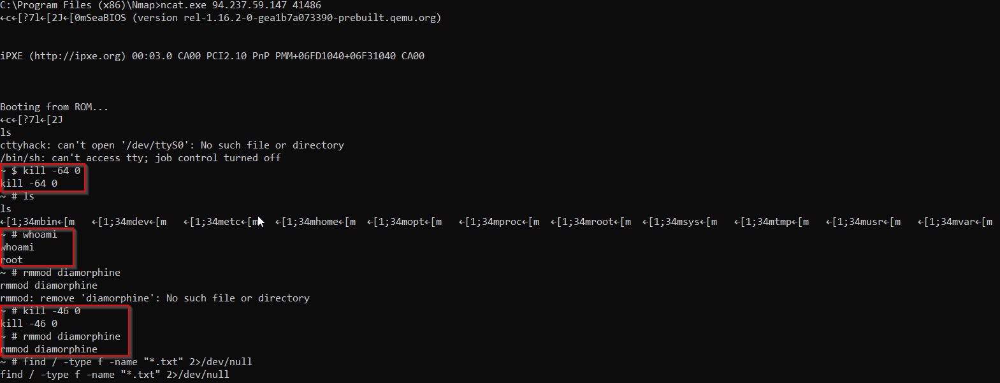

# Cyberpsychosis

### Challenge Description and Files
- Malicious actors have infiltrated our systems and we believe they've implanted a custom rootkit. Can you disarm the rootkit and find the hidden data?
- There are two files that are present in the challenge folder, the challenge binary and text document.

### Starting the Analysis
- The description mentions that the system is infected with a rootkit, our task is to find and disarm it.\
The file present in the challenge folder is named diamorphine.ko. A normal web search shows an alerady present version of this rootkit. .

- By reading the readme from the above github link we can see following details.
    - The rootkit impacts Linux Kernals 2.6.x/3.x/4.x/5.x/6.x (x86/x86_64 and ARM64);
    - The module starts invisible when loaded;
    - Hide/unhide any process by sending a signal 31;
    - Sending a signal 63(to any pid) makes the module become (in)visible;
    - Sending a signal 64(to any pid) makes the given user become root;
    - Files or directories starting with the MAGIC_PREFIX become invisible.

- Instructions to unisntall it.
```sh
kill -63 0
rmmod diamorphine
```

- When trying the command from the readme on the infected server we are encountered with a Kernal Panic.


- Now what is a kernel panic and why it happens?\
Kernal Panic is a situation where the operating system's kernel encounters a problem which it cannot resolve, leading to a system shutdown or restart.\
Kernel panics can be triggered by various issues, including hardware failures, software bugs, corrupted files, incompatible drivers, or even malicious software.

- What might have happened when we ran the above which caused the Kernel Panic.\
kill command sends a signal to processes, there are multiple codes that tell the kernel what action to take on the targetted process. 64 seems like a user-defined signal.\
When we specify "0" as the target process id, then a singal is send to all processes in the same process group as the current process.\
So what happens here is that the kernel cannot recognize 64 signal, so it might end up terminiating some crucial system process like *init*. As init is a crucial system process terminating it can lead the system to a kernel panic state.

- This means that the 64 signal has been changed to some other value, this is also hinted in the descritpion where they mention about a custom rootkit.\
Now we dissassembe and decompile using Ghidra or Binary Ninja.

- From the output from our decompiler we can see that there are functions named hacked kill and hacked getends. Our primary objective will be to see how can we disable the current one, specifically what sort of signal we have to send to disable and remove the rootkit.

- In the `diamorphine_init` function we can see a call to a `module_hide` function being made and apart from it calls to `original functions` as well.

- The rootkit actually hooks the original function by replacing them with the `hacked_syscallName`.

- Navigating to the `hacked_kill` function. We can see that there are multiple if else blocks and at the end of these blocks we are calling the `orig_kill` function.\



- We can see that there are two if conditions with checks based on the input equal to `0x2e -> 46` and the other `0x40 -> 64`.

- For hiding and unhiding the input signal 46 is being used. We can see that if the `module_hidden` hasn't been set to 1 then then it happens here, in case it has already been done then we change it to 0. So the toggle mechanism for hiding is done using 46 signal.

- The 64 signal is used to raise the user to a root.
    - `prepare_creds`: Prepares a new set of credentials for a process.
    - `commit_creds`: Applies the new credentials to a process

- So for removing this rootkit we have to raise our permissions using 64 signal and then unhide using 46 signal. Then use the `rmmod` command.



**Solved**
